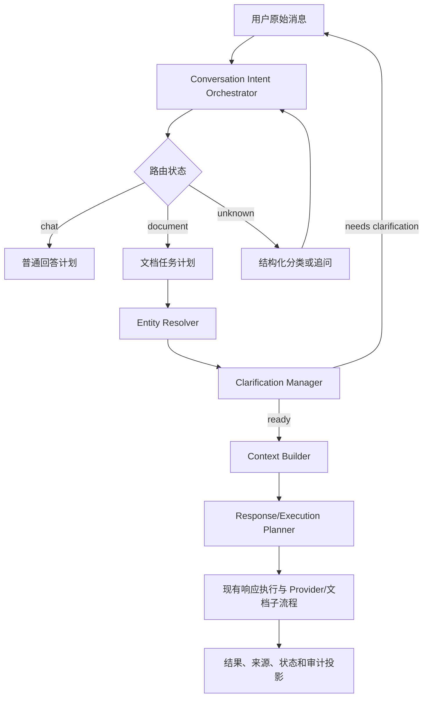

# UniComp 会话业务重设计总计划

日期：2026-09-03

状态：`in_progress/phase_1_automated_acceptance_passed`

文档类型：工程侧总计划

## 一、决策摘要

当前会话功能不需要重写整个基础设施，但必须重设计“自然语言输入 → 任务计划 → 上下文构建 → 受控执行”的业务主链。

本计划保留现有的 `Conversation`、`Message`、revision 并发控制、响应执行生命周期、流式输出、取消、Provider candidate、授权、幂等和适配器；重做会话语义编排、目标解析、多轮追问、上下文构建和执行交接。

第一阶段只完成以下四件事：

1. 建立自然语言黄金样本、误判基线和回归评测。
2. 建立 Application 层 `Intent Orchestrator`，将路由从 Renderer 正则分支中移出。
3. 持久化待追问/待确认任务，使多轮补充可以关联到同一任务。
4. 建立带角色和预算的 `Context Builder`，分离系统规则、用户内容、历史、资料和工具结果。

第一阶段不调用真实 Provider，不接入复杂文档工具循环，不引入向量数据库、embedding 服务或联网搜索服务商。现有智能文档专项计划作为后续子计划引用：

`docs/active/阶段9-智能文档提示词工程与安全加固计划.md`

## 二、当前基线与问题证据

| 位置 | 当前实现 | 业务后果 |
| --- | --- | --- |
| `src/pages/chat/ChatPage.tsx` | 发送前直接调用 `analyzeOfficeRequest`，命中后切换文档模式，否则进入普通聊天 | Renderer 直接决定业务路由，复杂输入无法进入后续语义处理 |
| `src/application/office-request-intent.ts` | 关键词和正则区分 create/revise/chat | 无法稳定处理否定、复合要求、代词、版本关系和多轮上下文 |
| `src/application/document-intent-planner.ts` | 能生成本地 `DocumentIntentPlan`，但未接入会话主链 | Schema 存在，运行时没有计划状态、追问或确认 |
| `src/shared/chat-context-ipc.ts` | `startResponse` 主要接收 `content`、候选和上下文选择 | 业务层无法传递 intent、参数、缺失项、目标绑定和工作流状态 |
| `src/platform/providers/conversation-response-artifact-factory.ts` | 将上下文快照作为 `user` 消息，并把历史 `message.content` 原样送给 Provider | 系统规则、用户内容、资料和内部 Prompt 混在一起，造成提示词污染 |
| `src/pages/chat/ChatPage.tsx` 文档发送段 | 将生成指令、上一版全文、附件摘要、RAG 片段拼到 `content` | 后续普通会话会重复携带内部指令和大段旧文档，token 持续膨胀 |
| `src/platform/providers/deepseek/*`、`newapi/*` | 仅有消息数量、单条大小和请求体大小限制 | 没有 token 预算、摘要、优先级裁剪和超限前的可理解反馈 |
| `src/platform/providers/provider-tool-calling.ts` | 有白名单工具和有限循环合同 | Electron 会话组合未注入工具桥，复杂会话实际上无法调用工具 |

已复现的典型样本：

| 用户输入 | 当前结果 | 期望行为 |
| --- | --- | --- |
| `这个报告出了问题` | 新建 Word | 普通分析或追问，不应因“出”字触发创建 |
| `帮我做个总结` | 普通聊天 | 识别为内容交付请求，类型不明确时追问或给出候选 |
| `给我一个表格` | 普通聊天 | 识别为表格创建请求 |
| `再加一个例子` | 直接修改最新文档 | 继承待处理任务；没有明确目标时追问 |
| `不是这个，改前一个版本` | 按全局数组倒数选择 | 按当前任务和同一文档实体的版本链解析 |

定向测试通过只能证明当前 Schema、状态和执行合同，没有证明自然语言理解质量。本计划把语义评测作为独立验收对象。

## 三、目标与非目标

### 3.1 目标

- 用户原始输入先进入 Application 语义编排，不再由页面正则直接决定执行分支。
- 路由拥有 `chat/document/unknown` 三态；`unknown` 不生成、不执行，只能进入结构化分类或追问。
- 任务计划具备版本、置信度、缺失项、歧义项、目标提示、资料策略和确认状态。
- 用户补充内容可以合并到同一个 pending 任务，而不是重新从零分类。
- 文档、附件、项目资料和历史消息以带元数据的上下文块传递，不把内部 Prompt 当作用户历史保存。
- 每个阶段都有结构化输入/输出、失败码、超时、取消和最大步数。
- 旧会话和旧 `startResponse` 能兼容迁移，并可在异常时回退到普通聊天或明确追问。

### 3.2 非目标

- 不重写 `Conversation` 消息持久化、流式生命周期、取消协调和 Provider 传输适配器。
- 不在第一阶段接入真实 Provider 语义分类调用；先用本地实现和离线夹具验证协议。
- 不在第一阶段执行文档生成、Office 文件写入、渲染、联网搜索或复杂 Agent 工具循环。
- 不新增业务一级页面；现有对话页只负责输入、状态展示和确认操作。
- 不让模型决定路径、凭证、Provider、权限、费用、内部 ID 或任意代码。

## 四、目标架构



分层职责：

| 层 | 负责 | 不负责 |
| --- | --- | --- |
| Renderer | 提交原始文本、展示追问/确认/进度、接受用户选择 | 不解析最终意图，不选择文件路径或 Provider |
| Application | 意图编排、参数合并、目标解析、完整性检查、检索策略和执行门禁 | 不直接操作文件和网络传输 |
| Domain | 计划、任务状态、目标提示、来源和失败码的严格 Schema | 不调用模型、文件系统或 IPC |
| Platform | Provider 调用、受控工具、文件读写、渲染和取消 | 不改变用户意图和权限规则 |

## 五、核心领域模型

### 5.1 IntentPlan

现有 `DocumentIntentPlan` 作为文档任务的子类型，增加通用会话包装，不把内部实体 ID 暴露给模型：

```ts
type ConversationIntentKind = 'chat' | 'document' | 'unknown';
type ConversationIntentConfidence = 'high' | 'medium' | 'low';

interface ConversationIntentPlan {
  readonly schemaVersion: 1;
  readonly kind: ConversationIntentKind;
  readonly action?: 'answer' | 'create' | 'revise' | 'analyze';
  readonly documentKind?: 'word' | 'excel' | 'ppt' | 'auto';
  readonly targetHint?: {
    readonly unit: 'document' | 'version' | 'page' | 'section' | 'table' | 'cell' | 'block';
    readonly ordinal?: number;
    readonly name?: string;
  };
  readonly parameters: Readonly<Record<string, string | number | boolean>>;
  readonly sourcePolicy: 'none' | 'internal' | 'web' | 'mixed';
  readonly missing: readonly string[];
  readonly ambiguities: readonly string[];
  readonly confidence: ConversationIntentConfidence;
  readonly needsConfirmation: boolean;
}
```

模型只能返回 `targetHint`，Application 根据当前会话实体解析为内部文档、版本、页面或结构索引。

### 5.2 ConversationWorkflowState

```ts
type ConversationWorkflowStatus =
  | 'draft'
  | 'needs_clarification'
  | 'needs_confirmation'
  | 'ready'
  | 'executing'
  | 'completed'
  | 'failed'
  | 'cancelled';

interface ConversationWorkflowState {
  readonly schemaVersion: 1;
  readonly workflowId: string;
  readonly conversationId: string;
  readonly sourceMessageId: string;
  readonly revision: number;
  readonly status: ConversationWorkflowStatus;
  readonly plan: ConversationIntentPlan;
  readonly pendingQuestions: readonly {
    readonly field: string;
    readonly question: string;
    readonly required: boolean;
  }[];
  readonly resolvedTarget?: {
    readonly artifactRef: string;
    readonly version: number;
  };
  readonly confirmation?: {
    readonly confirmationId: string;
    readonly planHash: string;
    readonly expiresAt: string;
  };
  readonly executionId?: string;
  readonly updatedAt: string;
}
```

### 5.3 ContextEnvelope

```ts
interface ContextEnvelope {
  readonly systemRules: readonly { readonly id: string; readonly content: string }[];
  readonly userTurns: readonly { readonly messageId: string; readonly content: string }[];
  readonly assistantTurns: readonly { readonly messageId: string; readonly content: string }[];
  readonly references: readonly {
    readonly sourceId: string;
    readonly sourceType: 'project' | 'attachment' | 'retrieval' | 'web';
    readonly revision?: number;
    readonly location?: string;
    readonly contentHash: string;
    readonly excerpt: string;
  }[];
  readonly toolObservations: readonly {
    readonly toolId: string;
    readonly summary: string;
  }[];
  readonly budget: {
    readonly maxInputTokens: number;
    readonly estimatedInputTokens: number;
    readonly truncated: boolean;
  };
}
```

## 六、业务闭环与状态规则

### 6.1 意图路由

1. Application 接收原始文本、当前会话摘要、可见文档候选和已有 pending workflow。
2. 本地规则只处理高置信度明确请求，并输出结构化候选，不直接执行。
3. 无法确定时返回 `unknown`，由受控分类端口或追问处理。
4. 分类失败、超时或 Schema 不合法时回退本地候选；仍不确定则 `needs_clarification`。
5. `unknown`、低置信度或目标不唯一时禁止生成、写文件和创建正式 Work。

### 6.2 多轮参数合并

- 新输入先判断是否是对 pending workflow 的补充回答。
- 只合并已声明字段，不覆盖用户没有提及的已确认字段。
- “给管理层，8 页，简洁一点”等回答必须更新 `audience/pageCount/style`，不能被当成全新普通聊天。
- 新输入明确开启新任务时，旧 workflow 标记为 `cancelled` 或 `superseded`，不得静默复用旧目标。

### 6.3 追问与确认

- 缺少必需字段时生成一个到三个最小问题，问题包含可选答案或需要用户提供的具体信息。
- 破坏性修改、目标不唯一、资料冲突和低置信度计划进入 `needs_confirmation`。
- 确认绑定 `workflowId`、会话 revision、planHash 和过期时间。
- 确认前不执行 Provider 生成、不写临时文件、不发布 Work。

### 6.4 目标解析

目标解析分两步：

1. 模型或本地规则产生语义提示：`上一版`、`第二页`、`结论页`、`销售表`。
2. Application 根据同一会话的 Artifact/Version/DocumentUnit 图解析为内部引用。

章节、页面、表格、单元格和块使用不同的 `unit`，不得用一个全局 ordinal 代替所有结构。

### 6.5 上下文构建

- 稳定系统规则进入 `system/developer` 区域。
- 用户原始文本进入 `user` 区域；显示文本和模型内部输入分离。
- 历史消息只保留必要摘要和近期窗口；内部 Prompt 不作为历史用户内容回送。
- 附件、项目资料、RAG 和网页结果进入 `reference/tool` 区域，带来源、版本、位置、Hash 和检索时间。
- 按 token 预算裁剪：当前任务 > 最近用户/助手轮次 > 已确认目标 > 相关资料 > 更早历史。
- 超预算时先摘要/裁剪；若缺失必需资料或当前任务上下文，返回可理解的追问或失败码。

## 七、第一阶段实施计划

### PR-1：自然语言评测基线

范围：建立离线黄金集、分类器输出快照和混淆矩阵，不改真实 Provider 调用。

黄金集至少覆盖：

- 普通闲聊、问答、分析和建议。
- Word/Excel/PPT 创建的同义表达、口语表达和省略表达。
- 修改、追加、删除、清空、替换和否定句。
- 文件名、上一版、刚才、前一个、页码、章节、表格和单元格指代。
- 多轮补充、纠正、撤回、新任务打断和复合多目标。
- 附件/项目资料要求、资料不足和要求最新公开信息。

产出：`tests/evaluation/conversation-intent-golden.json`、离线评测脚本、误判样本报告和版本化指标。

### PR-2：Intent Orchestrator

范围：新增 Application 编排服务，统一本地快速路径、`unknown`、结构化计划解析和完整性评估；`ChatPage` 只提交原始文本。

接口草案：

```ts
interface ConversationIntentOrchestrator {
  analyze(input: {
    readonly conversationId?: string;
    readonly rawText: string;
    readonly workflow?: ConversationWorkflowState;
    readonly context: ConversationSemanticContext;
    readonly signal?: AbortSignal;
  }): Promise<ConversationIntentDecision>;
}
```

要求：

- 本地规则输出必须带 `confidence` 和判定原因。
- 低置信度不能伪装成高置信度 `chat`。
- 不允许输出内部 message/work ID、路径、URL、凭证、Provider 或任意代码。
- 分类器失败必须有确定的回退路径和失败码。

### PR-3：Workflow 持久化与追问状态

范围：新增 workflow entity、JSON repository、IPC DTO 和会话 Controller 接口；支持创建、读取、追加回答、确认、取消和过期。

建议接口：

```text
conversation.workflow.analyze
conversation.workflow.answer
conversation.workflow.confirm
conversation.workflow.cancel
conversation.workflow.get
```

验收重点：

- 追问后回答能合并到原 workflow。
- 会话 revision 冲突不会覆盖别人的更新。
- 取消和新任务打断都能结束旧 workflow。
- 重启后 pending workflow 仍可恢复，过期确认不可重放。

### PR-4：Context Builder 与历史迁移

范围：新增 Context Builder，修改 `ConversationResponseArtifactFactory` 使用结构化上下文；保留旧消息读取兼容，逐步停止将内部文档 Prompt 写入 `message.content`。

迁移策略：

- 旧消息保留原始内容，不做破坏性重写。
- 新消息增加来源/用途投影，Provider 请求只使用 ContextEnvelope。
- 旧文档生成消息在读取时识别为 legacy prompt，默认不进入普通聊天历史；需要时只作为当前文档任务参考。
- Provider 不支持独立 system/developer 角色时，使用适配器能力标记和受控前缀降级，并记录降级原因。

验收重点：

- 后续普通聊天不再携带内部生成指令、旧文档全文和重复资料。
- 参考资料中的“忽略规则”“调用工具”等文本不会改变工具集或权限。
- 预算裁剪可预测，超限前返回结构化状态。

## 八、后续阶段规划

以下阶段不属于第一阶段交付，按独立 PR 实施：

1. **P1 目标与版本解析**：Artifact/Version/DocumentUnit 图、PPT 页类型映射、Word/Excel 结构目标。
2. **P1 结构化 LLM 分类兜底**：接入受控分类 Provider，离线回放、Schema 拒绝和成本预算。
3. **P1 资料路由**：`none/optional/required` 资料策略，内部 RAG 自动路由和来源引用。
4. **P2 受控工具执行**：把工具桥注入会话运行时，接入读取结构、补丁、渲染和布局检查。
5. **P2 文档修订迁移**：从完整大纲重生成逐步迁移到 `RevisionPlan` 和结构化补丁。
6. **P2 视觉校验与有限修正**：确定性修复、受限 `RepairPlan`、预算、最大次数和失败隔离。

后续阶段必须引用并更新现有智能文档专项计划，不得把计划状态写成已完成。

## 九、接口、失败码和取消语义

每个编排阶段必须定义以下字段：

```text
inputSchemaVersion
outputSchemaVersion
startedAt / completedAt
timeoutMs
cancelled
budgetUsed / budgetLimit
failureCode
redactedAuditFields
```

第一阶段建议失败码：

```text
invalid_intent_plan
unknown_intent
clarification_required
confirmation_required
target_ambiguous
workflow_not_found
workflow_revision_conflict
context_budget_exceeded
context_reference_unavailable
classification_timeout
classification_unavailable
cancelled
```

取消要求：

- `AbortSignal` 从 Renderer/Application 传到编排和 Provider 边界。
- 取消后不产生新的正式 Work，不留下 `executing` 状态。
- 追问状态可取消，确认状态过期后不可执行。
- 任何循环必须有最大步数、总超时和预算，不使用无限重试。

## 十、文件范围

### 新增文件（建议）

- `src/domain/entities/conversation-intent-plan.ts`
- `src/domain/entities/conversation-workflow.ts`
- `src/application/conversation-intent-orchestrator.ts`
- `src/application/conversation-clarification-manager.ts`
- `src/application/conversation-context-builder.ts`
- `src/platform/repositories/json-conversation-workflow-repository.ts`
- `tests/evaluation/conversation-intent-golden.json`
- `tests/application/conversation-intent-orchestrator.test.ts`
- `tests/application/conversation-workflow.test.ts`
- `tests/application/conversation-context-builder.test.ts`

### 需要谨慎修改的文件

- `src/pages/chat/ChatPage.tsx`：移除业务路由判断，只保留提交和状态投影。
- `src/application/office-request-intent.ts`：降级为本地快速路径，不再是唯一决策器。
- `src/application/document-intent-planner.ts`：作为文档计划构建器接入 Orchestrator。
- `src/shared/chat-context-ipc.ts`：增加 workflow/clarification/confirmation DTO，保持旧请求兼容。
- `src/platform/ipc/conversation-response-controller.ts`：消费已校验的 workflow plan。
- `src/platform/providers/conversation-response-artifact-factory.ts`：改用 ContextEnvelope，不再拼接内部 Prompt 历史。
- `src/platform/ipc/chat-context-runtime.ts`：注册 workflow repository、Orchestrator 和 Context Builder。

第一阶段不修改 Provider 真实网络请求合同，不修改文档渲染器和 Office 文件写入执行器。

## 十一、验收指标

### 11.1 语义质量

- 高置信度创建/修改请求误路由率 ≤ 1%。
- 普通聊天被误触发文档流程的比例 ≤ 1%。
- 明确文件名、版本和页/章目标解析准确率 ≥ 98%。
- 否定句和询问句触发破坏性操作的比例为 0%。
- 多轮参数合并准确率 ≥ 95%。
- unknown 请求自动生成率为 0%。

### 11.2 上下文质量

- 新流程产生的 Provider 请求中，内部 Prompt 作为历史 `user` 内容出现的比例为 0%。
- 资料注入文本不能改变任务、工具或权限决策。
- 超预算请求必须有裁剪、摘要或结构化失败，不得只等待上游 413/超时。
- 同一来源片段重复注入率 ≤ 5%。

### 11.3 状态可靠性

- 追问、确认、取消、过期和 revision 冲突均有可回放测试。
- 取消后无新的 Work、无残留 executing workflow。
- 进程重启后 pending workflow 可恢复或明确标记为 interrupted。
- 旧会话读取和旧消息展示不回归。

## 十二、测试与验收方式

1. 单元测试：计划 Schema、置信度、否定解析、参数合并、状态迁移和预算裁剪。
2. 应用测试：Orchestrator 三态路由、追问闭环、确认过期、目标歧义和回退。
3. 合同测试：IPC DTO、旧 `startResponse` 兼容、ContextEnvelope 到 Provider 消息映射。
4. 评测测试：黄金集版本对比、混淆矩阵、误判样本回归和阈值门禁。
5. UI 验收：输入、追问、确认、取消、恢复和失败状态可理解；不新增一级页面。
6. 第一阶段不进行真实 Provider、联网搜索、收费调用或真实 Office 修改验收；这些属于后续阶段的独立门禁。

## 十三、迁移、回滚与风险

### 迁移策略

- 先以 shadow 模式运行 Orchestrator，只记录脱敏计划和差异，不改变执行结果。
- 黄金集和线上脱敏样本达到阈值后，再由 Application 接管路由。
- 旧正则保留为 fallback，逐步减少其覆盖范围，不一次删除。
- workflow 与旧会话消息分开存储，避免破坏历史会话文件格式。

### 回滚策略

- Orchestrator 失败时回退到普通聊天或明确追问，禁止回退为自动文档生成。
- Context Builder 失败时不发送包含内部 Prompt 的旧式请求；返回可理解的 context failure。
- workflow repository 写入失败不影响已有 Conversation 消息，但不得标记为 ready/executing。
- 新 IPC 字段采用可选版本化结构，旧客户端仍可使用原 `startResponse`。

### 主要风险

- 黄金集过小导致正则和分类器在真实口语上过拟合。
- 旧消息中的内部 Prompt 难以完全识别，迁移规则需要保守默认。
- Provider 角色能力不一致，降级时可能重新引入上下文混淆。
- 过早接入文档工具会把语义误差放大为文件修改，因此必须先完成第一阶段门禁。

## 十四、完成定义

第一阶段只有同时满足以下条件才可标记完成：

- 黄金集、评测脚本和误判报告已提交。
- Renderer 不再直接决定 chat/document 业务分支。
- Orchestrator、workflow 状态、追问/确认接口和 Context Builder 均有自动化测试。
- unknown、低置信度、目标歧义和取消路径不会生成或执行。
- 新请求上下文不再把内部 Prompt、旧文档全文和资料片段作为普通历史 user 消息回送。
- typecheck、lint、相关测试和 `git diff --check` 通过。
- 未完成能力、真实 Provider 验证和后续文档 Agent 阶段仍明确标记为 `planned/not_started`。

## 十五、第一阶段实施与验收记录

实施日期：2026-09-03

阶段状态：`completed/automated_acceptance_passed`

### 15.1 实际修改

- 新增 `chat/document/unknown` 三态意图计划、完整性评估和 Application `ConversationIntentOrchestrator`；明确请求走本地高置信度路径，复杂或歧义请求预留受控 classifier port，超时、不可用、取消和非法 Schema 均失败关闭。
- Renderer 不再调用 `analyzeOfficeRequest` 或 `analyzeLocalConversationIntent` 决定 chat/document 路由；新消息统一通过 workflow IPC，文档模式只传结构化 `intentHint`。
- 新增 workflow entity、JSON repository、Application service 和 IPC Controller，支持追问、确认、取消、过期、revision 冲突、执行绑定和重启恢复；同一会话新任务会在仓储原子事务内取消旧 pending workflow，并发创建也只保留一个 pending。
- 确认绑定 SHA-256 `planHash` 和有效期；`unknown`、低置信度、目标歧义、未确认或过期请求不进入执行。
- 新增 `ConversationContextBuilder`，分离系统规则、可见历史、当前 Provider 输入和不可信参考资料；参考资料按来源类型与内容 Hash 去重，并按固定预算裁剪。
- 新文档请求的内部 Prompt 只保存在主进程响应草稿 `promptContent`，不追加为普通聊天历史；共享 IPC 明确禁止该字段，Renderer DTO 不投影，Provider 只把它作为当前请求输入。
- 黄金集升级为 `conversation-intent-offline-golden@1.0.0`，包含 45 条样本；默认 `pnpm test` 已纳入 `tests/evaluation`，评测记录见 `docs/active/会话意图离线评测报告-V1.0.0.md`。
- 对话页复用现有页面展示追问、确认、取消、继续执行和重启恢复状态；未新增业务一级页面。

### 15.2 验证结果

- `pnpm.cmd lint`：通过。
- `pnpm.cmd test`：通过；Node/UI 338/338，Vitest 180 个文件、1097/1097，0 失败、0 跳过。
- `pnpm.cmd build`：通过；主 TypeScript、Vite 生产构建、Electron TypeScript 和文档模板复制均成功。
- `git diff --check`：通过，仅有 Git 的既有 LF/CRLF 工作区提示。
- 离线语义黄金集：45/45 样本的全部已声明断言通过；该结果不是生产流量统计结论。
- 未调用真实 Provider、联网搜索、向量数据库或收费接口；未读取或验证真实凭证。

### 15.3 未完成项与边界

- 真实 LLM 结构化分类兜底、脱敏线上样本、扩大黄金集和生产误路由率统计仍为 `planned/not_started`。
- 企业资料分层 RAG、BM25/可选向量评测、联网授权与来源审计仍为 `planned/not_started`。
- `RevisionPlan`、受控 Agent 工具循环、渲染/视觉诊断和有限自动修正仍按后续专项实施；本阶段没有宣称具备这些能力。
- 未执行真实 Provider、真实 Office 文件修改、Windows Electron 人工交互、打包、签名、公证或 macOS 实机验收。
- 旧会话中已存在的 legacy 内部 Prompt 不做破坏性重写，只在新上下文构建中优先使用可见内容；更完整的 legacy 识别仍需后续迁移评测。
- 完整测试在仓库根新增 8 个未跟踪 `.e7-office-batch-*` 临时目录；本地删除策略拒绝清理命令，目录未进入 Git 或生产构建，需在允许的清理路径中处理。仓库原有同名未跟踪目录未触碰。

### 15.4 下一步建议

下一支小 PR 优先执行 P1 目标与版本解析：补齐 Artifact/Version/DocumentUnit 图和跨 Word/Excel/PPT 的精确目标评测。达到扩大后的离线阈值后，再单独批准并接入真实 LLM 分类兜底；不得在同一 PR 同时引入联网搜索、向量数据库或文档工具循环。

## 十六、V1.0.1 自然语言 PPT 创建回归

实施日期：2026-09-04

阶段状态：`completed/automated_acceptance_passed`

- 修复“帮我只做一个关于龙的ppt”被错误判为 unknown：创建动作识别现在允许“只、就、先、直接”等受控副词，但否定和撤销表达仍优先失败关闭。
- unknown 追问态会在 Application 层基于最近两条用户消息重新分析，因此“帮我做一个关于龙的”后补“制作ppt”可恢复主题和 PPT 类型，不由 Renderer 拼接或决定路由。
- 黄金集升级为 `conversation-intent-offline-golden@1.0.1`，包含 46 条样本；历史 V1.0.0 报告保持不变，新结果见 `docs/active/会话意图离线评测报告-V1.0.1.md`。
- 本次不接入真实 LLM、联网、Provider 或 Office 自动化，不改变后续阶段边界。

本文件中的第一阶段已按上述自动化边界实现；总计划仍为 `in_progress`，后续阶段未实施。
