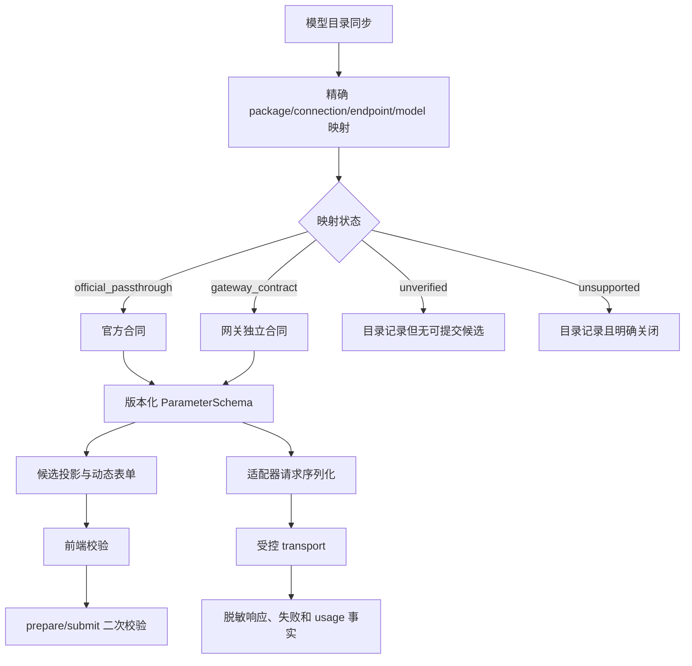

# 模型适配优化方案

日期：2026-08-28  
当前阶段：阶段 9 已收口后的工程优化方案；阶段 10 未启动。  
状态：方案设计，尚未实施。  
适用范围：UniCompAPI、普通 OpenAI-compatible/NewAPI、Vidu、Seedance、HappyHorse、Kling、DeepSeek、Qwen、GLM、Kimi 的模型合同、能力路由、参数投影和验收治理。

本文件是新增的工程侧说明，不覆盖最终 UI 与开发交接包 V1.2.1，也不改变 `AGENTS.md`、`PLANS.md` 或已经批准的阶段 9 边界。实施时必须从 `develop` 创建独立 `feature/*` 分支，按小 PR 非快进合并并保留分支。

## 一、方案目标

本方案要解决的不是“再增加几个模型名”，而是让以下四件事始终一致：

1. 模型选择器展示的能力；
2. 动态参数表单展示的字段、必填性和枚举；
3. HTTP 请求实际发送的字段和请求信封；
4. 该服务商、连接、端点和模型组合已经被什么证据证明。

最终规则：没有精确合同和证据的模型可以保留在目录中，但不得伪装成可提交候选；同名模型不得跨服务商继承官方序列化器；用户在界面设置的字段不得被适配器静默丢弃。

## 二、当前基线与问题分级

| 优先级 | 当前事实 | 影响 | 处理结论 |
| --- | --- | --- | --- |
| P0 | UniCompAPI `viduq3-turbo` 创建和轮询均可返回 200，但任务约 18 秒后进入 `failed`；文生、图生均有失败记录 | 当前不能把“创建成功”当作模型可用，继续调用可能产生费用且无法定位通道问题 | 候选保留目录事实，运行候选标为 `unverified/blocked_pending_provider_diagnosis`，暂停新的真实生成 |
| P0 | UniCompAPI Seedance 图生视频曾收到 HTTP 400、`invalid_tokenpony_request`，后台没有对应业务调用记录 | 无法证明请求到达业务网关，继续切换 `prompt/image`、`content[]` 或媒体字段属于猜测 | 图生视频映射标为 `unverified`；只保留脱敏 fixture 和本地零 HTTP 回归，等待实例级合同 |
| P1 | UniCompAPI 只有 Seedance、部分 Vidu、Seedream/Qwen 图片和文本总合同有精确特判；HappyHorse、Kling 等仍使用共享泛化视频 Schema | 时长、分辨率、比例、音频等字段无法表达模型级约束，UI 可编辑不代表上游接受 | 先建立映射注册表，再逐模型迁移精确 Schema；未迁移项不增加官方扩展字段 |
| P1 | UniCompAPI 文本 Schema 对多个模型共用；适配器只对 DeepSeek V4 发送 `reasoning_effort`，旧模型或未确认模型可能出现“界面有字段、请求不发送” | 用户设置与实际请求不一致，排查困难 | 将字段能力拆成模型级合同；不能发送的字段不进入该模型候选 Schema |
| P1 | Qwen Image 官方资料使用 `input.messages + parameters`，当前网关实现仍发送顶层 OpenAI 风格 JSON | 静态快照通过不能证明真实网关接收形态正确 | 保留当前已冻结网关合同，新增 `qwen-native` 仅在实例级证据后启用 |
| P2 | Vidu 合同和三个适配器内重复维护时长、分辨率、比例表 | 后续官方枚举更新容易只改一处，导致 UI、适配器和测试漂移 | 收敛到单一模型合同函数，并增加一致性测试 |
| P2 | Seedance 记录对当前请求信封的描述存在冲突；全模型方案仍写 34 个模型，实际为 35 个 | 维护者可能按错误文档修改请求或漏掉 `kimi-k3` | 以代码和最新失败复核为准，统一工程记录并注明历史版本 |

专项回归目前为 84/84 通过，完整 `pnpm test` 通过；这些结果只证明本地合同和合成 transport 自洽，不等于真实服务商已支持。

## 三、明确不做的事情

- 不新增一级业务页面，不恢复首页、多图参考、批量创作或视频批量创作。
- 不把对话页改成通用生成入口；已批准的 Office 文档独立功能继续按现有规则处理。
- 不读取、写入或输出 API Key、Token、Prompt、图片 Base64 或上游原始错误正文。
- 不继续调用已耗尽预算的 Vidu `q3-lite` 图片和 `viduq3-turbo` 视频。
- 不在没有负责人明确批准、实例级合同和停止条件的情况下发起新的收费真实调用。
- 不启动阶段 10 的安装包、签名、公证、生产更新、媒体组件分发、SBOM 或正式发布准入。
- 不执行 macOS 实机和媒体工具链验收；`macos-primary` 继续为 `required=false`、`not_run/deferred`。

## 四、目标架构



### 4.1 映射注册表

新增工程侧领域结构（名称可在实现 PR 中最终确定），至少包含：

```text
ProviderModelMapping
  packageId
  packageVersion
  templateId / endpointPolicyId
  providerModelKey
  productFeature
  mappingMode: official_passthrough | gateway_contract | unverified | unsupported
  parameterSchemaId / revision
  adapterId / adapterVersion
  evidenceIds[]
  candidatePolicy: available | hidden_unverified | blocked | unsupported
  reasonCode
```

映射粒度必须至少能区分“服务商包 + 连接模板/端点 + 模型 + ProductFeature”。如果某个实例对同名模型有特殊请求信封，必须建立该实例的网关映射，不得修改全局模型名规则。

建议把证据分为三类：

- `official_contract`：官方文档、版本日期、字段表和请求样例；
- `gateway_contract`：中转站书面合同、端点说明和脱敏响应样例；
- `runtime_observation`：批准后的真实或非收费探测结果、请求 ID、HTTP 状态和安全失败码。

只有 `official_passthrough` 或有完整 `gateway_contract` 的映射才能生成 `available` 候选；`unverified` 和 `unsupported` 永远不能进入可提交列表。

### 4.2 合同单一来源

`ParameterSchemaV2` 继续作为 UI 和适配器共同消费的字段合同，但每个字段要能追溯到映射和证据：

- 字段 ID、JSON 路径、类型、必填性、默认策略、枚举、数值范围和依赖关系；
- UI 暴露级别：`user_required`、`user_optional`、`adapter_derived`、`internal`；
- 适配器序列化目标：顶层字段、`metadata`、`content[]`、`input/parameters` 或 multipart 部件；
- 未支持的字段不得靠“其他参数”或自由 `metadata` 兜底。

适配器不再重复维护同一模型的枚举。Vidu、Seedance、Kling 等模型族的约束由合同工厂生成，适配器只执行合同校验和序列化。

## 五、分批优化计划

### PR0：冻结基线与数据清单

目标：先把当前 35 个 UniCompAPI 目录模型、普通 NewAPI 同名模型和官方服务商模型做成可审计清单。

工作项：

1. 从模型目录、能力表、Profile、ParameterSchema 和适配器导出“包/连接/模型/能力/Schema/请求路径/当前状态”。
2. 标记 `kimi-k3`，修正文档中的 34/35 差异。
3. 将 Vidu turbo 异步失败、Seedance 图生前置拒绝和 Qwen 信封未验证作为独立证据项，不混入“参数错误”。
4. 统一 Seedance 当前请求信封的工程记录，历史尝试单独保留，不覆盖原始事实。

允许修改文件：新增清单和工程说明、相关测试 fixture；不改当前工作区的用量统计未提交文件。

验收：清单覆盖所有已注册或已有适配代码的模型；未知模型、同名跨包模型和关闭模型各有测试断言；不发起网络请求。

### PR1：映射状态与候选门禁

目标：让“目录可见”和“可以提交”成为两个明确状态。

主要落点：

- `src/platform/providers/newapi/unicompapi-model-capabilities.ts`
- `src/platform/providers/newapi/openai-compatible-video-routing.ts`
- `src/platform/providers/newapi/openai-compatible-image-routing.ts`
- `src/platform/providers/provider-feature-candidates.ts`
- `src/platform/providers/provider-management-framework.ts`
- 必要的领域类型、Registry 和平台测试

规则：

1. 未知模型继续封闭世界，零 Profile、零候选。
2. `viduq3`、`viduq3-mix` 保持 `unsupported_model` 关闭，不被误恢复。
3. `viduq3-turbo` 在后台查明失败原因前改为“目录保留、运行候选阻断/未验证”，不能标记为 `unsupported`，因为现有证据尚未证明模型永久不支持。
4. Seedance 图生视频改为 `unverified`；Seedance 文生视频是否保持可用以已有明确异步接受事实和后续合同为准，不能由图生视频同名模型继承状态。
5. 普通 NewAPI 或其他 OpenAI-compatible 包同名模型不继承 UniCompAPI 映射。

验收：候选 DTO 能区分 `available`、`hidden_unverified`、`blocked`、`unsupported`；renderer 不接收 RouteSnapshot、端点、凭证或原始上游正文；同名隔离测试通过。

### PR2：文本合同拆分与“禁止静默丢字段”

目标：修复 UI 字段和实际请求不一致。

主要落点：

- `src/platform/providers/newapi/unicompapi-model-capabilities.ts`
- `src/platform/providers/newapi/newapi-chat-adapter.ts`
- `src/platform/providers/provider-management-framework.ts`
- `src/platform/providers/prompt-once-text-adapter.ts`

实施策略：

1. DeepSeek V4 的 `reasoning_effort` 只挂在精确 V4 reasoning Schema；旧 DeepSeek 模型未获证据时不展示该字段。
2. GLM、Qwen3、UniCompAPI Kimi K3 的 `thinking`、`enable_thinking`、`top_k`、`reasoning_effort` 按模型合同逐项处理；未确认项从可提交候选中移除，而不是在适配器内静默丢弃。
3. 将用户字段到 JSON 字段的投影做成显式白名单；每个 `user_*` 字段必须满足“序列化、明确派生或明确不可用”之一。
4. 继续保留产品固定的 `stream=true` 和 `stream_options.include_usage=true`，它们属于适配器派生字段，不向用户暴露。
5. 对非法字段在 `prepare()` 和 HTTP 前都返回稳定安全错误码。

验收：增加投影完整性测试、每个模型的允许字段快照、旧模型设置 `reasoning_effort` 的拒绝测试；不得出现“表单显示但请求 body 没有且无错误”的情况。

### PR3：图片合同和 Qwen 信封分层

目标：把“官方通义格式”和“当前 UniCompAPI OpenAI-compatible 网关格式”显式分开。

主要落点：

- `src/platform/providers/newapi/newapi-image-adapter.ts`
- `src/platform/providers/newapi/unicompapi-model-capabilities.ts`
- `src/platform/providers/newapi/openai-compatible-image-routing.ts`

实施策略：

1. 当前 `qwen-image` 和 `qwen-image-edit-2509` 继续使用已冻结的顶层网关 JSON，直到取得实例级证据；不在代码中暗示已经验证官方 `input/parameters` 信封。
2. 新增可插拔序列化器接口，例如 `openai_compatible_image` 与 `qwen_native_image`，但默认只注册前者。
3. `qwen-native` 映射必须同时具备端点、字段、媒体输入和响应结构证据，才可把候选状态提升为 `available`。
4. 参考图保持单张受控本地素材；不开放多图、任意 URL 或未经校验的 `images[]`。
5. 图片响应继续做本地文件头、大小、URL 安全和作品登记门禁；远端 URL 未下载校验前不能成为正式作品。

验收：顶层网关 fixture、未来 qwen-native fixture、跨项目素材拒绝、超过 24 MiB 请求预算拒绝、零 HTTP 前失败均有测试；两种信封不得被同一个布尔模型名分支混用。

### PR4：视频精确合同与适配器收敛

目标：移除对模型能力有误导性的共享自由字段，并解决 Vidu 重复表。

主要落点：

- `src/platform/providers/newapi/newapi-contracts.ts`
- `src/platform/providers/newapi/newapi-video-adapter.ts`
- `src/platform/providers/newapi/unicompapi-model-capabilities.ts`
- `src/platform/providers/vidu/vidu-contracts.ts`
- `src/platform/providers/vidu/vidu-video-adapter.ts`
- `src/platform/providers/vidu/vidu-text-video-adapter.ts`
- `src/platform/providers/vidu/vidu-reference-image-adapter.ts`

实施策略：

1. Vidu 官方适配器和 UniCompAPI Vidu 映射共同引用单一的模型合同工厂；保留不同传输层，但不再复制枚举和范围。
2. Seedance 精确 Schema 继续只对 UniCompAPI 精确模型键生效；图生视频在实例合同确认前维持 `unverified`，不再次尝试 `image`、`images[]`、`content[]` 猜测。
3. HappyHorse、Kling 先补清单和证据，再按模型/能力生成精确 Schema；未有证据的字段从 UI 移除，不用自由字符串替代官方枚举。
4. 通用 NewAPI 视频 Schema 仅保留真正有网关合同支持的公共字段；`metadata` 只接受映射明确声明的字段，不再把未知参数聚合进去。
5. `size` 与 `resolution`、`duration` 与 `frames` 等依赖关系由合同声明，并由前端和适配器共用校验器。

验收：每个已开放视频候选都有请求体快照和零 HTTP 非法值测试；每个用户字段在快照中有明确去向；普通 NewAPI 同名模型仍走其自身合同。

### PR5：运行证据与失败状态收口

目标：让真实结果、网关前置拒绝和模型通道失败不再混为一类。

主要落点：

- `src/platform/providers/newapi/newapi-runtime.ts`
- `src/platform/providers/newapi/newapi-video-adapter.ts`
- `src/platform/providers/provider-invocation-supervisor.ts`
- `src/platform/providers/provider-feature-candidates.ts`
- 相关安全日志和读模型测试

状态规则：

| 事实 | 本地状态 | 是否自动重试 | 是否可标记可用 |
| --- | --- | --- | --- |
| HTTP 前置明确拒绝，且没有远端 operation | `failed` / `newapi.invalid_request` | 否 | 否 |
| 创建 200、异步任务最终失败 | `failed`，保留安全失败码 | 否，等待后台诊断 | 否 |
| 超时、断网、响应损坏、结果无法确认 | `unknown_outcome` | 否，需用户/负责人决策 | 否 |
| 已获得完整合同且合成/批准探测通过 | `available` | 按合同策略 | 可以 |

日志只保留操作名、方法、HTTP 状态、序列化字节数、脱敏 `code/type`、受控 request ID 和耗时；不落盘 Prompt、Token、URL、Base64 或原始错误正文。

验收：Vidu turbo 异步失败、Seedance 前置拒绝、网络未知结果和明确成功各有独立 fixture；读模型可显示安全原因但不泄露上游正文；历史失败事实不可被新映射覆盖。

### PR6：文档、迁移和 Windows 收口

目标：删除维护歧义，并以 Windows x64 必需目标完成本轮回归。

工作项：

1. 将 `模型适配加固与官方参数核对-验收记录.md`、Seedance 两份记录和 `PLANS.md` 的当前信封描述统一；历史尝试保留为历史，不改写。
2. 将全模型方案的模型数改为实际清单数量，或改写为“当前清单”并由测试自动校验，避免再次出现 34/35 漂移。
3. 增加生成式清单校验：代码能力表、合同注册表、模型目录和文档清单不一致时门禁失败。
4. 复跑 Windows 九类必需套件、生产 Electron 4/4 响应与优雅关闭；macOS 继续 `deferred`。

验收：`pnpm test`、`pnpm typecheck`、`pnpm lint`、`pnpm build`、`git diff --check`、平台审计和阶段 9 收口校验全部通过；没有真实服务商请求和凭证读取。

## 六、建议的模型状态矩阵

| 模型/模型族 | 当前建议状态 | 下一步 |
| --- | --- | --- |
| UniCompAPI `deepseek-v4-flash/pro` | `available`，仅开放已证实的 `reasoning_effort` | 保持现有合同，补投影完整性测试和人工重启后验证 |
| UniCompAPI 旧 DeepSeek、GLM、Qwen3、Kimi K3 | 文本聊天可按现有网关合同保留；推理专属字段按模型进入 `unverified` 直到有证据 | 拆分模型级文本 Schema，禁止静默丢字段 |
| UniCompAPI Seedream 5、Qwen Image、Qwen Image Edit | `available` 仅代表当前网关合同可本地提交，不代表官方 native 信封已验证 | 补实例级图片信封和响应合同；保持单图和本地校验 |
| UniCompAPI Seedance 文生视频 | 依据已有明确接受事实暂保留，字段只来自精确 Schema | 补完整实例合同和失败/成功 fixture |
| UniCompAPI Seedance 图生视频 | `unverified/blocked_pending_provider_diagnosis` | 等待 TokenPony 字段级原因、媒体上传合同和调用记录链路 |
| UniCompAPI `viduq3-turbo` | `unverified/blocked_pending_provider_diagnosis` | 等待后台核对异步失败码、额度和模型通道；不再收费复试 |
| UniCompAPI `viduq3`、`viduq3-mix` | `unsupported` | 只有新实例证据和单独验收才能恢复 |
| UniCompAPI HappyHorse、Kling | 目录保留；精确能力/参数证据不足的候选为 `unverified` | 逐模型建立 gateway contract，不从同名官方模型继承 |
| 普通 NewAPI 同名模型 | 继续使用自身 `gateway_contract`/泛化合同 | 与 UniCompAPI 映射隔离，逐步补精确合同 |
| 官方 Vidu、DeepSeek、Kling、Volcengine | 维持各自官方适配器 | 共享合同工厂可复用字段定义，但不得共享不兼容传输器 |

## 七、验收门禁

### 7.1 合同和路由门禁

- 每个 `available` 候选都能追溯到精确映射、Schema revision、适配器版本和证据 ID。
- `unverified`、`unsupported`、`blocked` 不生成可提交令牌，不进入真实 submit IPC。
- 同名模型跨包路由不会共享官方扩展字段。
- 未知目录模型零 Profile、零候选；目录模型数量和能力表数量有自动断言。

### 7.2 参数和序列化门禁

- 每个用户可见字段在请求快照中有明确序列化去向，或被明确拒绝/标记为派生字段。
- 必填、枚举、范围、步长、互斥和素材依赖在前端与适配器各校验一次。
- 不允许通过自由 `metadata`、任意 JSON 或模型名规则绕过合同。
- 图片单图、视频单首帧、大小预算、URL 和本地文件校验继续有效。

### 7.3 运行与安全门禁

- 明确拒绝、异步失败和未知结果状态分离；不自动重试收费操作。
- 日志和错误文案只包含安全码和受限机器码，不包含凭证、Prompt、URL、Base64 或原始正文。
- 远端生成结果经过本地文件校验后才能登记正式 Work。

### 7.4 工程门禁

- 定向模型适配测试、领域/平台 Vitest、Node/UI 合同测试全部通过。
- `pnpm typecheck`、`pnpm lint`、`pnpm build`、`git diff --check` 通过。
- Windows x64 九类必需套件和生产 Electron 烟测通过；macOS 不宣称已支持。
- 真实服务商 HTTP、真实凭证和收费调用只有在获得新批准后，作为独立验收记录执行。

## 八、风险与回滚

| 风险 | 预防 | 回滚 |
| --- | --- | --- |
| 映射状态过严导致候选减少 | 目录状态与运行候选分离；先保留历史记录 | 回退候选投影版本，不恢复未经证据的自动挂载 |
| 新合同破坏旧草稿/旧任务 | RouteSnapshot 固定 schema revision；历史路由只读恢复 | 保留旧 Schema revision 和适配器版本，禁止静默改写历史快照 |
| 网关合同变化 | 映射绑定连接/端点/模型，证据过期即降级 `unverified` | 只切换新映射 revision，不修改旧事实 |
| UI 与适配器再次漂移 | 生成式字段投影测试和合同注册表单一来源 | 关闭候选，禁止以自由参数兜底 |
| 真实验证产生费用或泄露资料 | 预算封存、审批门禁、脱敏 transport 和最小样例 | 停止请求，保留失败事实和 request ID，不自动重试 |

## 九、实施顺序和停止条件

建议顺序：`PR0 → PR1 → PR2/PR3 → PR4 → PR5 → PR6`。PR2 与 PR3 可以并行，但都必须依赖 PR1 的映射状态；PR4 不得在实例级视频合同缺失时扩大真实能力；PR5 的真实探测不属于普通代码回归。

任何一个阶段出现以下情况都停止扩大范围：

- 发现新的上游请求字段但没有可复核合同；
- HTTP 200 后异步失败却没有安全失败码；
- 前置层拒绝且后台没有调用记录；
- 需要读取真实 Token、上传未批准媒体或继续消耗 Vidu 预算；
- Windows 必需套件回归失败。

停止时只记录安全事实、失败原因和下一步所需外部证据，不用客户端猜测修复。

## 十、下一步建议

1. 先实施 PR0/PR1，只做清单、映射状态和候选门禁，不发真实请求。
2. 由 UniCompAPI 维护方提供 Vidu turbo 异步失败码、Seedance 图生视频 TokenPony 合同、媒体上传方式和调用记录链路。
3. 在外部证据补齐前，不恢复 `viduq3`/`viduq3-mix`，不放开 Seedance 图生视频，不继续 Vidu turbo 收费测试。
4. 外部证据到位后，再实施 PR2—PR4 的模型级合同迁移；每个模型单独提供请求体快照、拒绝矩阵和回滚 revision。
5. 最后统一文档和 Windows 收口验收；不以本地静态测试通过宣称真实服务商支持。

