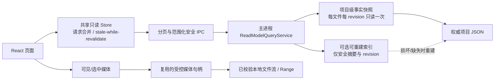

# 生成历史与任务中心性能优化方案

日期：2026-08-28

当前阶段：阶段 9 已收口后的工程性能优化；阶段 10 未启动。

状态：方案已形成，尚未实施。

适用范围：生成历史、本地图片/视频预览、全局任务摘要、任务中心任务详情与调用时间线、消费汇总及其本地 JSON 读模型。

本文件是新增的工程侧说明，不覆盖最终 UI 与开发交接包 V1.2.1，不改变 `AGENTS.md`、`PLANS.md`、阶段 9 收口结论或阶段 10 边界。后续实施必须从最新 `develop` 创建独立 `feature/*` 分支，按本文 PR 顺序小步实施、验收、非快进合并并保留本地与远程功能分支。

## 一、资料优先级与执行边界

本方案依据：

1. 最终 UI 与开发交接包 V1.2.1：任务中心继续承担过程事实，作品库继续承担结果事实；全局任务活动条只是轻量入口，不是第二套任务中心。
2. `docs/active/阶段9-UI与多服务商功能路由最终方案.md`：项目 JSON 继续是权威事实源；允许使用可重建性能索引，但索引损坏或删除后必须能从项目事实重建。
3. 当前实现与 2026-08-28 本地只读诊断结果。

本专项允许修改：

- 与全局任务、作品、调用、消费汇总相关的安全读模型、IPC、preload 和 React 消费端；
- JSON 仓储的批量读取、只读快照、共享缓存、请求合并和可重建索引；
- 生成历史分页、媒体句柄复用、懒加载和安全缩略图缓存；
- 性能基准、读次数断言、故障注入、UI 合同和 Windows Electron 验收工具；
- 新增工程记录，并按完成情况追加 `PLANS.md`。

本专项明确不做：

- 不引入 SQLite、SQL、远程数据库、云同步、微服务或通用事件总线；
- 不把缓存或索引改成事实源，不改变 Task、Execution、Invocation、Work、FileReference 的权威关系；
- 不改变现有生成、恢复、文件校验和作品登记安全门禁；
- 不恢复首页、多图参考、批量创作或其他被禁止能力；
- 不写死服务商、模型、价格、时长、分辨率或数量；
- 不把 Prompt、绝对路径、Hash、Endpoint、凭证、远端 operation、签名 URL 或原始响应加入 renderer DTO、索引或诊断日志；
- 不调用真实服务商，不读取真实凭证，不产生收费请求；
- 不启动安装包、签名、公证、生产更新、生产媒体组件分发、SBOM 或其他阶段 10 工作；
- 不把 Windows 结果宣称为 macOS 已支持，`macos-primary` 继续保持 `required=false`、`not_run/deferred`。

## 二、当前基线与问题分级

### 2.1 本地匿名规模基线

2026-08-28 对 Electron 项目目录执行了只读聚合测量，只统计数量、文件大小和解析时间，没有输出项目名、路径、Prompt、媒体内容或凭证：

| 指标 | 当前值 |
| --- | ---: |
| 项目目录 | 8 个，均可用 |
| Task | 286 |
| Work | 153 |
| ProviderInvocationAttempt | 289 |
| 媒体调用 | 277 |
| 图片作品 | 103 个，约 186.78 MiB |
| 视频作品 | 42 个，约 189.65 MiB |
| 一次 `listTasks()` 估算重复读取量 | 约 12.58 MiB |
| 一次 `listWorks()` 估算重复读取量 | 约 16.15 MiB |
| 生成历史基础扫描，不含详情/句柄/媒体 | 约 28.73 MiB |
| 一次跨项目调用事实全扫描 | 约 1.50 MiB |

以上读取量是按当前实现的调用关系和现有文件大小计算的诊断估算，不是正式端到端性能成绩。PR0 必须补充可重复的 Node/Electron 基准后，才允许记录正式优化前后数据。

### 2.2 问题分级

| 优先级 | 当前事实 | 影响 | 处理结论 |
| --- | --- | --- | --- |
| P0 | `listTasks()` 为每个 Task 重新读取并解析整个 `executions.json` | 任务越多，读取和实体校验近似线性放大；两个常驻组件还会重复轮询 | 先建立项目级批量只读快照，一次读取后在内存分组 |
| P0 | 任务时间线先列出最多 200 条媒体调用，再逐条 `getCallDetails()`，最后才按 `taskId` 过滤 | 一次选中任务可触发 1 + 200 次 IPC，并在主进程重复跨项目扫描 | 新增按 `projectId + taskId` 的单次时间线查询，禁止 renderer 逐条补详情 |
| P0 | `listCallRecords()` 在全部项目和全部调用完成构建、排序后才分页 | `limit` 只减少返回量，不能减少读取与构建成本 | 项目过滤前置；分页建立在轻量摘要或可重建索引上，详情按单条/批次读取 |
| P0 | 生成历史先全局 `listTasks/listWorks`，再逐任务、逐作品取详情和创建句柄 | 打开一个草稿会扫描无关项目、任务和作品 | 新增项目/草稿范围的分页历史读模型，一次完成关系关联 |
| P1 | `GlobalStatusMonitor` 与 `TaskStatusDock` 各自每 5 秒执行同一 `listTasks()` | 常驻重复 I/O、解析和 IPC；进入任务中心后页面再发第三次 | renderer 建立唯一共享任务摘要 Store，事件驱动刷新并保留低频兜底 |
| P1 | 消费汇总是独立全扫描，并在通用存储变更后重新计算 | 活跃任务写入期间会频繁失效，与任务列表和时间线争用磁盘 | 按相关事实 revision 缓存、请求合并、延迟刷新，不阻塞任务列表首屏 |
| P1 | 每个作品句柄都从项目目录开始查找 Work 和 FileReference | 历史作品越多，句柄创建越慢；选中预览还会重复创建句柄 | 句柄请求带安全 `projectId` 并校验归属；复用有效句柄，只为可见/选中媒体创建 |
| P1 | 历史图片使用原图且没有 lazy/async decode；所有视频立即 `preload="metadata"` | 大量原图解码和视频文件打开造成磁盘、解码与渲染争用 | 图片懒加载；视频默认不设置 `src` 或 `preload="none"`，进入视口/选中后再加载 |
| P2 | 仓储 `get/list` 每次读取、解析并完整校验集合，没有跨请求快照 | 即使已经读取过同一 revision，后续请求仍重复做相同工作 | 增加按规范化项目根目录和文件 revision 管理的只读快照缓存与 in-flight 合并 |

## 三、目标与成功标准

### 3.1 功能与安全目标

优化后必须保持：

1. 任务、调用、用量、文件和作品仍以项目事实文件为准。
2. 任务中心的排序、筛选、状态、时间线、恢复资格和消费统计语义不改变。
3. 远端结果未经本地下载、校验和正式 Work 登记前，不能显示为正式作品。
4. 项目不可用、文件损坏、索引损坏、句柄过期或作品文件被删除时，返回明确安全状态，不得使用陈旧缓存伪造成功。
5. renderer 继续只接收安全 DTO；性能索引不保存秘密或被禁止字段。
6. 删除全部性能索引并重启后，系统可只从项目事实文件重建并得到相同业务结果。

### 3.2 硬性读放大门禁

测试必须使用可计数的 `ProjectStorageAdapter`，对 I/O 次数设置确定性断言：

| 场景 | 优化后硬门禁 |
| --- | --- |
| 全局任务摘要 | 每个参与项目的 `tasks.json`、`executions.json` 各最多读取 1 次；禁止按 Task 再读 |
| 全局作品摘要 | 每个参与项目的 `works.json`、`executions.json`、`file-references.json` 各最多读取 1 次；禁止按 Work 再读 |
| 单任务详情与调用时间线 | renderer 只发 1 次业务 IPC；目标项目每类调用事实文件最多读取 1 次；禁止逐调用详情 IPC |
| 生成历史首屏 | renderer 只发 1 次分页历史 IPC；目标项目相关实体文件各最多读取 1 次；不得扫描其他可用项目 |
| 媒体句柄 | 首屏只为选中项和实际进入视口的项目创建；同一 Work 的有效句柄复用；不得为整页历史预创建 |
| 同 revision 并发请求 | 相同查询只有 1 个主进程 in-flight 读取，其余请求共享结果 |
| 常驻任务状态 | 全应用只有 1 个共享刷新源，不允许两个组件各自建立 5 秒轮询 |

### 3.3 性能目标

PR0 在同一 Windows x64 参考环境、同一数据夹具下记录至少 5 次冷读和 20 次热读，保留 median、P95、文件读取字节、JSON 解析次数、IPC 次数和 renderer 长任务。后续 PR 使用同一脚本比较。

硬性相对目标：

- `listTasks()` 冷读 P95 较 PR0 基线下降至少 70%，热读 P95 下降至少 85%；
- 当前规模下，单任务调用时间线 P95 较 PR0 基线下降至少 90%，IPC 从最多 201 次收敛为 1 次；
- 生成历史首屏元数据 P95 较 PR0 基线下降至少 70%，首屏不再等待全部媒体句柄；
- 常驻空闲状态 60 秒内不得发生 24 次 `listTasks()`；没有存储变更时只允许焦点/低频健康检查触发的共享刷新；
- 页面切换和滚动过程中不得因一次批量原图解码持续阻塞 renderer 主线程。

Windows 本地 SSD 的用户体验目标如下，作为参考目标与回归告警，不能脱离机器、磁盘类型和数据规模单独宣称通过：

| 交互 | 冷读目标 | 热读目标 |
| --- | ---: | ---: |
| 任务列表可交互 | 800 ms 内 | 300 ms 内 |
| 首个任务时间线可见 | 800 ms 内 | 300 ms 内 |
| 生成历史最近 20 条元数据可见 | 600 ms 内 | 250 ms 内 |
| 已选本地媒体开始显示/播放 | 1,000 ms 内 | 500 ms 内 |

外接盘、机械盘、断盘和高延迟目录必须单独记录，不用降低业务正确性来追求相同绝对时间。

## 四、目标架构



核心原则是“先减少读取，再缓存；先范围化查询，再分页；先懒加载，再考虑缩略图”。缓存、索引和缩略图都只是可丢弃派生物。

## 五、核心设计

### 5.1 项目级批量事实快照

新增只读查询层，名称可在实现 PR 中最终确定，例如：

```text
ProjectReadSnapshot
  projectId
  projectRootIdentity
  sourceRevisions
  tasksById
  executionsById / executionsByTaskId
  worksById / worksByTaskId / worksByExecutionId
  filesById
  attemptsById / attemptsByTaskId
  eventsByAttemptId
  routesById
  usageByAttemptId
  localResultsByAttemptId
```

规则：

1. 同一次查询中，每份 JSON 只读取和验证一次，然后在内存建立 Map/分组。
2. 快照按规范化绝对根目录、项目 ID 和源 revision 标识；不同项目、重定位前后目录不得共享。
3. 同一 key 的并发构建必须使用共享 in-flight Promise，不能创建多个重复仓储实例并行解析同一文件。
4. 缓存命中前必须核对失效信号或源 revision；缓存不能掩盖不可用项目、损坏 JSON 或文件删除。
5. 写路径继续使用现有共享写协调、原子替换和备份；本专项不把读缓存接入写事务。

### 5.2 范围化查询与分页合同

建议新增或替换为以下安全 IPC；最终命名以实现测试冻结为准：

```text
listTaskSummaries({ projectId?, state?, query?, cursor?, limit })
getTaskTimeline({ projectId, taskId })
listCallRecords({ projectId?, filters..., cursor?, limit })
getCallDetails({ projectId, invocationAttemptId })
getConsumptionSummary({ calendarDays })
listGenerationHistory({ projectId, draftId, mediaKind, cursor?, limit })
createWorkMediaHandle({ projectId, workId })
```

合同规则：

- `limit` 必须在主进程受限，例如 1—100；默认 20 或 50，不由 renderer 任意放大。
- 优先使用稳定游标 `createdAt + id`，避免 offset 在写入期间导致重复或遗漏；旧 offset 合同只做兼容。
- 传入 `projectId` 只用于缩小查找范围，主进程必须再次校验 Task、Invocation、Work 确实属于该项目。
- `getTaskTimeline()` 一次返回任务所需的安全调用详情，不能让 renderer 先取 200 条全项目调用再逐条补详情。
- 调用列表先根据项目和轻量字段筛选、排序、分页，再为当前页构建 DTO；不得先构建所有完整详情。
- 生成历史在主进程内按 `sourceDraftId → Task → Execution → Work/FileReference` 完成关联，只返回当前草稿当前媒体类型。

### 5.3 两层缓存和精确失效

第一层为主进程内存快照与查询结果缓存，必须在 PR1—PR3 完成；第二层磁盘索引为条件项，只有在消灭 N+1 后仍未满足 PR0 指标时才进入 PR5。

内存缓存：

- 以项目事实 revision 和查询参数为 key；
- 相同 key 请求合并；
- Task/Execution 变化只失效任务相关摘要，Invocation/Usage/Route/LocalResult/Work 变化才失效调用与消费汇总；
- 返回值必须不可变或结构化复制，renderer 不得修改共享缓存；
- 设置最大项目数、最大查询数和 LRU/TTL，防止缓存无界增长。

可重建磁盘索引：

- 只保存安全排序键、实体 ID、项目 ID、状态、类型、时间、关系 ID 和源 revision；
- 不保存 Prompt、用户媒体、绝对路径、Hash、Endpoint、凭证、远端 operation、签名 URL、原始响应或堆栈；
- 使用版本号、revision、原子替换和显式校验；
- 缺失、版本过旧、revision 不匹配或内容损坏时丢弃并从事实源重建；
- 提供“删除索引后结果一致”的自动化验收。

### 5.4 renderer 共享任务 Store

`GlobalStatusMonitor`、`TaskStatusDock` 和任务中心不再各自调用 `listTasks()`。新增唯一共享 Store，可使用 `useSyncExternalStore` 或等价实现：

- 首个订阅者触发一次读取，其他订阅者共享 snapshot 和 in-flight；
- 收到精确读模型变更事件后标记 stale 并合并刷新；
- 窗口 focus 可检查 stale，但不能无条件叠加请求；
- 无变更时使用 30—60 秒低频健康兜底，而不是两个 5 秒轮询；
- 活跃任务状态依靠项目事实写入后的变更事件刷新，不伪造进度；
- 页面卸载、窗口关闭和 storage API 变化时正确取消订阅。

现有通用 `localStorageChanged` 可在迁移期保留兼容；目标事件至少区分 `tasks`、`works`、`invocations`、`usage`、`files`、`project_catalog`，避免任意草稿或缓存文件变化触发所有昂贵查询。

### 5.5 消费汇总

当前人民币消费汇总继续使用精确十进制、已核准价格和换算事实，不改变业务语义。性能优化仅改变读取方式：

- 与调用列表共享项目事实快照，不重复读取相同 Invocation/Route/Usage/Work 文件；
- 按 `calendarDays + source revisions` 缓存结果并合并 in-flight；
- 任务列表首屏不等待消费汇总，图表可先显示上一次安全缓存并后台刷新；
- 只在调用、用量、路由、作品登记或换算事实 revision 变化时失效；
- 连续写入期间进行 1—2 秒合并，并保证同时最多一个汇总计算；
- 缺价格、缺用量和待换算数量继续明确显示，不能用性能缓存改写为 0。

### 5.6 媒体加载与缩略图

第一阶段不依赖新的生产媒体二进制：

1. 生成历史默认只取最近 20 条，滚动到边界后再取下一页。
2. 图片增加 `loading="lazy"`、`decoding="async"`，并限制并发解码。
3. 视频列表使用占位卡，默认 `preload="none"`；被选中或进入预加载视口后才设置受控 `src`。
4. 选中预览复用历史项已有且未过期的媒体句柄，不再二次 `createWorkMediaHandle()`。
5. 句柄过期后只刷新对应 Work，不重载整段生成历史。
6. IntersectionObserver 只保留小幅预加载边界，快速滚动时不得为已经离开视口的所有条目继续创建句柄。

缩略图缓存作为后续可选项：

- 图片可使用 Electron/Chromium 已批准的安全解码能力生成固定像素上限的派生缩略图；
- 视频 poster 只有在现有生产可用媒体适配器具备该能力时启用；不得为本专项把 `.tools/` 或 FFmpeg 二进制加入 Git、生产构建或发布物；
- 缩略图按源文件安全标识和版本生成，可删除重建，不替代正式 Work/FileReference；
- 解码失败只影响缩略图，正式作品仍通过原受控媒体流打开。

## 六、分阶段实施计划

当前工作区位于 `feature/task-consumption-summary-cny`，且有未提交的消费汇总改动。本方案只新增文档，不在该脏工作区直接开始性能实现。实施前应先完成或明确处置当前功能分支，再从最新 `develop` 建立下列分支。

### PR0：性能基线与读放大测试

建议分支：`feature/read-model-performance-baseline`

目标：建立可复现基准，冻结正确性和 I/O 计数，避免凭体感优化。

工作项：

1. 新增合成数据生成器，至少覆盖 10 项目、500 Task/Execution、300 Work、1,000 Invocation 和多事件/用量记录。
2. 增加可计数/可延迟的 `ProjectStorageAdapter`，记录读取次数、字节、解析次数和最大并发。
3. 测量 `listTasks`、`listWorks`、任务时间线、调用分页、消费汇总和生成历史首屏。
4. 增加 Electron renderer IPC 计数和媒体元素数量采样，不记录用户内容。
5. 保存机器、磁盘类型、冷/热读方法、样本数、median/P95 和当前失败门禁。

允许修改：基准脚本、测试夹具、诊断计数端口和新增工程记录；不得借 PR0 修改业务查询结果。

验收：基准能在临时项目目录运行；数据固定且无凭证/Prompt；连续两次结果无数量漂移；明确记录当前未达标项。PR0 只记录，不宣称性能已经优化。

### PR1：项目级批量快照，消灭 Task/Work N+1

建议分支：`feature/project-read-snapshots`

目标：让任务和作品摘要的磁盘读取次数由实体数量决定改为由项目数量决定。

主要落点：

- `src/platform/ipc/global-read-model-controller.ts`
- `src/platform/repositories/json-repositories.ts`
- `src/platform/storage/*`
- 新增项目只读快照/分组模块及测试

工作项：

1. 每项目一次读取 Tasks、Executions、Works、FileReferences。
2. 在内存建立 `executionById`、`executionsByTaskId`、`workById`、`fileById`。
3. `listTasks()`、`listWorks()`、`getTaskDetails()`、`getWorkDetails()` 复用同一快照和 in-flight。
4. 保留损坏项目隔离和 `issues` 语义；不能因缓存把 invalid_data 改成成功。
5. 加入 bounded cache 和精确失效接口，但先不改 renderer 轮询。

验收：硬性读次数门禁通过；结果顺序与 DTO 快照一致；不可用/损坏项目测试通过；PR0 数据集的 `listTasks/listWorks` 相对目标通过。

### PR2：任务时间线与调用分页改造

建议分支：`feature/task-timeline-batch-read-model`

目标：移除任务详情的最多 200 次逐条 IPC，并把筛选/分页前置。

主要落点：

- `src/platform/ipc/provider-invocation-read-model-controller.ts`
- `src/pages/tasks/TasksPage.tsx`
- `src/pages/tasks/CallRecordsView.tsx`
- `src/shared/storage-ipc.ts`
- `electron/preload.ts`
- `electron/ipc/storage-ipc.ts`

工作项：

1. 为目标项目一次加载 Invocation、Event、Route、Usage、LocalResult 和 Work 快照。
2. 增加 `getTaskTimeline({ projectId, taskId })`，主进程按媒体 subject 的真实 `taskId` 过滤并一次构建。
3. 任务中心删除 `listCallRecords → N × getCallDetails → renderer 按 taskId 过滤` 链路。
4. 调用列表先选择项目和轻量摘要，再排序分页；当前页才补完整 DTO。
5. 详情请求携带并校验 projectId，避免每次从目录第一个项目开始搜索。
6. 保持调用安全投影和用量/作品登记状态语义不变。

验收：任务时间线 1 次 renderer IPC；目标项目每类事实文件最多读取 1 次；1,000 调用夹具中第一页构建量受 limit 约束；跨项目 ID、伪造 projectId、损坏事件和缺路由均安全失败；PR0 时间线 P95 下降至少 90%。

### PR3：共享任务 Store 与消费汇总缓存

建议分支：`feature/shared-task-read-store`

目标：消除两个常驻 5 秒轮询和页面重复请求，让消费统计不阻塞任务首屏。

主要落点：

- `src/ui/layout/GlobalStatusMonitor.tsx`
- `src/ui/layout/TaskStatusDock.tsx`
- `src/pages/tasks/TasksPage.tsx`
- 新增 renderer 共享只读 Store/hook
- 项目存储变更通知与消费汇总缓存

工作项：

1. 三个任务消费者订阅同一 snapshot 和 in-flight 请求。
2. 用精确变更类型替代通用全失效；保留迁移兼容和低频健康检查。
3. 消费汇总按相关 revisions 缓存、合并请求、限制单并发并后台刷新。
4. 任务列表、详情和消费图表分别呈现 loading/stale/error，图表失败不能卡住任务列表。
5. 处理 React StrictMode、focus、项目切换、窗口关闭和快速连续通知。

验收：同一时刻最多一个 `listTasks`；60 秒空闲调用次数满足门禁；一次变更只产生一次合并刷新；消费汇总无并发风暴；任务状态仍能由真实写入事件及时更新。

### PR4：生成历史分页与按需媒体

建议分支：`feature/generation-history-pagination`

目标：生成历史只读取当前项目和草稿，首屏不再为全部作品创建句柄或加载原始媒体。

主要落点：

- `src/components/GenerationHistory.tsx`
- `src/components/GenerationResultPreview.tsx`
- `src/platform/ipc/global-read-model-controller.ts` 或独立历史读模型
- `src/platform/ipc/controlled-local-media.ts`
- Storage IPC/preload 和 UI 合同测试

工作项：

1. 增加 `listGenerationHistory` 稳定游标分页，默认 20 条。
2. 主进程在目标项目快照内完成 Draft/Task/Execution/Work/FileReference 关联。
3. 历史 DTO 只返回安全元数据，不提前创建媒体句柄。
4. 句柄请求带 projectId 并校验；有效句柄按 Work 复用。
5. 图片 lazy/async decode；视频进入视口/选中后才设置 src，默认不预读全部 metadata。
6. `GenerationResultPreview` 优先消费已选历史项的有效句柄，避免重复句柄与重复文件打开。
7. 处理游标期间新增作品、句柄 TTL、文件删除、快速切换草稿和组件卸载。

验收：历史首屏 1 次元数据 IPC；不读取其他项目；媒体句柄数不超过选中项加可见预加载项；未进入视口的视频没有受控 src；当前数据集首屏相对目标通过；图片/视频拖拽和作品校验语义保持。

### PR5：条件式可重建索引与缩略图缓存

建议分支：`feature/rebuildable-read-index`

启动条件：PR1—PR4 已通过，但 10 项目/1,000 调用或当前 Windows 冷读仍未达到性能目标。若已达标，PR5 只保留设计，不实施磁盘索引，避免过度复杂化。

工作项：

1. 实现安全、版本化、可删除的任务/调用排序分页索引。
2. 索引写入使用原子替换；源 revision 不匹配时重建。
3. 增加损坏、部分写、旧版本、项目重定位和删除索引故障注入。
4. 评估图片缩略图缓存；视频 poster 仅在已有生产媒体能力可用时实施。
5. 设置容量上限和清理策略，缓存清理不能删除正式作品。

验收：索引有/无/损坏三种状态返回相同业务结果；索引内容安全扫描通过；不引入 `.tools` 或生产 FFmpeg；性能目标达到后记录实际收益和维护成本。

### PR6：Windows Electron 性能收口

建议分支：`feature/read-model-performance-closeout`

目标：执行完整回归、真实窗口测量和证据归档，不新增业务能力。

验收矩阵：

- 当前真实匿名规模和 PR0 合成规模；
- 冷启动、热切页、连续任务写入、快速切换任务、快速滚动生成历史；
- 图片与视频混合、句柄过期、作品文件删除、项目断盘/恢复；
- 索引删除/损坏后的重建；
- `800x720`、`1440x900` 和 `1920x1080`；
- Windows 生产 Electron 响应、可见窗口、正常关闭和残留进程；
- 完整 Node、Vitest、TypeScript、ESLint、生产构建、平台审计、交接包校验、安全扫描和 `git diff --check`。

收口记录必须同时写明：优化前后 median/P95、I/O/IPC/媒体句柄数量、未达目标项、磁盘类型、测试规模、失败或跳过原因。没有真实结果不得宣称完成；Windows 通过不代表 macOS 已验证或阶段 10 已启动。

## 七、关键故障与回退策略

| 故障 | 必须行为 |
| --- | --- |
| 项目目录不可用 | 从结果中隔离并返回既有 `unavailable` issue；不得用旧缓存显示为实时成功 |
| JSON 主文件损坏、备份有效 | 继续按现有备份读取规则返回，并记录来源；缓存 key 使用实际加载 revision |
| JSON 主文件和备份均损坏 | 返回 `invalid_data`，不得让索引覆盖损坏事实 |
| 索引缺失/损坏/过期 | 删除或忽略索引，从项目事实重建；业务仍可用但可暂时较慢 |
| 快照构建期间发生写入 | 通过 revision 检查丢弃不一致快照并有界重试；不能混合两个 revision |
| 连续存储通知 | 合并失效和刷新，保持最多一个 in-flight；最终必须看到最新 revision |
| 句柄过期 | 只为对应 Work 重建句柄，不重跑全部历史 |
| 媒体文件删除或变成目录 | 返回媒体不可用，不能继续使用旧 URL 或标记为正式可播放 |
| 缩略图生成失败 | 显示安全占位并允许按需打开原受控媒体；不影响 Work 事实 |
| renderer 快速卸载/切换 | 忽略过期响应并释放订阅；不能将上一草稿或上一项目结果写入当前页面 |

## 八、测试与证据清单

每个实现 PR 至少覆盖：

1. 结果等价测试：优化前后任务、调用、用量、作品顺序和状态一致。
2. I/O 次数测试：按“每项目每文件一次”断言，不只测运行时间。
3. 请求合并测试：10—50 个并发相同查询只建立一个底层读取。
4. revision 失效测试：写入后旧缓存不再返回；无关文件变化不失效昂贵查询。
5. 安全 DTO 和索引扫描：禁止字段零命中。
6. 分页稳定性测试：同 timestamp、分页期间新增记录、游标篡改和 limit 越界。
7. 媒体测试：懒加载、视频无预读、句柄复用/过期、中文路径、Range 和文件缺失。
8. UI 生命周期测试：StrictMode、focus、项目切换、组件卸载、连续变更通知。
9. 故障注入：断盘、损坏 JSON、损坏索引、半写、重建失败和并发写入。
10. Windows Electron 可见验收：真实页面、滚动和切换行为，不能只用静态合同代替。

所有性能诊断日志只允许记录：查询种类、项目数量、实体数量、revision、耗时、读取字节、缓存命中、IPC 次数和安全错误码。不得记录项目名、绝对路径、Prompt、媒体内容、Token、Endpoint、远端 operation 或原始响应。

## 九、推荐执行顺序与停止条件

固定顺序：

```text
PR0 基线
  → PR1 批量快照
  → PR2 时间线/调用分页
  → PR3 共享 Store/消费缓存
  → PR4 历史分页/按需媒体
  → 条件判断是否需要 PR5 索引/缩略图
  → PR6 Windows 收口
```

出现以下情况必须停止当前 PR，并在 `PLANS.md` 记录阻断：

- 需要改变权威事实源或引入数据库才能继续；
- 需要把被禁止字段写入 renderer、索引、缓存或日志；
- 需要恢复被禁止的业务入口或修改最终导航；
- 需要真实服务商请求、真实凭证、收费调用或已耗尽预算的 Vidu 调用；
- 需要把 `.tools`、FFmpeg 二进制或未批准媒体组件加入生产构建；
- 性能提升依赖跳过文件校验、结果登记或损坏数据检查；
- 当前消费汇总功能分支未处置，导致实施文件范围重叠且无法安全保留用户改动；
- 完整门禁或 Windows Electron 验收出现无法解释的失败。

## 十、当前结论与下一步

本方案确认性能问题可在现有本地 JSON 架构内解决，不需要数据库，也不需要修改产品信息架构。最高收益路径是先消灭任务、作品和调用详情的 N+1，再合并常驻刷新和消费汇总缓存，随后把生成历史改成范围化分页与按需媒体；只有上述措施仍不足时才实施磁盘索引和缩略图缓存。

当前只完成方案设计与匿名基线诊断，没有实施代码、没有改变当前消费汇总功能、没有运行完整工程门禁、没有调用真实服务商，也没有启动阶段 10。下一步需由项目负责人明确批准启动 PR0；批准后应先处置当前 `feature/task-consumption-summary-cny` 的未提交改动，再从最新 `develop` 创建 `feature/read-model-performance-baseline`。
