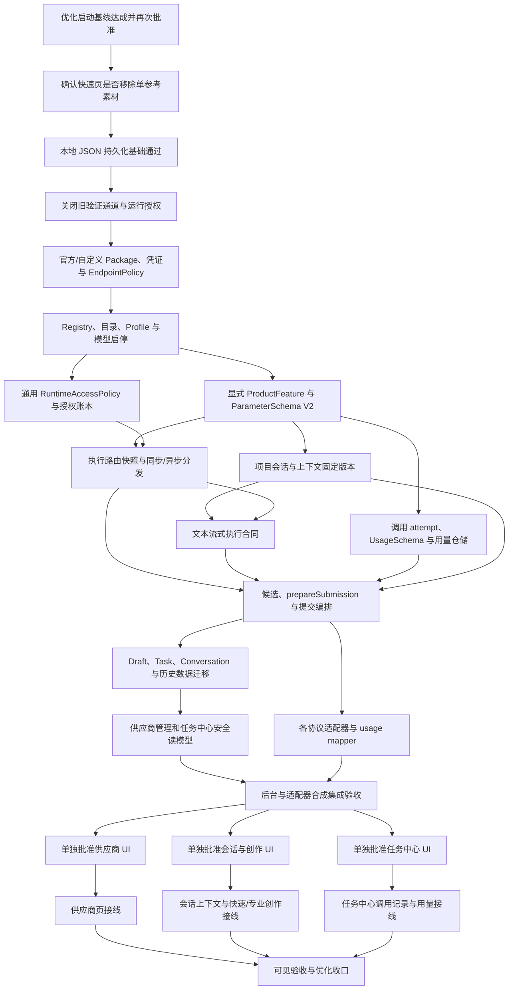

# 阶段 9｜供应商、会话创作与调用记录优化方案（规划修订版）

日期：2026-07-31

状态：项目负责人已重新指定用户流程；本版原有“优化启动基线”内容保留为历史规划快照。2026-09-01 最新决策新增阶段 9 智能文档工作流扩展，覆盖 LLM 意图与参数计划、企业资料 RAG、经授权联网搜索、受控工具链、渲染校验和有限自动修正；具体实现仍须按阶段 9 扩展任务拆分从 `develop` 创建独立 `feature/*` 分支并逐项验收，不修改代码、不联网、不验证凭证、不产生收费。本文新增的无数据库、本地文件持久化、事实源和执行闸门继续有效。

### 负责人最新补充（2026-09-01）

阶段 9 智能文档扩展采用“LLM 规划、Application 校验、Platform 执行”的受控 Agent 工作流，不开放无界自主 Agent。企业资料优先本地 RAG，BM25 保留为回退；向量检索和具体 embedding/数据库选型须经过脱敏评测与单独批准。联网搜索仅在用户明确授权且本地资料不足或用户要求最新公开信息时启用，必须有外发脱敏、来源/时间/Hash、域名策略、预算、缓存、取消和离线回退。外部网页、附件和项目上下文始终是不可信参考资料，不能覆盖系统指令。详细 E1-E6 任务与验收以 `docs/active/阶段9-任务拆分.md` 第十九节为准。

本文不再使用未定义的“第一版完成”。“优化启动基线”是未来里程碑，不是当前已有的分支、Tag、安装包或文档，必须同时满足：

1. 阶段 9 的 A3、B4、A4 已完成、验收并合并 `develop`；
2. 阶段 9 的 macOS 实机、Windows 人工项及其他阻断已完成，或由项目负责人逐项批准范围排除；
3. 当前未优化的用户流程已经使用获批的真实 API 完成生图和生视频闭环，结果通过本地校验并登记 Work；当前 C2 流程 8 的 Vidu 真实验证事实可以作为证据，但不得恢复已用尽的收费预算；
4. `AGENTS.md`、`PLANS.md` 和阶段 9 最终验收记录明确写明阶段 9 已收口；
5. 项目负责人另行批准启动本优化方案中的具体分支。

当前 `develop@6df95b9` 只包含已完成的阶段 9 工作和 C2 真实最小闭环证据，不满足上述第 1、2、4 项，因此不是“优化启动基线”。

## 一、最终结论

结论：整体可行，但必须以“已支持协议的自定义连接、显式功能与模型选择、版本化参数 Schema、固定上下文快照、适配器白名单用量解析”为前提。任意 API 自动兼容、按素材猜功能和缺失用量补零均不可行。

本方案规划一条从配置到调用记录的完整用户链：

1. 用户只在“模型与服务商”页添加官方或自定义兼容连接，并启用模型；
2. 对话、快速创作和专业创作只选择已有的服务商、连接和模型，绝不在功能页创建连接；
3. 会话属于项目，只有登记为项目上下文并在专业页再次显式选择的内容才参与媒体生成；
4. 快速创作只展示用户必须填写的参数，专业创作展示当前协议全部安全且用户可调的参数；
5. 任务中心统一查看每次业务调用、状态时间线和上游实际返回的用量事实。

核心结构固定为：

```text
一个服务商包
  -> 一个或多个协议族适配器
  -> 多个服务商模型记录
  -> 每个模型的版本化功能档案
```

不得每模型创建一个适配器，也不得把同一服务商的文本、图片和视频协议塞入一个巨型适配器。

产品只向用户表达“要完成什么功能”“使用哪个服务商/连接/模型”“将向谁外发什么内容”“调用处于什么状态”和“上游实际报告了多少用量”。协议、适配器、能力证据、endpoint、凭证、远端 operation ID、签名 URL 和原始响应均由主进程管理。

本方案属于“有前置条件的可实施方案”。在以下基础契约合并前，不得开放任何新增服务商或模型到真实创作页面：

- 正式运行授权与流程 8 验证授权分离；
- Provider Package 持久化归属和安全分发；
- 多服务商执行路由快照及异步分发；
- ProductFeature、ModelFeatureProfile 和历史数据迁移；
- 主进程候选查询、一次性选择令牌和提交编排；
- 文本流式执行、项目上下文固定版本与结构化凭证契约；
- 统一调用记录、版本化 UsageSchema 和脱敏用量事实。

## 二、权威依据与冲突处理

发生冲突时依次采用：

1. 项目负责人最新明确决策；
2. 最终 UI 与开发交接包 V1.2.1；
3. `AGENTS.md`、`PLANS.md` 和本方案；
4. `docs/active/`、`docs/frozen/` 中的正式工程记录；
5. 旧页面、旧截图、外部方案稿和历史归档。

最终 UI 交接包位置：

```text
handoff/UniComp-技术开发启动包-V1.0.0/03-最终UI交接包-已解压/UniComp-AI-最终UI与开发交接包-V1.2.1/
```

外部文件《阶段9-UI视觉对齐与逐按钮接口验收设计方案》只有在补齐仓库位置、版本和 Hash 后，才能作为视觉诊断与按钮清单来源。其“连接、模型目录、能力与路由三栏”设计由本方案替换。

## 三、当前事实与运行安全边界

### 3.1 已确认事实

- C2 流程 1—8 已合并 `develop`；
- 流程 8 仅完成 `q3-lite` 参考生图和 `viduq3-turbo` 图生视频各一次 Windows 开发态验证；
- 两项真实 Vidu 收费预算均已用尽，不得继续发起真实 Vidu 请求；
- Vidu Image V1 鉴权及 `images` 输入结构仍未验证，不因其他协议通过而晋级；
- 流程 8 的 `passed` 只是一项能力事实，不是后续正式运行授权；
- DeepSeek、豆包视觉、Seedance、可灵和 NewAPI 尚未因本方案获得真实联网或收费测试批准；
- macOS 未执行项继续保持 `not_run/deferred`；
- 阶段 10 的安装包、签名、公证、生产更新、SBOM 和媒体组件分发不在本方案范围内。

### 3.2 四类事实必须分离

```text
ModelFeatureProfile / CapabilityEvidence
  = 模型和协议具备什么能力

ConnectionAvailability
  = 当前连接是否已验证可用

RuntimeAccessPolicy
  = 当前环境是否允许该连接和协议发起真实请求

SubmissionConfirmation
  = 用户是否确认本次外发范围和费用事实
```

四项同时满足，才允许进入真实 HTTP 提交。任何一项不得替代另一项。

`CapabilityEvidence=system_observed`、流程 8 `status=passed` 或模型 `enabled=true` 均不得自动修改 `RuntimeAccessPolicy`。

### 3.3 正式运行授权

建议增加主进程内部策略：

```ts
type RuntimeAccessState =
  | 'blocked'
  | 'validation_only'
  | 'interactive_allowed';

interface RuntimeAccessPolicy {
  readonly policyId: string;
  readonly providerPackageId: string;
  readonly connectionId?: string;
  readonly adapterKey?: string;
  readonly state: RuntimeAccessState;
  readonly revision: number;
  readonly allowedOperations: readonly (
    | 'submit'
    | 'query'
    | 'cancel'
    | 'receive_result'
  )[];
  readonly approvedScope?: string;
  readonly maximumSubmissions?: number;
  readonly expiresAt?: string;
}

interface RuntimeAuthorizationClaim {
  readonly claimId: string;
  readonly policyId: string;
  readonly policyRevision: number;
  readonly routeSelectionNonce: string;
  readonly idempotencyKey: string;
  readonly allowedContinuationOperations: readonly (
    | 'query'
    | 'cancel'
    | 'receive_result'
  )[];
  readonly state:
    | 'claimed'
    | 'request_started'
    | 'outcome_recorded'
    | 'released_before_request';
  readonly claimedAt: string;
  readonly requestStartedAt?: string;
}
```

要求：

- 流程 8 收口后，Vidu 的测试策略必须进入 `blocked`，不能因为记录为 `passed` 继续放行；
- `validation_only` 只接受单独批准的验证规格、次数和有效期；
- `interactive_allowed` 必须由新的实现计划明确批准，不能由用户保存 Key、验证连接或启用模型自动产生；
- 用户每次提交仍需完成本次外发和费用确认；
- 策略存入主进程持久化授权账本；没有精确匹配的策略时默认拒绝；
- 同时存在多条策略时，connection + adapter 的最具体拒绝优先于宽泛允许；
- 新提交在 HTTP 前按策略 revision 和幂等键原子 claim 次数；请求一旦开始，claim 不返还；
- 授权账本按未释放 claim 计算已用次数，并保证同一 nonce 和幂等键最多存在一个 claim；
- 已被远端接受的在途 operation 使用提交时的授权 claim 继续执行 query、cancel 和 receive_result，后续禁止新提交不应破坏结果收口；
- 只有显式安全吊销才能阻止在途 operation，阻止后必须记录不可恢复原因；
- 未知提交结果不得自动重试，也不得静默切换模型、连接、协议或服务商；
- 运行授权失败必须在 HTTP 前返回，HTTP 调用数为 0。

### 3.4 无数据库与本地文件持久化边界

本方案明确不引入 SQLite、SQL、远程数据库、云同步、微服务或通用事件总线。未来优化版以项目目录和 Electron `userData` 下的版本化本地文件为唯一持久化基础；内存中的事件只能作为运行态，不能冒充已保存事实。

持久化按所有权划分：

| 事实归属 | 权威位置 | 典型内容 |
| --- | --- | --- |
| 项目级 | 当前项目根目录 | Conversation/Message、ProjectContext、Draft、Task、Execution、ProviderInvocationAttempt/Event、UsageObservation、LocalResultObservation、Work、FileReference、SubmissionIntent 恢复事实 |
| 应用级 | Electron `userData` | Provider Package/Connection/Model Registry、加密凭证、应用设置、项目目录索引、供应商管理审计、诊断日志和缓存 |
| 运行级 | 主进程内存 | IPC 请求、页面点击、短期流式片段、轮询 tick、窗口生命周期通知；只有影响恢复、计费或结果登记的状态转换才写入上述权威文件 |
| 性能级 | 可重建索引 | 跨项目任务/调用列表的排序和分页索引；索引损坏时必须从项目文件重建，不能成为事实源 |

目标项目目录的结构只作为实现约束示意，具体文件名须在对应仓储合同中冻结：

```text
<project-root>/
  project.json
  entities/          # 项目实体、会话/消息、任务、执行、调用和用量事实
  journals/          # SubmissionIntent 与崩溃恢复记录
  index/             # 项目内可重建索引
  files/             # 已校验并正式发布的本地结果
  tmp/               # 同项目暂存和未完成接收
```

所有项目文件使用版本化 JSON 或等价结构化本地文件，并遵守：同路径共享写入协调、revision/CAS、同目录临时文件、文件 `fsync`、原子替换、目录同步、有效备份和显式迁移。不得用每个控制器自己的实例级队列声称并发安全。

项目元数据事务、应用级授权账本和安全凭证库是不同存储域，不能宣称跨文件系统的单事务。提交编排使用“项目元数据单元的原子写入 + 全局授权 claim 的幂等 reservation/commit/release + 可恢复意图日志”协调；崩溃后按幂等键恢复或标记结果未知，不重复收费提交。

持久化边界还包括：

- Token、Authorization、签名 URL、完整响应正文和原始远端结果不得写入项目或应用记录；远端结果先进入主进程受控暂存区，再以不透明句柄、媒体属性、Hash、FileReference 和 Work 事实落盘；
- 原始用户媒体可以继续位于项目外部，项目只保存受控 `FileReference`、校验事实和用途；正式生成结果通过校验后发布到项目 `files/`；
- 供应商注册和凭证不随项目复制。项目历史只保存稳定连接/配置版本引用和非秘密路由快照；换机器或打开项目时必须重新绑定可用凭证；
- 供应商连接验证和模型同步属于应用级管理审计，不创建项目生成调用记录；任务中心的生成调用时间线只读取项目级 Invocation 事实。

当前第一版至少有四项与目标边界不同，不能在规划中倒写成已经完成：

- Conversation/Message 目前位于应用级 `userData/conversations.json`，而 ProjectContext 位于项目目录；优化迁移必须把新项目会话改为项目所有，保留 `projectId=null` 历史会话为只读，并由用户显式复制到项目，禁止自动归属或跨项目读取；
- `ProviderInvocationAttempt/Event`、`ProviderUsageObservation/Summary` 和 `LocalResultObservation` 尚未实现，`projectStoragePaths` 也没有这些新仓储路径；
- 现有 `ProviderOperationRecord` 的旧结果合同可能包含 `remote_url`、Base64 或 `file_uri`，部分异步结果也只存在进程内存；迁移后只能作为只读 legacy 事实，新的提交必须改用不透明结果句柄、远端收据和受控结果接收链；
- 现有若干 JSON 仓储的写队列是实例级，而控制器会重复创建仓储实例；优化版必须先建立按规范化绝对路径共享的 writer/CAS 协调器，并用并发、半写和崩溃恢复测试证明不会丢更新。

### 3.5 四类权威事实源

本节的四类事实源与 3.2 的四项提交前门禁不同。3.2 回答“本次请求能不能提交”；本节回答“哪份持久化事实可以被系统信任”：

| 事实源 | 权威内容 | 主要位置 | 禁止的替代来源 |
| --- | --- | --- | --- |
| `ProviderCapabilitySource` | ProviderPackage、ModelDefinition、ModelFeatureProfile、CapabilityEvidence，回答“能做什么” | 应用级 Registry 与不可变 Evidence | 模型名称、`enabled`、当前页面或 `/models` 名称推断能力 |
| `RuntimeAuthorizationSource` | RuntimeAccessPolicy、AuthorizationClaim，回答“现在是否允许提交或继续 query/cancel” | 应用级授权账本 | 流程 8 `passed`、连接验证成功或保存 Key |
| `InvocationLifecycleSource` | SubmissionIntent、ProviderInvocationAttempt/Event、ConversationResponseExecution，回答“外发处于什么状态” | 项目级实体与追加事件文件 | Task 状态、远端响应正文、当前配置或轮询次数推断状态 |
| `ResultAndUsageSource` | ProviderUsageObservation/Summary 与 LocalResultObservation、FileReference、Work，分别回答“上游报告了什么用量”和“本地结果是否可信” | 项目级实体与结果文件 | 价格表、余额差、文件名、索引或互相推导 |

`Execution.taskId` 和 `Work.sourceExecutionId` 是目标关系事实；旧 `Task.executionIds`、`Execution.workId` 只能作为兼容投影。`ProviderOperationRecord` 只保留受控远端收据和句柄，不能单独决定 Invocation 生命周期。任何页面、任务中心和恢复服务只能从相应事实源读取；索引损坏时从项目事实重建。

## 四、范围与禁止事项

### 4.1 本方案覆盖

- 全局壳层、现有一级页面、图片五页、视频四页和已批准页面的视觉对齐；
- `800x720` 至 `1920x1080` 的桌面响应式布局；
- 服务商模板、连接、结构化凭证、连接验证、模型发现和模型启停；
- Provider Package Registry、Adapter Registry 和版本化功能档案；
- 文本、图片、视频的强类型候选查询、提交、查询、取消和结果接收；
- 对话文本流式响应，不把对话页改成图片或视频直接生成入口；
- 动态参数 Schema、一次性候选令牌、提交前确认和结果本地登记；
- 自动化、Electron 可见验收和逐按钮追踪。

### 4.2 本方案不批准

- 新增业务一级页面或恢复“首页”；
- 海螺适配器；
- 多图参考、图片批量创作或视频批量创作；
- 对话页直接生成图片或视频；
- 登录、会员、充值或云同步；
- 在 React 页面写死服务商、模型、价格、时长、分辨率或数量；
- 自动读取真实凭证、真实联网或收费请求；
- 引入 SQLite、SQL、远程数据库、云同步或微服务作为本方案的持久化基础；
- 保存连接后自动取得真实运行授权；
- 自动启动 A3、B4、A4 或阶段 9 收口；
- 安装包、签名、公证、生产更新、SBOM 或生产媒体组件分发。

## 五、用户产品流程

### 5.1 唯一总流程

```text
模型与服务商页
  -> 添加官方连接或自定义兼容连接
  -> 验证连接并发现/登记模型
  -> 用户启用模型
  -> 进入对话、快速创作或专业创作
  -> 用户显式选择服务商 / 连接 / 模型
  -> 填写当前功能允许的参数
  -> 必要时显式选择项目上下文或单张素材
  -> 确认本次外发范围和已知费用事实
  -> 主进程冻结路由、参数、上下文和素材快照
  -> 协议适配器执行
  -> 任务中心显示调用状态和上游用量事实
  -> 媒体通过本地校验后登记 Work
```

连接创建、凭证写入、连接验证和模型同步只存在于“模型与服务商”页。对话、图片、视频和任务中心不得创建、修改或验证连接，也不得因为没有候选而临时生成连接。

### 5.2 添加官方服务商

```text
点击“添加供应商”
  -> 选择“官方”
  -> 选择内置官方服务商模板
  -> 填写模板定义的凭证字段
  -> 原子保存连接元数据和本机安全凭证
  -> 执行无费用的连接验证
  -> 按 Package 策略同步或加载模型目录
  -> 用户启用需要使用的模型
```

官方 endpoint 固定或由 Package 的受控区域选项生成，普通用户不得编辑任意 URL、`adapterKind`、`protocolId` 或签名规则。服务商模板来自主进程 Provider Package Registry 的安全 DTO，不在 React 页面硬编码。

连接验证只改变 `ConnectionAvailability`。验证成功不等于模型具备某项功能，不自动创建 `ModelFeatureProfile`，不自动授予正式运行权限，也不触发任何生成请求。

没有无费用验证方式时，连接保持 `unverified`，不得进入可提交候选。未来若批准收费验证，必须另有次数、金额、有效期和停止条件。

### 5.3 添加自定义兼容服务

```text
点击“添加供应商”
  -> 选择“自定义”
  -> 先选择已支持的兼容协议模板
  -> 填写显示名、Base URL 和该协议要求的凭证
  -> EndpointPolicy 安全校验
  -> 原子保存连接元数据和本机安全凭证
  -> 执行协议允许的无费用验证
  -> 发现模型，或登记精确的 model/deployment ID
  -> 用户启用已有功能档案支持的模型
```

“自定义 API”严格表示“自定义地址的已支持兼容协议”。本规划首批只列出待实现并验收的 NewAPI-compatible 包；OpenAI-compatible 或其他协议只有在新增明确 Package、协议版本和适配器分支后才能出现在产品入口。产品不得承诺只凭 URL 和 Key 自动兼容任意 REST API；未知鉴权、请求体、轮询、取消、结果和 usage 格式必须通过新的协议适配器支持。

`/models` 只证明远端存在某个模型标识，不能证明它支持生图、生视频或对话。无法精确匹配受控 Model Definition/Profile 的模型可以留在目录中，但状态必须为“尚不可用于创作”，不得根据模型名称猜功能。

### 5.4 发起会话并登记项目上下文

优化后的新会话必须属于当前项目。每次助手回复由用户显式选择已有的服务商、连接和文本模型；可以记住上次选择用于界面预填，但不能自动提交、静默故障转移或在失败后切换模型。

```text
项目内发起会话
  -> 用户选择服务商 / 连接 / 文本模型
  -> 发送消息并获得受控流式回复
  -> 用户选择已完成的消息片段
  -> 登记为 ProjectContext 的新 revision
  -> 专业创作页按需打开上下文选择器
  -> 查看并勾选用于本次生成的上下文
  -> 提交时冻结 revision、contentHash 和外发内容快照
```

切换到专业生图、文生视频或图生视频页面不会自动读取、拼接或外发整个会话。快速生图和快速视频不使用会话上下文。对话页仍只产生文本回复，不得直接创建图片或视频任务。

### 5.5 使用创作功能

```text
进入具体功能
  -> 页面保存带显式 ProductFeature 的草稿
  -> 主进程查询当前服务商 / 连接 / 模型候选
  -> 用户明确选择一个候选并取得 ParameterSchema
  -> 用户填写参数并选择允许的上下文/素材
  -> 页面保存最终草稿或 ConversationResponseDraft revision
  -> 主进程 prepareSubmission 重新校验并签发一次性选择令牌
  -> 用户核对外发与费用事实并确认提交
  -> 主进程复核同一 revision 并原子接受 SubmissionIntent
  -> 建立一次 ProviderInvocationAttempt
  -> 路由到对应协议适配器
  -> 追加状态和用量事实
  -> 本地校验结果后登记 Work 或写入对话消息
```

一次性模型选择令牌必须绑定填写完成后的最终草稿或 ConversationResponseDraft revision。ProductFeature、参数、素材、上下文、连接、模型、Profile、ParameterSchema、UsageSchema、运行授权或费用事实变化后，旧令牌和旧确认必须失效。

即使只有一个候选，也不得自动选择、自动提交或绕过提交前确认。没有候选时只能解释原因并提供前往“模型与服务商”页的导航。

### 5.6 普通用户界面不得暴露

- `adapterKind`、`protocolId`、`endpointTemplate` 和签名规则；
- 手工编辑 CapabilityEvidence、模型功能或默认路由优先级；
- 远端 operation ID、签名下载 URL、Token 或凭证回显；
- 任意 JSON 请求/响应透传；
- 只用于流程 8 的 Vidu 最小闭环入口。

## 六、产品功能与现有内部用途

### 6.1 产品功能

页面和应用服务使用稳定的产品功能，不使用页面名、服务商名或模型名作为路由条件：

```ts
type ProductFeature =
  | 'text_chat'
  | 'text_reasoning'
  | 'image_understanding'
  | 'image_to_prompt'
  | 'text_to_image'
  | 'reference_to_image'
  | 'image_edit'
  | 'text_to_video'
  | 'image_to_video';
```

`ProductFeature` 是面向产品和候选查询的分类，不直接替换已经持久化的 `ProviderOperationPurpose`。

### 6.2 显式兼容映射

本优化版映射固定为：

| ProductFeature | 现有内部用途 | 规则 |
|---|---|---|
| `text_chat` | 新文本执行合同 | 不伪装为媒体 Task |
| `text_reasoning` | 新文本执行合同 | 与普通聊天显式区分 |
| `image_understanding` | `image_understanding` | 单张受控图片 |
| `image_to_prompt` | `image_to_prompt` | 单张受控图片和结构化输出 |
| `text_to_image` | `image_generation` | 无参考图片 |
| `reference_to_image` | `reference_to_image` | 单张参考图片 |
| `image_edit` | `image_editing` | 单张原图 |
| `text_to_video` | `video_generation` | 不含参考素材 |
| `image_to_video` | `reference_to_video` | 恰好一张图片素材 |

映射必须带版本并写入确认及执行快照，不允许字符串模糊匹配，也不允许执行时根据当前素材重新猜测历史任务用途。

### 6.3 快速与专业不是协议适配器

快速/专业是表单投影和产品约束，不是新的协议，也不创建独立适配器：

```text
同一个 ProductFeature
  + 同一个协议族适配器
  + 同一个版本化 ParameterSchema
  -> 快速页使用 required_only 投影
  -> 专业页使用 full 投影
```

快速页只渲染 `user_required` 字段。可省略字段不发送，由服务商使用其官方默认值；不得用首个枚举、最小值、空字符串或 `false` 猜默认值。

专业页渲染 `user_required + user_optional`，但“全部参数”只指当前模型和功能下全部安全、受控、用户可调的业务参数，不包含 Token、endpoint、签名、回调 URL、模型覆盖、批量数量、重试、轮询或内部安全字段。

### 6.4 本方案拟定的快速页规则

为消除素材存在与否导致协议静默切换的问题，本优化方案建议：

- 快速生图固定为 `text_to_image`，不接收参考图；
- 快速视频固定为 `text_to_video`，不接收参考素材；
- 专业生图通过显式分段控件选择 `text_to_image` 或 `reference_to_image`；
- 图生视频页面固定为 `image_to_video`，恰好一张受控图片。

该建议会在未来优化范围内覆盖最终 UI 交接包中“快速页可选单个参考素材”的旧规则，因此必须在第一个实现分支开始前由项目负责人再次明确确认。确认前不修改权威原件或优化启动基线之前的现有实现；若未确认，则必须改为显式功能选择，仍不得根据是否存在素材静默猜测 ProductFeature。

## 七、Provider Package 与安全分发契约

### 7.1 服务商包

建议建立：

```ts
interface ProviderPackageDescriptor {
  readonly packageId: string;
  readonly packageVersion: string;
  readonly templates: readonly ProviderTemplateDescriptor[];
  readonly credentialSchemas: readonly CredentialSchema[];
  readonly adapters: readonly ProviderAdapterDescriptor[];
  readonly modelDefinitions: readonly ProviderModelDefinition[];
}

interface ProviderTemplateDescriptor {
  readonly templateId: string;
  readonly kind: 'official' | 'compatible_custom';
  readonly credentialSchemaId: string;
  readonly credentialSchemaVersion: number;
  readonly connectionPolicyId: string;
  readonly connectionPolicyRevision: number;
  readonly discoveryPolicyId: string;
  readonly discoveryPolicyRevision: number;
  readonly endpointPolicyId: string;
  readonly endpointPolicyRevision: number;
}
```

首批包结构：

```text
ProviderPackageRegistry
├─ DeepSeekProviderPackage
│  └─ DeepSeekChatAdapter
├─ VolcengineProviderPackage
│  ├─ DoubaoVisionAdapter
│  └─ SeedanceVideoAdapter
├─ KlingProviderPackage
│  └─ KlingVideoAdapter
├─ ViduProviderPackage
│  ├─ ViduImageV1Adapter
│  ├─ ViduGeminiImageV2Adapter
│  └─ ViduReferenceVideoV2Adapter
└─ NewApiProviderPackage
   ├─ NewApiChatAdapter
   ├─ NewApiImageAdapter
   └─ NewApiVideoAdapter
```

`Provider` 或 `ProviderConnection` 必须持久化稳定的 `packageId`、`templateId`、凭证/连接/目录/endpoint 策略版本。官方和自定义兼容模板可以属于同一 Package，但各自引用独立策略；验证、模型发现、提交、查询、取消和结果接收均按稳定 ID 分发，不得按显示名称或模型名称判断。

Package 发布的是按官方精确模型标识定义的 `ProviderModelDefinition` 和 Profile 模板，不携带运行时生成的内部 model ID。同步目录或登记部署时，主进程只能按精确 `providerModelKey`、受控部署 ID 或人工选择的官方 definition ID 实例化连接专属 ProviderModel 与 Profile。未知标识保持无 Profile，不允许按显示名、前缀、后缀或相似字符串猜测。

创建连接时，主进程必须确认模板确实属于对应包。包、模板或适配器不存在时，在任何凭证读取和 HTTP 之前失败。

### 7.2 安全模板 DTO

renderer 只读取：

- `templateId`、安全显示名和可选图标资源 ID；
- Base URL 是否固定、可选或必填；
- 凭证字段的标签、是否必填和是否秘密；
- 是否提供免费连接验证；
- 模型发现类型及安全状态文案。

renderer 不读取：

- 固定 endpoint 模板和签名细节；
- adapter key、protocol ID 和内部绑定；
- 凭证值、凭证引用或签名中间值；
- Evidence 来源、内部约束 Hash 和仓储路径。

### 7.3 结构化凭证

凭证不能继续假设每个连接只有一个字符串。建议：

```ts
interface CredentialSchema {
  readonly schemaId: string;
  readonly version: number;
  readonly fields: readonly {
    readonly key: string;
    readonly label: string;
    readonly secret: boolean;
    readonly required: boolean;
    readonly kind: 'token' | 'access_key' | 'secret_key' | 'string';
  }[];
}
```

要求：

- renderer 只写不读秘密字段；
- Vault 按 schema 版本加密保存结构化记录；
- Authorization、AK/SK 签名、JWT 或查询签名只在主进程生成；
- 日志、错误 DTO、遥测和 Git 不得包含秘密值；
- 替换凭证产生新的内部版本，历史执行只记录非秘密版本 ID；
- 删除连接不删除历史 Task、Execution、Message 或 Work 的来源事实。

凭证轮换规则固定为：

- 新提交只能使用轮换后的最新凭证版本；
- 已接受的异步 operation 默认继续使用提交快照中的原凭证版本查询、取消和接收结果；
- Vault 对活跃 operation 引用的旧凭证版本执行引用计数和受控延迟销毁；
- 不得在旧凭证失效后静默改用当前凭证；如协议允许重新授权，必须由独立恢复命令记录实际使用的新版本；
- 存在活跃 operation 时，普通删除连接必须先完成或取消任务；用户明确放弃时，记录 `credential_unavailable/recovery_required` 后才能销毁旧秘密。

### 7.4 自定义 Base URL

`ProviderTemplateKind` 至少区分 `official` 与 `compatible_custom`。官方直连和自定义兼容连接必须使用独立 Connection、ProviderModel、凭证状态、目录状态和执行来源；同一 Key 或模型名不得让两条连接合并为一个运行事实。

每个自定义兼容模板必须绑定稳定的 `packageId + templateId + protocolId + protocolVersion`，并提供版本化 EndpointPolicy，至少控制协议、主机范围、端口、路径前缀、重定向、代理、回环/私网访问和 DNS 重绑定。默认要求 HTTPS；本机回环 HTTP 只有在模板允许且用户明确确认时才可使用。凭证不得跨主机重定向发送。

自定义连接只能选择已注册适配器支持的兼容协议。不得提供“任意 REST”“自动识别协议”或把未知 JSON 直接透传到网络的入口。无模型目录接口时，只允许登记精确的 model/deployment ID，并继续要求受控 Profile 精确匹配。

失败时不得静默切换到其他连接、官方服务或 NewAPI。

## 八、模型功能事实与迁移

### 8.1 唯一职责划分

三类记录职责固定为：

| 记录 | 唯一职责 | 能否单独使模型进入候选 |
|---|---|---|
| `ModelFeatureProfile` | 当前版本可执行的产品功能和 Schema 索引 | 可以，但仍需其他门禁 |
| `ModelCapabilityEvidence` | 不可变证据、来源和历史审计 | 不可以 |
| `ProviderProtocolBinding` | 协议、媒体种类、生命周期和传输约束 | 不可以 |

不得并行维护三个“模型支持什么功能”的权威来源。

### 8.2 功能档案

Provider Package 先发布不含连接专属 ID 的模板：

```ts
interface ProviderModelDefinition {
  readonly definitionId: string;
  readonly providerModelKey: string;
  readonly profileTemplates: readonly ModelFeatureProfileTemplate[];
}

interface ProductFeatureDefinition {
  readonly productFeature: ProductFeature;
  readonly internalPurpose?: string;
  readonly parameterSchemaDefinitionId: string;
  readonly resultSchemaDefinitionId: string;
  readonly usageSchemaDefinitionId: string;
  readonly constraintSetDefinitionId: string;
}

interface ModelFeatureProfileTemplate {
  readonly templateId: string;
  readonly adapterKey: string;
  readonly protocolDefinitionId: string;
  readonly features: readonly ProductFeatureDefinition[];
  readonly sourceDocumentRevision: string;
}
```

目录精确匹配或受控部署登记后，再从模板实例化连接专属档案：

```ts
interface ModelFeatureProfile {
  readonly profileId: string;
  readonly revision: number;
  readonly packageId: string;
  readonly sourceTemplateId: string;
  readonly adapterKey: string;
  readonly modelId: string;
  readonly modelRevision: number;
  readonly protocolBindingId: string;
  readonly status: 'declared' | 'verified' | 'restricted' | 'disabled';
  readonly features: readonly {
    readonly productFeature: ProductFeature;
    readonly internalPurpose?: string;
    readonly parameterSchemaId: string;
    readonly resultSchemaId: string;
    readonly usageSchemaId: string;
    readonly constraintSetId: string;
  }[];
  readonly evidenceIds: readonly string[];
  readonly recordedAt: string;
}
```

规则：

- `declared` 仅表示目录已登记，不能进入可提交候选；
- `verified` 才能参与候选资格判断；
- `restricted` 只有在限制全部满足时才能参与候选；
- `disabled` 不参与新候选，但历史任务仍可恢复；
- `/models` 返回名称只创建或更新目录记录，不创建 Profile；
- 只有精确匹配 ProviderModelDefinition 或人工选择受控 definition ID 才能实例化 Profile；
- Profile 新版本追加，不覆盖历史版本；
- 普通用户不查看或编辑 Profile 和 Evidence。

### 8.3 显式迁移范围

迁移必须覆盖：

- Provider 和 Connection 的 package/template 归属；
- ProviderModel、ProtocolBinding 和 Registry revision；
- 图片及视频 Draft 中的模型、Evidence、参数、确认、显式 ProductFeature、上下文固定版本和单图约束；
- Task、Execution、ProviderOperationRecord；
- 对话 Message、新增的文本执行记录和 ProjectContext 引用；
- ProviderInvocationAttempt/Event、ProviderUsageObservation/Summary 与 LocalResultObservation 的新仓储版本；
- 当前路由偏好及旧功能用途。

可以确定映射时，保存映射版本和旧 ID。无法确定时：

- Draft 保留用户输入和素材，但清除旧模型、参数及确认；
- 历史 Task、Execution 和 Work 保持只读事实；
- 旧 Execution/ProviderOperation 只生成可重建的 legacy 调用读模型，不伪造当时不存在的 ProviderInvocationAttempt 或原始用量；
- 异步历史任务标记为 `legacy_route_unavailable`，不得猜测适配器；
- 旧快速生图中带参考图的草稿迁移到专业生图 `reference_to_image`；
- 旧快速视频中带一张图片的草稿迁移到图生视频，含视频或多素材时只读阻断；
- 旧 `saved_conversation` 引用不得自动外发，必须先由用户登记为 ProjectContext；
- 现有 `projectId=null` Conversation 保持“未绑定历史会话”只读，不得自动归入当前项目；用户只能显式复制所选消息到某个项目并形成新的 ProjectContext；
- 历史记录没有用量时显示 `not_collected_legacy`，不得补写为 `0`；
- 不得修改已有作品文件或伪造恢复成功。

## 九、Registry、模型目录与并发更新

Provider Registry 必须增加单调递增的 `registryRevision`，写操作使用原子更新：

```text
update(expectedRevision, mutator)
  -> 在同一写队列中读取最新快照
  -> 校验 expectedRevision
  -> 应用修改和领域不变量
  -> 原子落盘
```

不得继续由多个控制器分别 `load -> 修改 -> save`，否则并发验证、模型同步和启停会互相覆盖。

远端目录模型增加目录状态：

```ts
type CatalogState = 'present' | 'missing' | 'retired';
```

- 同步时记录 `lastSeenAt` 和目录版本；
- 远端消失的模型保留历史记录，但必须退出新候选；
- `missing` 或 `retired` 模型不得因旧 `enabled=true` 继续执行；
- 同步失败不覆盖上一次成功目录，也不把连接伪装为已同步。

### 9.1 架构基础与唯一事实源

在迁移历史数据、接入真实适配器或开放任何 UI 分支前，必须先关闭以下四个基础风险：

1. **项目隔离**：主进程创建 ProjectContext 时必须同时校验当前 Session、Conversation 的 `projectId` 和目标项目；renderer 不能用其他项目的 Conversation ID 登记上下文。新会话属于项目，旧 `projectId=null` 会话只读且只能显式复制。
2. **JSON 并发一致性**：同一项目路径使用进程内共享的按路径写入协调器和 revision/CAS；控制器不得反复实例化带独立写队列的仓储。跨实体提交使用 `ProjectMetadataUnitOfWork` 或等价协调边界，失败时保留可恢复意图，不宣称跨 `userData` 与项目目录的单事务。
3. **结果安全持久化**：Provider 结果只以主进程不透明 `resultHandleId` 进入持久化；URL、签名 URL、Base64、file URI 和原始响应先在受控暂存区消费，最终记录只保留校验后的 FileReference、媒体属性、Hash、Work 和安全错误事实。
4. **唯一事实源**：新增调用事件前先固定关系和状态的权威方向，禁止继续维护互相可写的重复字段。

优化版事实源表：

| 事实 | 唯一写入事实源 | 允许的投影/兼容字段 |
| --- | --- | --- |
| Conversation 所属项目 | `Conversation.projectId` 与项目会话仓储 | 应用级历史会话索引 |
| ProjectContext 生命周期 | 项目 `ProjectContext` revision 历史 | 当前 revision、候选列表 |
| Task 与 Execution 关系 | `Execution.taskId` | 旧 `Task.executionIds` 只读迁移投影 |
| Execution 与 Work 关系 | `Work.sourceExecutionId`；一个执行可产生多个 Work | 旧 `Execution.workId` 只读迁移投影 |
| 服务商调用生命周期 | 追加写入、单调 sequence 的 `ProviderInvocationEvent` | `ProviderInvocationAttempt.state` 为可重建当前状态 |
| 远端操作关联 | `ProviderOperationRecord` 只保存受控远端句柄并引用路由快照 | 任务中心调用读模型 |
| 用量 | `ProviderUsageObservation` 不可变事实 | `ProviderUsageSummary` 聚合投影 |
| Provider 目录 | `registryRevision` 版本文档 | 候选和全局索引 |

旧双向字段在迁移完成前可以保留为只读兼容事实，但新写入不得同时更新两套来源。调用时间线必须由事件流重建，任务中心不能自行推断状态；全局索引损坏时从项目文件重建。

实现上由主进程提供一个 `InvocationSupervisor` 统一恢复异步 query/cancel/receiveResult，并由共享 `ControlledProviderTransport` 承担超时、响应上限、重定向、代理和脱敏。适配器只负责自己的协议映射、鉴权和 Schema 解析；不得再创建各自独立的生命周期事实源。

## 十、候选、确认与执行路由

### 10.1 产品候选查询

新增主进程查询端口，名称可在实现时冻结为等价命名：

```ts
type FeatureCandidateSubject =
  | {
      readonly kind: 'draft';
      readonly draftId: string;
      readonly draftRevision: number;
    }
  | {
      readonly kind: 'conversation_response_draft';
      readonly conversationId: string;
      readonly conversationRevision: number;
      readonly responseDraftId: string;
      readonly responseDraftRevision: number;
      readonly userMessageId: string;
    };

listFeatureCandidates(input: {
  subject: FeatureCandidateSubject;
}): Promise<FeatureCandidateResult>;
```

主进程必须读取 Draft 或 ConversationResponseDraft 中持久化的显式 ProductFeature，再校验当前页面模式、素材数量和上下文是否满足该功能；不得接收 renderer 单独传入的 ProductFeature，也不得根据“有没有素材”推断或切换。媒体功能使用 draft subject；文本功能使用 conversation response draft subject，不能为对话伪造媒体 Draft。

候选必须同时满足：

1. 模型 `enabled=true` 且目录状态为 `present`；
2. 连接状态严格为 `available`；
3. Profile 为可执行状态并支持当前 ProductFeature；
4. Binding 与 Adapter Registry 中的协议端口匹配；
5. RuntimeAccessPolicy 允许当前交互；
6. 当前草稿素材和产品冻结限制满足；
7. ParameterSchema、ResultSchema 和 UsageSchema 可被当前应用版本解释。

返回 DTO 只包含：

- 不透明候选 ID、服务商/连接/模型安全显示名；
- ParameterSchema/UsageSchema 安全版本标识和当前有效参数约束；
- 当前可展示费用事实；
- 可向用户展示的不可用原因；

不得返回 Profile ID、Evidence、adapter key、protocol ID、endpoint、凭证引用、远端 ID 或下载 URL。

`listFeatureCandidates` 不签发一次性令牌。用户选择候选、填写参数和上下文期间可以反复查询；候选 ID 只用于后续 `prepareSubmission`，不能直接提交。

用户不再编辑路由偏好。候选使用稳定排序但不自动选择；不存在静默故障转移。

### 10.2 一次性选择令牌

最终草稿保存后，页面调用：

```ts
prepareSubmission(input: {
  readonly subject: FeatureCandidateSubject;
  readonly candidateId: string;
}): Promise<SubmissionPreparation>;
```

主进程重新执行全部 preflight，冻结外发内容和费用事实，然后才签发 `routeSelectionToken`。`SubmissionPreparation` 只包含令牌、过期时间和用户确认 DTO；任何参数、素材、上下文或选择变化都必须先保存新 revision 并重新 prepare。

`routeSelectionToken` 或等价签名摘要必须绑定：

- draft ID/revision 或 conversation/response draft ID/revision；
- userMessageId、所选 ProjectContext 版本集合及外发内容 Hash；
- ProductFeature 和映射版本；
- model ID 和 revision；
- Profile、Binding、Adapter、ParameterSchema 和 UsageSchema revision；
- connection 和 RuntimeAccessPolicy revision；
- 参数 Hash、素材引用 Hash 和产品固定约束；
- 外发接收方、外发内容类别和费用事实；
- 过期时间及一次性 nonce。

renderer 只回传令牌，不提交内部路由字段。主进程提交前原样复核；任何绑定事实变化均返回 `stale_route_selection` 且 HTTP 为 0。

### 10.3 不可变执行路由快照

每次执行必须持久化内部快照：

```ts
interface ProviderExecutionRouteSnapshot {
  readonly schemaVersion: number;
  readonly packageId: string;
  readonly packageVersion: string;
  readonly adapterKey: string;
  readonly adapterVersion: string;
  readonly providerId: string;
  readonly connectionId: string;
  readonly connectionRevision: number;
  readonly connectionConfigVersionId: string;
  readonly endpointPolicyId: string;
  readonly endpointPolicyRevision: number;
  readonly credentialVersionId: string;
  readonly modelId: string;
  readonly modelRevision: number;
  readonly profileId: string;
  readonly profileRevision: number;
  readonly protocolBindingId: string;
  readonly protocolBindingRevision: number;
  readonly productFeature: ProductFeature;
  readonly internalPurpose?: string;
  readonly featureMappingVersion: number;
  readonly parameterSchemaId: string;
  readonly parameterSchemaRevision: number;
  readonly resultSchemaId: string;
  readonly resultSchemaRevision: number;
  readonly usageSchemaId: string;
  readonly usageSchemaRevision: number;
  readonly constraintSetId: string;
  readonly constraintSetRevision: number;
  readonly runtimePolicyId: string;
  readonly runtimePolicyRevision: number;
  readonly runtimeAuthorizationClaimId: string;
}
```

该快照至少由 SubmissionIntent、ProviderInvocationAttempt、Task/文本执行、Execution 和 ProviderOperationRecord 引用。连接配置和 endpoint 配置使用不可变版本记录，不在快照中保存秘密，但不能在历史操作中读取当前 Base URL 代替旧版本。查询、取消、结果下载和结果接收必须使用提交时快照分发，不能读取当前选中的模型或当前默认适配器。

### 10.4 同步与异步分发

Adapter Registry 至少提供：

```text
submit(routeSnapshot, request)
query(routeSnapshot, providerOperationId)
cancel(routeSnapshot, providerOperationId)
receiveResult(routeSnapshot, resultReference)
```

- 图片同步结果也必须按快照选择结果接收器；
- 视频轮询和取消不得使用全局单端口；
- 远端 operation ID 只保存在主进程受控记录；
- 适配器缺失或版本不兼容时停止，不尝试其他适配器；
- 未知提交结果保留事实并等待用户处理，不自动重试。

## 十一、单一主操作与可恢复提交编排

页面每个功能最多一个业务主操作。保存草稿、候选查询、创建 Task、创建 Execution、建立调用 attempt、适配器提交和结果接收是主进程内部步骤，不显示为多个工程按钮。

新增 `submitDraft` 或等价应用服务，至少执行：

```text
校验最终草稿/回复草稿 revision、routeSelectionToken 和用户确认
  -> 再次检查参数、素材、上下文、运行授权、连接、Profile、Binding 和 Adapter
  -> 在内存中完成请求构造和全部可确定 preflight
  -> 在项目元数据单元内原子持久化 SubmissionIntent、完整路由快照、媒体 Task/Execution 或 ConversationResponseExecution、ProviderInvocationAttempt 和幂等键
  -> 通过全局授权账本的幂等 reservation/claim 核销 nonce 和次数，再将项目 attempt 推进 submitting；不宣称跨项目文件、userData 和安全凭证库的单事务
  -> 发起一次适配器提交
  -> 只追加提交 outcome、远端 operation ID 和 ProviderOperationRecord
  -> 同步接收结果或进入异步轮询
```

要求：

- 不能只在 React 中连续 `await` 多个 IPC；
- 畸形 IPC、篡改/过期令牌、旧 revision、参数错误和素材数量错误在接受 SubmissionIntent 前失败，不创建 Task、Execution、ConversationResponseExecution 或 ProviderInvocationAttempt；
- 授权 reservation 因并发、次数或过期失败时，项目单元必须回滚或写入可恢复的 `authorization_not_claimed` 意图，不留下可提交的半成品 attempt；
- ProviderInvocationAttempt 只表示已经通过 preflight 且被系统接受的用户提交，不是安全探测或表单校验日志；
- attempt 建立后若 transport 在任何请求字节写出前失败，记录 `failed_before_submission`，远端调用数为 0；
- 进程崩溃后能根据持久化意图区分“未提交”“已接受”“结果未知”；
- 任何 HTTP 请求前都已存在足以恢复分发的完整路由快照；
- 同一幂等键不得创建第二次远端提交；
- 未知提交结果不得自动重试；
- 用户重试创建新的明确 attempt，并保留旧事实；
- 只有本地结果完成下载/读取、媒体探测、字节校验、SHA-256 和原子落盘后才能登记 Work。

## 十二、文本流式执行合同

文本不能只通过扩展媒体用途落地。DeepSeek 和 NewAPI 文本适配器开发前，必须新增：

```ts
interface ConversationResponseDraft {
  readonly responseDraftId: string;
  readonly revision: number;
  readonly conversationId: string;
  readonly conversationRevision: number;
  readonly userMessageId: string;
  readonly productFeature: 'text_chat' | 'text_reasoning';
  readonly contextSelections: readonly PinnedProjectContextSelection[];
}
```

- 文本候选、模型/Profile 和连接快照；
- 新 Conversation 必须绑定项目；ConversationResponseDraft 显式保存功能和上下文，`prepareSubmission` 再绑定用户选择的连接和模型候选；
- 对话 revision、受控上下文和本次外发内容快照；
- `ConversationResponseExecution` 或等价审计记录；
- 流式开始、增量、完成、失败、取消、中断和恢复状态；
- renderer 订阅的受控事件 DTO；
- 背压、断线和应用退出语义；
- 用户主动重试的新 attempt 规则；
- 运行来源为官方直连或 NewAPI 的明确事实。

Conversation 领域现有 streaming 状态可以复用，但不能让 renderer 直接持有 provider client、Token 或远端流。

文本提交使用 `submitConversationResponse` 或等价服务，基于 conversation subject、选择令牌和外发确认；不得调用媒体 `submitDraft` 假装存在 Draft。

对话页仍只生成文本回复，不得直接创建图片或视频 Task。

ProjectContext 是专业创作可引用会话事实的唯一入口。创作页不得直接选择整个 `saved_conversation`；用户必须先选择完成消息并登记 ProjectContext revision。草稿保存 `contextId + revision + contentHash`，SubmissionIntent 和 Task/文本执行再保存本次实际外发的不可变内容快照。“查看上下文”不等于“用于本次生成”，未勾选时外发为 0。

## 十三、模型发现与连接验证

所有服务商不能强制使用相同的 `/models` 机制。Provider Package 必须声明自己的发现策略：

| 发现方式 | 适用情况 | 处理规则 |
|---|---|---|
| 官方模型目录 API | DeepSeek、NewAPI 等明确提供模型列表的协议 | 同步模型标识和安全显示名，不推断功能 |
| 部署或 Endpoint 绑定 | 火山方舟 | 连接登记受控部署/Endpoint 标识，功能来自版本化 Profile |
| 随适配器发布的官方目录 | Vidu、可灵等无可靠统一目录的协议 | 只登记官方文档已确认的模型，不编造规格 |

连接验证只能使用官方允许的无费用方式。没有无费用验证接口时，不得使用收费生成代替连通性检查。

NewAPI 当前只把以下入口作为规划依据：

- `GET /v1/models`；
- `POST /v1/chat/completions`；
- `POST /v1/responses`；
- `POST /v1/images/generations`；
- `POST /v1/images/edits`；
- `POST /v1/videos`；
- `GET /v1/videos/{task_id}`。

该清单只证明 NewAPI 暴露协议入口，不证明任何同步模型支持某项功能。未知模型可以出现在目录中，但必须显示“当前版本暂不可用于创作”，直到存在受控的 verified Profile。

## 十四、首批服务商与功能规划

| 服务商包 | 协议适配器 | 规划功能 | 当前是否可开放 |
|---|---|---|---|
| DeepSeekProviderPackage | DeepSeekChatAdapter | `text_chat`、`text_reasoning` | 否，等待文本合同、官方证据和独立批准 |
| VolcengineProviderPackage | DoubaoVisionAdapter | `image_understanding`、`image_to_prompt` | 否，等待包和适配器 |
| VolcengineProviderPackage | SeedanceVideoAdapter | `text_to_video`、`image_to_video` | 否，等待包和适配器 |
| KlingProviderPackage | KlingVideoAdapter | `text_to_video`、`image_to_video` | 否，等待包和适配器 |
| ViduProviderPackage | ViduImageV1Adapter | `text_to_image`、`image_edit` | 否，Image V1 关键事实未验证 |
| ViduProviderPackage | ViduGeminiImageV2Adapter | `reference_to_image` | 否，流程 8 预算已关闭，等待正式运行授权 |
| ViduProviderPackage | ViduReferenceVideoV2Adapter | `image_to_video` | 否，流程 8 预算已关闭，等待正式运行授权 |
| NewApiProviderPackage | NewApiChatAdapter | `text_chat`、`text_reasoning` | 否，等待映射、包和适配器 |
| NewApiProviderPackage | NewApiImageAdapter | 映射确认后的图片功能 | 否，未知模型不开放 |
| NewApiProviderPackage | NewApiVideoAdapter | 映射确认后的视频功能 | 否，未知模型不开放 |

DeepSeek 不登记 `image_understanding` 或 `image_to_prompt`。图片转提示词由豆包视觉结构化结果经过应用层固定输出合同形成，不伪装成 DeepSeek 视觉能力。

Vidu 复用现有 C2 服务商包和三个协议适配器，不重复实现；但必须通过专门迁移 PR 接入新的 Package、Profile、运行授权和路由快照合同。兼容迁移不得发起真实请求，也不得把未验证的 Image V1 晋级。

### 14.1 现有 C2 Vidu 适配器基线

C2 已经验证了本方案要求的适配器拆分，不需要在优化阶段重写：

```text
ViduProviderPackage
├─ ViduSharedRuntime
├─ ViduImageV1Adapter
├─ ViduGeminiImageV2Adapter
└─ ViduReferenceVideoV2Adapter
```

| 现有适配器 | 当前证据 | 优化版处理 |
| --- | --- | --- |
| `ViduGeminiImageV2Adapter` | `q3-lite` 参考生图完成一次流程 8 Windows 开发态真实验证，本地结果校验和 Work 登记通过 | 迁移为 `reference_to_image` 的协议 Binding/Profile/Schema；证据不等于正式运行授权 |
| `ViduReferenceVideoV2Adapter` | `viduq3-turbo` 图生视频完成一次流程 8 Windows 开发态真实验证，本地结果校验和 Work 登记通过 | 迁移为 `image_to_video` 的异步 Binding/Profile/Schema；保留查询、取消和结果接收快照语义 |
| `ViduImageV1Adapter` | 已实现 generations/edits 请求与结果解析，但鉴权和 `images` 结构仍未验证 | 保持 `unverified/blocked`，不得进入候选，不得因其他适配器通过而晋级 |

流程 8 的两项 Vidu 收费预算已经用尽，任何迁移、合同测试和合成集成均不得再次联网。迁移只做以下事情：

1. 将现有 Package、三个协议 Binding、连接版本和模型记录映射到新的 `ProviderPackage/Profile/ParameterSchema/ResultSchema/UsageSchema` 合同；
2. 为旧 Task、Execution、ProviderOperation 和 Work 生成可重建的 legacy 读模型，不能伪造历史上不存在的 InvocationEvent 或用量；
3. 将现有受控 HTTP 运行时能力提取到共享 `ControlledProviderTransport`，协议鉴权、请求体和响应解析仍留在各适配器；
4. 使用合成 transport 验证 `submit/query/cancel/receiveResult`、未知提交、结果句柄和脱敏边界；
5. 只有新的正式运行授权计划批准后，才允许另行申请真实联网或收费验证。

迁移时必须移除 Electron composition 中对固定 `protocolBindings[0]` 的选择，以及按当前连接重新查找适配器的路径；`query/cancel/receiveResult` 必须使用提交时的 RouteSnapshot、连接/endpoint/凭证版本和适配器版本。现有视频结果的进程内 Map 只能作为临时运行态，不能作为重启恢复依据，必须改为受控远端收据与项目恢复事实。

参考实现和工程证据保留在 `docs/active/阶段9-C2-Vidu官方API接入技术架构.md`、`docs/active/阶段9-C2-Vidu官方API接入任务拆分.md` 及各流程记录中；本方案不复制或覆盖这些权威原件。

## 十五、参数 Schema 与页面候选

每个协议族适配器提供版本化 ParameterSchema V2；模型 Profile 只引用适用的 Schema 版本，不为每个模型复制一套适配器。字段可见性和提交默认策略是两个独立维度：

```text
exposure:
  user_required | user_optional | product_fixed | adapter_derived | internal

defaultPolicy:
  require_user_value | omit_use_provider_default | use_explicit_provider_default
  | use_product_fixed | derive_in_adapter
```

例如，一个专业页可调且具有官方默认值的字段使用 `exposure=user_optional` 和 `defaultPolicy=omit_use_provider_default`；用户不修改时省略，修改后发送用户值。两者不得压成互斥枚举。

Schema 必须明确：

- 稳定字段 ID、类型、层级、分组、显示顺序和帮助文案 ID；
- 枚举、范围、步长、单位、数组/对象结构和媒体槽位；
- 条件显隐、互斥关系和跨字段依赖；
- 默认值来源为产品固定、服务商明确默认或不发送，不得由页面猜测；
- ProductFeature 与 Schema 的一对一引用；
- 官方限制、UniComp 冻结限制和当前连接限制的合并规则；
- 字段是否为 secret/internal，以及永不进入 renderer DTO 的规则；
- 未知字段、旧版本、篡改值和不可解释约束的拒绝方式。

```text
官方协议约束
  + UniComp 产品冻结限制
  + 当前连接、模型和运行授权状态
  = effectiveProductConstraints
```

页面只按 Schema 渲染控件，不判断具体模型名称。快速页 `required_only` 只投影 `exposure=user_required`；专业页 `full` 投影 `user_required + user_optional`。两种投影提交到同一个主进程校验器和协议适配器，不能产生两套参数解释。

快速页对当前模型没有额外必填参数时，只显示提示词、服务商/连接/模型选择和提交确认。可选字段全部省略，不得为了“请求完整”擅自发送首个枚举或最小值。

专业页的“API 文档全部参数”解释为“Package 根据官方协议文档白名单建模后，适用于当前 ProductFeature 的全部 `user_required + user_optional` 参数”。任意 key/value 透传、未知 JSON 和内部参数不属于此范围。

UniComp 当前继续强制：

- 单张输入；
- 单个输出；
- 无图片批量入口；
- 无视频批量入口；
- 对话页不直接生成图片或视频。

图生视频的单图规则必须在 renderer 表单、主进程 preflight 和适配器 request builder 三层重复校验。0 张或 2 张及以上图片时在接受 SubmissionIntent 前失败，不创建调用记录，不消耗授权次数，HTTP 为 0。

## 十六、模型与服务商页面

原“三栏能力与路由”设计废止。最终产品结构为：

```text
页面标题与添加连接
├─ “官方”与“自定义兼容”添加入口
├─ 服务商连接列表
├─ 当前连接详情、凭证和验证
└─ 模型目录、同步状态和模型启停
```

宽屏可以使用三列；窄屏必须折叠为顺序区域、标签页或受控抽屉，不能依赖横向滚动。

允许的操作：

| 操作 | 主进程真实连接 |
|---|---|
| 选择官方服务商 | Provider Package Registry 的官方安全 DTO |
| 选择自定义兼容协议 | 只列出已有适配器的 compatible template DTO |
| 添加连接 | 包和模板受控的创建服务 |
| 写入或替换凭证 | 结构化本机安全存储，只写不回显 |
| 验证连接 | 对应 Package 的无费用验证策略 |
| 同步模型 | 对应 Package 的目录发现策略 |
| 登记精确模型 ID | 仅在协议没有模型目录接口时提供，不推断功能 |
| 启用或停用模型 | ProviderModel 应用服务 |
| 启用或停用连接 | ProviderConnection 应用服务 |
| 删除本地连接 | 高风险确认，保留历史执行和作品事实 |

普通页面必须移除：

- CapabilityEvidence 数量、来源和编辑入口；
- “能力未知/能力验证”等工程状态；
- 默认用途与路由优先级表单；
- 手工修改功能分类；
- 普通用户的手工模型登记；
- Vidu 最小闭环验证卡和收费批准控件。

上述旧 IPC 不能只从页面隐藏。Provider 管理安全 DTO 上线后，应从普通 preload API 移除内部能力写入和路由编辑接口，开发测试入口如需保留必须处于主进程独立开发门禁下。

“普通用户的手工模型登记”禁止项是指任意模型和任意能力编辑。自定义兼容协议确实没有目录接口时，可以通过受控表单登记精确 model/deployment ID，但该记录只有精确匹配 Package 中已批准的 Model Definition/Profile 后才能进入功能候选。

## 十七、各功能页面与调用记录最终行为

### 17.1 页面功能合同

下表采用第 6.4 节的推荐规则，必须在实现前完成产品确认；若保留快速页单参考素材，须先把快速页改为显式功能选择并重审本表，仍不得自动推断协议。

| 页面/模式 | 固定 ProductFeature | 参数投影 | 素材与上下文 | 输出 |
|---|---|---|---|---|
| 对话 | `text_chat` 或显式 `text_reasoning` | 文本 Schema | 当前项目会话；不创建媒体任务 | 文本流式回复 |
| 快速生图 | `text_to_image` | `required_only` | 无参考图、无会话上下文 | 单张图片 |
| 专业生图/文生图 | `text_to_image` | `full` | 可显式选择项目上下文 | 单张图片 |
| 专业生图/图生图 | `reference_to_image` | `full` | 恰好一张图片；可显式选择项目上下文 | 单张图片 |
| 图片编辑 | `image_edit` | `full` | 单张原图/受控蒙版；不与图生图合并 | 单张图片 |
| 快速视频 | `text_to_video` | `required_only` | 无参考素材、无会话上下文 | 单个视频 |
| 文生视频 | `text_to_video` | `full` | 可显式选择项目上下文 | 单个视频 |
| 图生视频 | `image_to_video` | `full` | 恰好一张图片；可显式选择项目上下文 | 单个视频 |
| 图片识别 | `image_understanding` | 受控 Schema | 单张图片 | 结构化识别结果 |
| 图片转提示词 | `image_to_prompt` | 受控 Schema | 单张图片 | 结构化提示词结果 |

每个页面必须选择已有的“服务商 / 连接 / 模型”候选三元组。页面不能新建连接，不能按模型名推断功能，不能因只有一个候选而自动提交，也不能在失败后静默切换候选。

专业生图中的“图生图”是单参考图生成 `reference_to_image`；带蒙版、区域和版本谱系的图片编辑继续属于独立 `image_edit`，两者不得共用模糊的“有图片就切换”判断。

图片识别和图片转提示词的执行按钮必须等待结构化结果合同、适配器、结果持久化和错误恢复全部存在后再渲染。不得用静态文本制造结果。

### 17.2 项目上下文固定版本

专业生图、文生视频和图生视频共用受控上下文选择端口。候选只来自当前项目已登记的 ProjectContext，不直接读取整个 Conversation。

```ts
interface PinnedProjectContextSelection {
  readonly contextId: string;
  readonly contextRevision: number;
  readonly contentHash: string;
  readonly includeInPrompt: boolean;
}
```

该结构是主进程/领域内部快照；renderer 只持有不透明的上下文选择 ID 和安全预览，不读取 contentHash。草稿保存固定版本引用；SubmissionIntent、Task 和 ConversationResponseExecution 保存实际外发内容快照。上下文更新后，旧选择不自动漂移到新 revision。删除或失效的上下文不得静默替换；提交前必须让用户重新选择。

### 17.3 统一调用记录

Task 是媒体业务意图，Execution 是一次执行尝试，ConversationResponseExecution 是一次文本回复尝试。三者保持各自领域职责，不互相替换。新增 `ProviderInvocationAttempt` 作为任务中心统一读取的一次服务商调用事实：

```ts
interface ProviderInvocationAttempt {
  readonly invocationAttemptId: string;
  readonly subject:
    | { readonly kind: 'media'; readonly taskId: string; readonly executionId: string }
    | {
        readonly kind: 'conversation';
        readonly conversationId: string;
        readonly userMessageId: string;
        readonly responseExecutionId: string;
      };
  readonly routeSnapshotId: string;
  readonly retryOfInvocationAttemptId?: string;
  readonly state:
    | 'submitting'
    | 'failed_before_submission'
    | 'accepted'
    | 'running'
    | 'completed'
    | 'failed'
    | 'cancelled'
    | 'unknown_outcome';
  readonly createdAt: string;
}

interface ProviderInvocationEvent {
  readonly eventId: string;
  readonly invocationAttemptId: string;
  readonly sequence: number;
  readonly type:
    | 'submission_started'
    | 'submission_failed_before_request'
    | 'provider_accepted'
    | 'provider_progressed'
    | 'cancel_requested'
    | 'cancelled'
    | 'result_received'
    | 'completed'
    | 'failed'
    | 'outcome_unknown';
  readonly safeCode?: string;
  readonly occurredAt: string;
}
```

```text
媒体 Task / Execution -----------+
                                  +-> ProviderInvocationAttempt
对话 / ConversationResponseExecution +        |
                                           +-- ProviderOperationRecord
                                           +-- ProviderInvocationEvent[]
                                           +-- ProviderUsageObservation[]
                                           +-- LocalResultObservation[]
```

调用记录边界固定为：

- 一次用户确认的图片、视频、识别、提示词或对话提交对应一条调用记录；
- 用户明确重试创建新的 attempt 和新记录，旧记录保留；
- 异步轮询、下载、流式片段和取消是该调用的内部时间线，不单独生成顶层行；
- 连接验证和模型同步是供应商管理审计事件，不伪装为生成调用；
- 纯本地导出只保留在“任务”视图，不创建 ProviderInvocationAttempt；
- 接受 SubmissionIntent 前的输入、令牌和 preflight 失败不创建调用记录；
- attempt 建立后、请求字节写出前的 transport 失败记录 `failed_before_submission`，远端调用次数为 0。

ProviderInvocationAttempt 必须在 HTTP 前建立，并引用完整 ProviderExecutionRouteSnapshot。ProviderInvocationEvent 以单调 sequence 追加，`eventId` 幂等，重复 sequence 内容冲突时拒绝写入；任务中心时间线只由该事件流投影。媒体关联 `taskId + executionId`；文本关联 `conversationId + userMessageId + conversationResponseExecutionId`。任务中心只做统一安全投影，不把媒体和文本聚合强行合并。

### 17.4 UsageSchema 与用量事实

每个协议适配器按版本化 UsageSchema 白名单提取上游真实返回字段。建议支持：

- input、output、cached 和 total token；
- 输出图片数量；
- 上游明确报告的视频/音频计费时长；
- credit、compute unit 或其他服务商计费单位；
- 上游明确报告的单次金额与币种；
- 经批准、带稳定 metric ID 的服务商专属指标。

```ts
interface UsageMetricDefinition {
  readonly metricId: string;
  readonly allowedUnits: readonly string[];
  readonly numericKind: 'integer' | 'decimal';
  readonly aggregation:
    | 'final_authoritative'
    | 'cumulative_latest'
    | 'delta_sum'
    | 'first_reported';
  readonly requiredForComplete: boolean;
  readonly allowedStages: readonly ('submit' | 'poll' | 'result')[];
}

interface UsageSchema {
  readonly usageSchemaId: string;
  readonly revision: number;
  readonly metrics: readonly UsageMetricDefinition[];
  readonly completenessRule: 'all_required_metrics' | 'provider_status_only';
  readonly conflictPolicy: 'mark_invalid_response';
}

type UsageSource =
  | 'provider_body'
  | 'provider_header'
  | 'provider_usage_endpoint';

type UsageAvailability =
  | 'reported_complete'
  | 'reported_partial'
  | 'not_reported'
  | 'invalid_response'
  | 'unknown_outcome'
  | 'not_applicable'
  | 'not_collected_legacy';

type UsageObservationStatus =
  | 'reported'
  | 'not_reported'
  | 'invalid_response'
  | 'unknown_outcome';

interface UsageFact {
  readonly metricId: string;
  readonly quantity: string;
  readonly unit: string;
  readonly source: UsageSource;
}

interface ProviderUsageObservation {
  readonly observationId: string;
  readonly invocationAttemptId: string;
  readonly usageSchemaId: string;
  readonly usageSchemaRevision: number;
  readonly sourceEventKey: string;
  readonly sequence: number;
  readonly status: UsageObservationStatus;
  readonly sourceStage: 'submit' | 'poll' | 'result';
  readonly facts: readonly UsageFact[];
  readonly observedAt: string;
}

interface ProviderUsageSummary {
  readonly invocationAttemptId: string;
  readonly availability: UsageAvailability;
  readonly facts: readonly UsageFact[];
  readonly calculatedAt: string;
}

interface LocalResultObservation {
  readonly observationId: string;
  readonly invocationAttemptId: string;
  readonly mediaKind: 'image' | 'video' | 'text';
  readonly outputCount: number;
  readonly durationMs?: string;
  readonly width?: number;
  readonly height?: number;
  readonly byteLength?: string;
  readonly validationState: 'pending' | 'valid' | 'invalid';
  readonly observedAt: string;
}
```

聚合规则固定为：

- 同一 `sourceEventKey` 幂等写入；内容冲突时标记 `invalid_response`，不覆盖旧事实；
- `final_authoritative` 只采用最终阶段权威值，早期值保留审计但不参与展示合计；
- `cumulative_latest` 取最大 sequence 的累计值，禁止把多次轮询累计值相加；
- `delta_sum` 只累加不同 sourceEventKey 的增量；
- `first_reported` 采用首次合法值，后续冲突进入异常状态；
- 未注册 metric、单位不匹配、非法数字或禁止阶段一律拒绝；
- `reported_complete/reported_partial` 由 UsageSchema 的完整性规则计算，不能由 adapter 自由填写。

`sourceEventKey` 是主进程生成的本地不透明幂等键，不得直接使用或下发远端 operation ID、响应 URL 或签名字段。

用量与结果属性必须分开：请求时长和分辨率是“请求规格”，媒体探测得到的数量、时长、分辨率和字节数是“本地结果属性”；除非官方 UsageSchema 明确声明，否则不能冒充计费用量。

显示规则固定为：

- 上游未返回用量时显示“服务商未返回用量”，不能显示 `0`；
- 未知提交结果显示“调用结果未知，用量无法确认”；
- credit 是服务商单位，不自动换算成金额；
- 只有上游明确返回单次金额和币种时才显示“服务商报告费用”；
- 不通过价格表、余额差、请求参数或本地结果推导费用；
- 自定义兼容 API 也只能解析所选协议已知字段，不能展示任意响应 JSON。

ProviderUsageObservation 只保存白名单 metric ID、受限十进制字符串、单位、来源、观察时间和 Schema 版本；本地探测事实保存到独立 LocalResultObservation。不得保存 Token、Authorization、完整响应正文、完整响应头、签名 URL、远端 operation ID、Prompt、用户媒体或未知字段。

### 17.5 任务中心呈现

任务中心保留现有“任务”视图，并增加“调用记录”视图或等价分段视图。调用列表至少支持按项目、功能、服务商、连接、模型、状态和时间筛选，详情显示：

- 项目、功能、服务商、连接、模型的提交时快照显示名；
- 提交、接受、轮询、取消、完成、失败或结果未知的脱敏时间线；
- 总耗时和重试归属；
- 上游报告用量、用量完整性和来源；
- 本地结果属性、校验状态及 Work 登记状态；
- 已明确报告的费用事实。

任务中心不得显示完整 Prompt、用户媒体、绝对路径、Hash、endpoint、内部路由键、远端 operation ID、签名 URL、原始响应或内部堆栈。全局索引若存在只能是可重建缓存；媒体调用事实继续属于项目存储，文本调用事实继续随 Conversation 存储。

## 十八、UI 视觉与响应式基线

### 18.1 页面分类

| 类型 | 页面 | 规则 |
|---|---|---|
| 流程型 | 快速生图、快速视频、图片转提示词 | 最大内容宽度 1080px，水平居中 |
| 数据型 | 项目、任务、作品、模型与服务商 | 使用工作区全宽，内部网格响应式变化 |
| 工作室型 | 专业生图、文生视频、图生视频、基础编辑、图片识别 | 多栏按容器宽度折叠 |
| 对话型 | 对话 | 会话列表和正文按容器宽度折叠，不承担媒体生成 |
| 设置型 | 设置 | 导航与设置区域在窄屏顺序化，不嵌套横向滚动 |

### 18.2 响应式规则

- 标题栏、全局导航和工作区壳层使用窗口级 `@media`；
- `.workspace` 增加 `container-type: inline-size`；
- 页面内部优先使用 `@container`，不增加 JavaScript 尺寸监听；
- 全局导航标准宽度 72px，紧凑宽度 56px；
- 紧凑图标必须具有 tooltip、可访问名称和键盘焦点；
- `1181-1280px` 的快速生图空轨道优先修复；
- 只允许时间线、媒体胶片和明确横向资源带自身横向滚动；
- 页面、表单、卡片和主操作栏不得产生横向滚动。

支持矩阵：

| 窗口 | 验收重点 |
|---|---|
| `800x720` | Electron 最小窗口、紧凑导航、单列和主操作可达 |
| `960x720` | 小窗口折行且不裁切 |
| `1280x820` | 默认窗口无空轨道 |
| `1440x900` | 常用窗口内容密度接近权威图 |
| `1920x1080` | 流程页保持可读宽度，不拉成超宽表单 |

`800x720` 不是纯 CSS 调整。响应式壳层分支必须允许修改 Electron `BrowserWindow` 最小尺寸、根节点最小宽度、导航结构和相应测试，并执行 Windows Electron 可见窗口验收。

## 十九、按钮与业务事实边界

每个可见按钮必须是页面本地动作、导航、真实业务动作或前置条件不满足时不渲染/返回真实原因的条件业务动作。

禁止：

- 空 `onClick`、日志按钮或假 Toast；
- `setTimeout` 制造进度和成功；
- 没有接口却永久禁用的“即将支持”按钮；
- 把预检、Task、Execution 和远端提交拆成面向用户的工程按钮；
- 远端完成前展示正式作品；
- 本地校验完成前登记 Work；
- renderer 直接组合 endpoint、Authorization、签名参数或下载 URL。

真实业务链必须可追踪：

```text
页面主操作
  -> window.unicomp 命名 API
  -> ipcRenderer.invoke
  -> ipcMain.handle
  -> 提交编排器
  -> Package / Adapter Registry
  -> Task / Execution / Message / Work 事实
  -> 页面状态更新
```

## 二十、实施分支与依赖顺序

本方案只允许在“优化启动基线”达成后实施。项目负责人还必须再次批准具体分支；所有实现分支必须从包含前一依赖的最新 `develop` 创建，并保留本地与远程分支。批准一个分支不等于批准后续分支、UI、联网或收费调用。

### 20.1 依赖图



所有 React 页面、页面样式、按钮、preload 页面接线和 Electron 页面组合都位于各自独立 UI 批准节点之后。后台合同或单个适配器通过不自动批准任何 UI 分支。

### 20.1.1 必须先完成的本地持久化基础

在 20.2 的安全、Package 或授权分支之前，先单独批准并合并：

`feature/local-json-persistence-foundation`

该分支只处理本地持久化基础，不实现供应商页面、真实适配器或联网：

- 冻结项目级与应用级路径、Schema envelope、revision 和迁移注册表；
- 建立按规范化绝对路径共享的 writer、CAS、临时文件、`fsync`、原子替换、备份和目录同步；
- 提供 `ProjectMetadataUnitOfWork` 或等价项目事务边界，以及 `SubmissionIntent`/调用 journal 的追加、恢复和幂等扫描；
- 提供旧记录迁移、legacy 读模型和项目索引重建工具；
- 覆盖多控制器实例并发、revision 冲突、半写/断电模拟、崩溃恢复、重复事件和秘密不落盘测试；
- 启动恢复扫描必须区分：未发出请求则释放 reservation；已接受请求继续按原路由 query/cancel/receiveResult；提交结果未知则标记 `unknown_outcome` 并禁止自动重试；
- 本分支不得创建 ProviderInvocation 的 UI，不得恢复流程 8 预算，不得发起任何真实 HTTP。

该分支合并并通过门禁后，才允许从最新 `develop` 创建 20.2 的后续分支。未合并不得启动依赖分支。

### 20.2 第一组：安全与后台基础契约

本组的前置是 20.1.1 的 `feature/local-json-persistence-foundation` 已合并并通过门禁；以下编号分支不得绕过该前置。

1. `feature/vidu-runtime-authorization-closure`
   - 关闭流程 8 一次性验证通道；
   - `passed` 和系统 Evidence 不再自动放行；
   - 在现有 Vidu composition 前设置明确硬阻断；
   - 测试证明预算用尽和未授权时 HTTP 为 0。
   - 本分支不提前实现通用 RuntimeAccessPolicy。
2. `feature/provider-package-connection-contracts`
   - `official | compatible_custom` 模板、package/template 归属和 Adapter Registry；
   - 结构化 CredentialSchema、EndpointPolicy 和原子连接保存；
   - 拒绝任意 REST、协议自动识别和未知 JSON 透传；
   - 只做合成响应和零联网测试。
3. `feature/provider-registry-atomic-catalog`
   - registry revision、原子 update 和冲突处理；
   - `present/missing/retired` 目录状态；
   - Model Definition/Profile 精确匹配和模型启停；
   - 并发验证、同步和启停不丢更新。
4. `feature/provider-runtime-authorization-contracts`
   - RuntimeAccessPolicy、持久化授权账本和最具体拒绝优先级；
   - 原子 claim、最大次数、过期和一次性 nonce；
   - 新提交与在途 query/cancel/receive_result 的独立授权范围。
5. `feature/provider-feature-contracts`
   - 快速/专业显式 ProductFeature、版本化映射和 Profile 唯一权威；
   - ProviderModelDefinition、Profile 模板和精确模型匹配；
   - ParameterSchema V2、`required_only | full` 投影和不可变配置版本；
   - 落实第 6.4 节已确认的快速页规则，以及专业图生图/图生视频单图约束；
   - 本分支只建立新合同，不迁移历史记录。
6. `feature/project-conversation-context-snapshots`
   - 新会话绑定项目、ConversationResponseDraft 和显式文本 ProductFeature；
   - ProjectContext revision、contentHash 和外发内容快照；
   - “查看但未勾选”时不外发；
   - 快速页不消费会话上下文。
7. `feature/provider-invocation-usage-contracts`
   - ProviderInvocationAttempt/Event、UsageSchema、ProviderUsageObservation/Summary 和 LocalResultObservation；
   - 媒体与文本调用统一只读投影，不改写原聚合；
   - 完整、部分、未返回、未知、不适用和历史未采集状态；
   - 原始响应、签名 URL、Prompt 和媒体不得进入记录。
8. `feature/provider-execution-route-snapshot`
   - ProviderExecutionRouteSnapshot；
   - submit/query/cancel/receiveResult 四类分发；
   - HTTP 前持久化路由、参数、上下文、usage Schema 和运行授权 claim；
   - 本分支不承担历史数据迁移。
9. `feature/provider-text-streaming-contracts`
   - 文本候选主体、ConversationResponseExecution、执行快照、受控流、取消和失败恢复；
   - 不接入真实服务商。
10. `feature/provider-public-candidates-orchestration`
    - `listFeatureCandidates` 安全 DTO 和显式三元组选择；
    - routeSelectionToken 和全量失效规则；
    - 可恢复 `submitDraft` 与 `submitConversationResponse` 编排；
    - 令牌核销、调用 attempt、授权 claim、幂等和未知提交语义。
11. `feature/provider-contracts-data-migration`
    - Draft、Task、Execution、ProviderOperation 和旧路由迁移；
    - Provider/Connection 包归属、Registry revision、Message 和 Context 迁移；
    - 旧快速页参考素材迁移到专业生图或图生视频；
    - 历史 usage 标记 `not_collected_legacy`；
    - 无法确定的旧异步记录进入明确不可恢复状态。

### 20.3 第二组：后台应用服务与协议适配器

12. `feature/provider-management-framework`
    - 实现通用模板、连接、凭证、验证、目录和启停产品流；
    - 只依赖包接口，不硬编码具体厂商模型。
13. `feature/provider-invocation-read-model`
    - 聚合媒体与文本调用安全投影；
    - `listCallRecords/getCallDetails` 受控 IPC；
    - 项目、功能、服务商、连接、模型、状态和时间筛选；
    - 不修改任务中心 React 页面。
14. `feature/deepseek-chat-adapter`
15. `feature/volcengine-doubao-vision-adapter`
16. `feature/volcengine-seedance-video-adapter`
17. `feature/kling-video-adapter`
18. `feature/newapi-provider-package`
19. `feature/vidu-provider-package-migration`
    - 只迁移现有 C2 包到通用合同；
    - 不重复实现三个适配器；
    - 不联网，不恢复流程 8 预算，不晋级 Image V1。

每个协议适配器必须先完成官方合同证据、请求参数映射、合成成功响应、错误、安全、取消、结果解析和 UsageSchema/usage mapper 测试。真实联网、凭证验证或收费测试均需针对具体分支另行批准。

`provider-management-framework`、调用读模型和满足各自合同依赖的适配器可以并行；全部通过合成集成验收后，才允许请求 UI 批准。

DeepSeek 和 NewAPI 文本适配器额外依赖 `provider-text-streaming-contracts`；图片、视觉理解和视频适配器不需要等待文本合同。

### 20.4 后台与适配器集成验收

20. `feature/provider-backend-integration-acceptance`
    - 官方与自定义兼容连接合成流程；
    - 模型发现、精确 Profile、候选与提交全链路；
    - 快速/专业参数投影和单图约束；
    - 对话、ProjectContext 和媒体外发快照；
    - 同步/异步/文本调用记录及完整、部分、缺失、未知用量；
    - 全部使用合成 transport，真实 Token、联网和收费次数为 0。

### 20.5 第三组：后续单独批准的 UI 接线

21. `feature/ui-provider-management-wiring`
    - 官方/自定义入口、凭证、验证、模型发现和启停。
22. `feature/ui-conversation-context-wiring`
    - 项目会话模型选择、上下文登记、查看和显式使用。
23. `feature/ui-image-feature-wiring`
    - 快速生图 required-only；专业文生图/图生图 full；单图约束。
24. `feature/ui-video-feature-wiring`
    - 快速视频 required-only；文生视频/图生视频 full；单图约束。
25. `feature/ui-task-call-records-wiring`
    - 任务/调用记录分段、筛选、用量完整性和结果属性。
26. `feature/ui-provider-acceptance-closeout`
    - 响应式、逐按钮、Electron 可见窗口和完整回归。

页面接线只消费已经合并的安全 DTO、ParameterSchema、选择令牌、调用读模型和提交端口，不在 React 中新增模型名称、协议、usage 字段路径或适配器判断。

### 20.6 实际执行方法与停止点

未来执行不采用“一次性实现全部方案”，而采用一支一验收、一支一合并的门禁流程：

1. **确认基线**：核对 A3、B4、A4、跨平台阻断、阶段 9 收口记录和真实 API 证据；任何一项未满足时只整理文档，不创建优化分支。
2. **批准一个分支**：项目负责人明确分支名称、允许修改范围、是否允许联网和最大费用；分支从包含全部依赖的最新 `develop` 创建。
3. **实现与验证**：分支只完成自己的合同和测试，更新对应工程记录、`PLANS.md` 失败项和迁移说明；禁止用假适配器、假进度、假用量或静态 DTO 代替缺失能力。
4. **收口与合并**：执行 TypeScript、Lint、单元/平台/契约测试、生产构建、`git diff --check`；涉及 Electron、preload 或 UI 时增加 Windows Electron 启动烟测和可见窗口验收。项目负责人验收后再非快进合并 `develop`，保留本地和远程功能分支。
5. **停止并重新取基线**：每支合并后立即停止，不自动启动下一支；下一支必须从新的 `develop` 读取最新事实和迁移状态。失败项写入记录，不通过增加调用次数或静默切换协议来“修成成功”。
6. **后台先行**：先完成本地持久化基础，再按依赖图完成授权、Package/Registry、Feature/Schema、Context、Invocation/Usage、Route、文本合同、候选编排、迁移、读模型和适配器合成验收；适配器可在合同合并后并行，但不得跳过集成验收。
7. **UI 后置**：后台与所有目标适配器通过合成集成验收后，分别批准供应商页、会话/上下文与创作页、任务中心 UI；UI 只消费安全 DTO 和提交端口，不新增路由判断。
8. **真实 API 另立计划**：本方案的合成验收不授权真实联网、凭证验证或收费调用。真实 Vidu、LLM、图片和视频请求必须由新的专项计划单独批准，并继承运行授权、次数、停止和脱敏规则。

启动恢复必须先扫描 `SubmissionIntent` 和恢复 journal，再开放新的提交：

```text
意图已写入、claim 未写入
  -> 视为未提交，清理意图

claim 已写入、HTTP 尚未开始
  -> 释放 claim，不创建远端调用

请求已开始、提交结果未知
  -> 标记 unknown_outcome，禁止自动重试

服务商已接受
  -> 使用提交时 RouteSnapshot 继续 query/cancel/receiveResult

结果已收到、本地发布未完成
  -> 继续下载、探测、Hash、原子落盘和 Work 登记，不重新提交
```

执行中的唯一事实原则是：项目事件从项目文件读取，应用授权从授权账本读取，能力从 Registry/Evidence 读取，结果和用量分别从各自观察事实读取；任何索引、页面状态或当前配置都不能反向篡改历史。

## 二十一、每批验收

### 21.1 后台与安全验收

每个相关 PR 至少验证：

- 流程 8 为 `passed` 但 RuntimeAccessPolicy 为 `blocked` 时，HTTP 为 0；
- Vidu 两项预算用尽后不能继续提交；
- Vidu Image V1 未验证时不进入候选；
- 并发提交不能超过 RuntimeAccessPolicy 的 maximumSubmissions；
- 禁止新提交后，已接受 operation 仍按原 claim 完成允许的 query/cancel/receive_result；
- 包、模板、连接或 adapter key 不匹配时，HTTP 为 0；
- 文本、图片、视频跨类型返回 `operation_model_mismatch` 且 HTTP 为 0；
- `declared` Profile、`unverified` 连接和 `missing` 模型不进入候选；
- `/models` 名称不自动产生 Profile；
- 只有精确 providerModelKey、部署 ID 或受控 definition ID 可以实例化 Profile；
- 未注册协议的自定义 URL + Key 在 HTTP 前失败；
- 功能页无法创建、修改或验证 Connection；
- 即使只有一个候选也不会自动选择或自动提交；
- `listFeatureCandidates` 不签发一次性令牌，参数和上下文填写完成后才调用 `prepareSubmission`；
- 旧或篡改的 routeSelectionToken 在 HTTP 前失败；
- 篡改令牌、旧 revision、非法参数和非法素材不创建 Task、Execution 或调用记录；
- HTTP 发起前已在项目元数据单元保存完整路由快照和调用 attempt，并以幂等授权 reservation/claim 协调令牌核销；不得把跨存储协调描述成单事务；
- 两个独立控制器同时写同一项目文件不丢更新，CAS 冲突、半写和进程崩溃后可恢复或明确标记未知；
- 删除派生索引后，任务中心能只从项目事实源重建；旧结果 URL/Base64/file URI 不再进入安全 DTO；
- attempt 建立后、请求字节发出前的 transport 失败显示 `failed_before_submission` 且远端调用数为 0；
- 快速页不发送任何 `user_optional` 字段，也不猜默认值；
- 专业页完整覆盖当前 Schema 的所有安全可调字段，未知字段被拒绝；
- 若第 6.4 节规则获确认，快速生图/视频带素材时在 HTTP 前失败，不能静默切换 ProductFeature；
- 专业图生图和图生视频为 0 张或多张图片时在 HTTP 前失败；
- 上下文查看但未勾选时外发内容为 0；
- ProjectContext revision 或 contentHash 变化使旧确认失效；
- query/cancel/receiveResult 按原执行快照进入正确适配器；
- 当前配置变化不改写历史执行路由；
- 凭证轮换后，新提交与在途异步任务分别使用规定的凭证版本；
- 并发 Registry 更新不会丢失已提交修改；
- 官方直连失败不切换到 NewAPI；
- 未知提交结果不自动重试；
- 一次逻辑调用只有一条顶层记录，轮询和流片段只进入时间线；
- ProviderInvocationEvent sequence 单调、重复事件幂等且时间线可重建；
- 纯本地导出不创建 ProviderInvocationAttempt，只留在任务视图；
- 用户重试产生新调用记录，旧 attempt 和用量事实保留；
- 上游未返回、部分返回、结果未知和不适用用量分别显示，不补写为 0；
- UsageSchema 对累计值、增量值和最终权威值按定义聚合，重复轮询不重复计数；
- 请求规格、本地结果属性和上游计费用量保持分栏，不互相冒充；
- 费用只在上游明确返回金额和币种时显示；
- renderer DTO 不含 Token、Prompt、用户媒体、路径、Hash、endpoint、远端 ID、下载 URL、原始响应或内部堆栈；
- 旧 Draft、Task、Execution 和 Work 按迁移规则恢复或明确只读阻断；
- `projectId=null` 的历史 Conversation 不自动绑定当前项目。

### 21.2 UI 验收

- 页面不出现 CapabilityEvidence、路由优先级或工程步骤按钮；
- 供应商页明确区分“官方”和“自定义兼容”，自定义必须先选协议模板；
- 对话和所有创作页只选择已有服务商/连接/模型，不出现创建连接表单；
- 当前功能只列出对应且可执行的模型；
- 快速页只显示必填参数，专业页显示全部安全可调参数；
- 专业页上下文必须先查看、再勾选，快速页无上下文入口；
- 图生视频只接受一张图片，并在界面上稳定显示当前计数；
- 参数显隐和默认值只由 Schema 与产品限制决定；
- 候选、草稿、上下文、Schema、UsageSchema 或费用事实变化后旧确认失效；
- 任务中心能查看文本和媒体调用，并明确显示“服务商未返回用量”等缺失状态；
- 每页最多一个业务主操作；
- 深色/浅色、五档窗口、键盘焦点及正常、空白、加载、失败、禁用状态均覆盖；
- 页面、表单、卡片和主操作栏 `scrollWidth <= clientWidth`；
- Task、Execution、Message 和 Work 顺序不被 UI 改写。

### 21.3 完整门禁

```text
npm test
npm run typecheck
npm run lint
npm run build
npm run audit:platform
npm run verify:handoff
git diff --check
```

涉及 Electron、preload 或页面时，必须执行 Windows Electron 生产构建启动烟测和可见窗口验收，结束后确认本次残留进程为 0。

macOS 未执行项继续记录为 `not_run/deferred`，不得使用 Windows 结果替代。

## 二十二、实施准入与停止条件

本方案更新完成后只停止在规划状态，不自动启动上述任何实现分支。

当前阶段 9 尚有 A3、B4、A4 和跨平台实机缺口，“优化启动基线”尚未达成，本优化方案不得抢跑。未来开始优化时，必须先按第 20.2、20.3 和 20.4 节完成后台基础、应用服务、协议适配器及其合成集成验收；第 20.5 节全部 `feature/ui-*` 分支继续保持未批准，直到项目负责人另行明确批准。不得提前修改 React 页面、页面样式、页面按钮、preload 页面接线或 Electron 页面组合。

下一次实施批准应明确指定一个或多个分支。推荐：

1. “优化启动基线”达成后，先明确确认快速页是否移除单参考素材；
2. 产品决策冻结后，后台首先批准 `feature/local-json-persistence-foundation`，通过后再批准 `feature/vidu-runtime-authorization-closure`；
3. 后续后台分支严格按依赖图逐项批准、验收、提交并合并；
4. `feature/provider-backend-integration-acceptance` 合并并通过后，才可提出 UI 实施申请；
5. 全部 `feature/ui-*` 分支由项目负责人逐个单独批准；
6. 每个分支完成后停止，不自动开始下一分支；
7. 任何真实联网、凭证验证和收费调用继续等待单独计划。

A3、B4、A4、阶段 9 收口和阶段 10 均不因本方案更新自动启动。

## 二十三、本次修订摘要

- 将用户流程改为“供应商页添加连接并启用模型，功能页只选已有候选”；
- 明确官方模板和自定义兼容协议两种连接方式，自定义不等于任意 REST；
- 将 Conversation 固定绑定项目，并以 ProjectContext revision 作为专业创作唯一会话引用；
- 拟定快速生图/视频纯文本与必填参数投影，并将是否覆盖旧单参考素材规则设为实施前确认门禁；
- 图生视频固定恰好一张图片并展示全部安全可调参数；
- 增加 `required_only | full` ParameterSchema V2 投影和参数来源分层；
- 增加 ProviderInvocationAttempt、UsageSchema、ProviderUsageObservation 和任务中心统一调用读模型；
- 明确上游未返回用量时不显示 0，费用不从价格表、余额差或结果属性推导；
- 将流程 8 能力通过与正式运行授权彻底分离；
- 明确 Vidu 当前全部真实提交继续阻断，Image V1 保持未验证；
- 增加 Provider Package 归属、结构化凭证和安全 endpoint 契约；
- 增加 Registry 原子更新和远端模型目录状态；
- 增加不可变执行路由快照及 submit/query/cancel/receiveResult 分发；
- 将产品 ProductFeature 与历史 ProviderOperationPurpose 分离并补迁移；
- 确立 ModelFeatureProfile、Evidence 和 Binding 的唯一职责；
- 增加安全候选 DTO、一次性选择令牌和主进程提交编排；
- 修正为 HTTP 前在项目事务内持久化路由快照和调用事实，并以幂等授权 reservation/claim 协调跨存储状态；
- 明确动态目录模型精确匹配、凭证轮换和在途任务继续执行规则；
- 增加文本流式执行合同；
- 明确 `800x720` 响应式分支包含 Electron 窗口约束；
- 重排实施顺序和验收门禁，防止 UI 先冻结错误业务语义；
- 按项目负责人最新决定，将全部 UI 分支调整为适配器集成验收后的单独批准事项；
- 明确不引入数据库，按项目/应用/运行归属使用本地文件、恢复 journal 和可重建索引；
- 增加四类权威持久化事实源、Task/Execution/Work/Invocation 的唯一关系方向和跨存储事务边界；
- 增加 `feature/local-json-persistence-foundation` 前置分支、启动恢复矩阵和现有 C2 Vidu 三适配器迁移基线。
