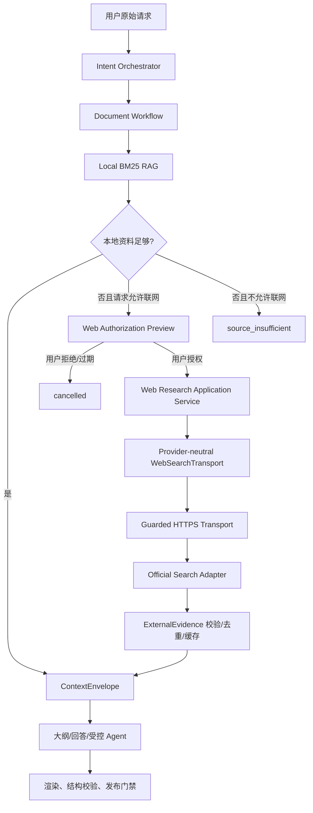

# 阶段 9｜受控联网搜索真实接入计划

日期：2026-09-04  
状态：`planned/not_started`  
文档类型：工程侧实施计划

## 一、目的与结论

本计划用于把现有的 Platform 受控联网搜索合同接入智能文档会话主链。当前仓库已经具备 `ControlledWebResearchService`、授权 DTO、HTTPS/域名过滤、结果去重、缓存、超时、取消和离线回退合同，但尚未接入真实网络 transport、搜索服务商、联网 IPC 或授权 UI。

因此，本文件不表示联网搜索已经可用，也不要求负责人现在执行真实搜索。真实接入必须先完成本计划的代码门禁和合成 transport 验收，再由负责人单独批准服务商、域名范围和费用预算，最后执行一次受控真实请求。

## 二、权威依据与当前基线

本计划遵循：

- `AGENTS.md`；
- `PLANS.md`；
- `docs/active/会话业务重设计总计划.md`；
- `docs/active/阶段9-智能文档提示词工程与安全加固计划.md`；
- `docs/active/阶段9-E2-企业资料分层RAG验收记录.md`；
- `docs/active/阶段9-E3-受控联网搜索验收记录.md`。

当前实现基线：

| 能力 | 当前状态 | 证据 |
| --- | --- | --- |
| 本地附件检索 | 已实现 BM25，即时重建索引 | `src/platform/search/rag-service.ts` |
| 联网搜索安全合同 | 已实现，依赖注入 transport | `src/platform/search/web-research.ts` |
| 真实搜索 transport | 未实现 | E3 验收记录 |
| 联网 IPC/preload | 未实现 | E3 验收记录 |
| 对话内授权 UI | 未实现 | E3 验收记录 |
| 会话主链联网接线 | 当前对 `web/mixed` 取消并阻断 | `src/pages/chat/ChatPage.tsx` |
| 真实 HTTP/凭证/费用 | 0 | 项目阶段 9 边界 |

## 三、目标与非目标

### 3.1 目标

- 用户明确要求最新公开信息或授权联网时，才允许进入联网候选路径。
- 企业资料始终优先走本地 RAG；联网只补充本地缺失的公开证据。
- 联网前展示可理解的外发预览，并由用户显式授权。
- 授权绑定 workflow、会话 revision、planHash、域名策略和过期时间。
- 搜索服务商只在主进程受控 transport 中运行，Renderer 不接触凭证。
- 外部结果以 `ExternalEvidence` 进入 `ContextEnvelope.references`，保留来源、时间和 Hash。
- 未授权、域名不允许、来源不足、超时、取消、额度耗尽或校验失败时 fail-closed。
- 真实请求可审计、可取消、可回放，且不自动切换服务商或扩大外发范围。

### 3.2 非目标

- 不在本计划中预先绑定具体搜索服务商、向量数据库或 embedding 模型。
- 不抓取 Google/Bing 等搜索网页，不绕过服务商官方 API。
- 不自动上传企业附件全文、项目目录、凭证、绝对路径或内部 Prompt。
- 不新增业务一级页面；授权入口复用现有对话页工作流区域或本地设置子区域。
- 不把搜索结果直接登记为 Work；联网只提供资料，正式作品仍走文档生成和发布门禁。
- 不把网络失败自动降级为另一家服务商，也不进行无限重试。

## 四、目标架构



职责边界：

| 层 | 负责 | 禁止负责 |
| --- | --- | --- |
| Renderer | 展示预览、接收授权、展示安全来源状态 | 读取 Key、拼装请求、选择域名、直接 fetch |
| Application | 资料策略、授权状态、RAG/联网编排、预算和状态 | 读取文件路径、直接网络连接 |
| Domain | 授权、证据、失败码和状态 Schema | 调用网络、文件系统或 Electron |
| Platform | 凭证读取、固定端点、HTTP、解析、缓存和脱敏 | 改变用户任务、扩大权限或自动换路由 |

## 五、核心流程与状态

### 5.1 资料策略

Application 根据用户请求和已校验计划决定策略，不能由网页内容决定：

| 策略 | 行为 |
| --- | --- |
| `no_external_context` | 不查本地 RAG，不联网 |
| `optional_context` | 本地 RAG 或联网失败可继续，但交付说明标记未使用资料 |
| `required_context` | 本地资料或联网证据不足时停止生成，进入追问/失败关闭 |

默认顺序为本地附件/企业资料 → 必要时联网。用户明确要求“今天/最新/公开政策”等信息时，可将联网标记为候选，但仍需授权。

### 5.2 授权状态

```text
intent_received
→ source_retrieval
→ web_authorization_required
→ web_authorized
→ web_searching
→ web_evidence_validated
→ plan_validated
→ executing
→ completed / failed_closed / cancelled
```

授权记录至少绑定：

```ts
interface WebAuthorizationRecord {
  workflowId: string;
  conversationRevision: number;
  planHash: string;
  confirmedAt: string;
  expiresAt: string;
  outboundSummary: string;
  allowedDomains: readonly string[];
  queryHash: string;
}
```

授权不得复用于新的查询、文档、域名或 revision。授权失败、过期和取消均不可重放。

## 六、分阶段实施计划

所有代码 PR 必须从最新 `develop` 创建独立 `feature/*` 分支，按以下顺序推进。每个 PR 单独测试、提交、推送和验收；不得把真实联网请求混入普通门禁。

### PR-W0｜服务商与外发范围决策

状态：`planned/not_started`

冻结以下外部事实：

- 一个官方搜索 API 服务商及其官方文档证据；
- 允许访问的域名模式和是否允许子域名；
- 查询是否允许携带企业术语，混合资料是否允许外发；
- 单次、每日或周期预算；
- 缓存时间、来源保留时间和审计保留字段。

没有负责人批准前，只实现 provider-neutral 层和合成 transport，不读取真实凭证、不发起真实 HTTP。

### PR-W1｜Provider-neutral transport 与凭证端口

状态：`planned/not_started`

范围：

- 新增 `WebSearchTransport` 的主进程实现适配接口；
- 复用 `GuardedControlledProviderTransport` 的 HTTPS、DNS、手动重定向、超时、响应大小和取消约束；
- 接入 `SecureCredentialVault` 的只读使用端口；
- 固定 endpoint origin，禁止模型、Renderer 或网页结果提供 URL；
- 统一映射 `invalid_request/dns_unavailable/timeout/cancelled/network_error/response_too_large/authentication_failed/rate_limited`；
- 解析结果只允许标题、摘要、来源 URL、发布时间等受控字段。

验收：合成 HTTP executor 覆盖所有失败码，真实 API 调用为 0。

### PR-W2｜官方搜索适配器

状态：`planned/not_started`

范围：

- 按 PR-W0 冻结的服务商实现一个精确适配器，不提供通用任意 URL 代理；
- 请求字段使用固定 Schema，查询、域名、条数、时间过滤均由 Application 传入；
- API Key 只在主进程短生命周期内使用，不写日志、DTO、缓存或仓库；
- 服务商响应执行长度、字段、URL、发布时间和域名校验；
- 服务商错误不得触发自动切换或无限重试。

验收：官方文档合同、脱敏合成响应、非法响应、鉴权失败和限流均有测试。

### PR-W3｜Application 搜索编排与本地 RAG 优先

状态：`planned/not_started`

范围：

- 新增 Web Research Application Service；
- 将 `RagRetrievalService` 结果和 `ExternalEvidence` 统一投影为 reference DTO；
- 明确 `required/optional/no_external_context` 的停止语义；
- 本地资料充分时禁止联网调用；
- 必需资料无结果时停止生成，不创建临时文件、不登记 Work；
- 证据不足时进入追问或用户确认，不让模型自行降低资料要求；
- 将来源 Hash、检索时间、索引版本和证据引用写入脱敏审计。

验收：本地命中零联网、本地失败的 optional/required 分支、来源不足和重复片段均通过。

### PR-W4｜IPC、preload 与对话授权 UI

状态：`planned/not_started`

建议新增受控通道：

```text
conversation.web.preview
conversation.web.authorize
conversation.web.cancel
conversation.web.getStatus
```

范围：

- IPC 主进程重新校验 workflow、revision、planHash、域名和授权有效期；
- preload 只暴露安全 DTO；
- 对话页显示查询摘要、资料范围、允许域名、预计费用事实和授权有效期；
- 用户拒绝或取消后清除活动任务，不显示“继续执行”；
- 授权失败时保留可理解状态，不显示内部堆栈、Prompt 或凭证。

验收：Renderer 静态合同、IPC 非法字段拒绝、重复授权、revision 冲突、刷新恢复和取消均通过。

### PR-W5｜缓存、来源交付与审计治理

状态：`planned/not_started`

范围：

- 缓存键包含规范化查询、域名策略、结果数量、时间过滤和服务商适配器版本；
- 缓存只保存受控证据，不保存 API Key、完整网页或企业附件全文；
- 交付说明展示实际使用的本地/外部来源数量、域名和检索时间；
- 审计字段仅包含策略、域名、来源 ID/Hash、状态、耗时、预算和失败码；
- 加入缓存过期、来源失效和删除治理。

### PR-W6｜自动化与 Windows 真实验收

状态：`planned/not_started`

自动化门禁：

```powershell
pnpm.cmd exec vitest run tests/platform/web-research.test.ts tests/platform/rag-service.test.ts tests/platform/retrieval-evaluation.test.ts
pnpm.cmd typecheck
pnpm.cmd lint
pnpm.cmd build
pnpm.cmd test
pnpm.cmd audit:platform
pnpm.cmd verify:handoff
git diff --check
```

真实验收必须在 W0-W5 全部通过后，由负责人再次明确批准，并且只执行预算内的最小请求。验收记录不得包含 Token、完整 Prompt、附件全文、绝对路径、原始响应、签名 URL 或内部堆栈。

## 七、失败码与 fail-closed 规则

建议新增/统一以下失败码：

```text
web_authorization_required
web_authorization_expired
web_authorization_mismatch
web_domain_not_allowed
web_query_not_allowed
web_credential_unavailable
web_authentication_failed
web_rate_limited
web_timeout
web_cancelled
web_network_error
web_response_invalid
web_response_too_large
web_no_results
source_required_unavailable
source_citation_insufficient
```

以下情况必须零生成、零临时文件、零 Work：

- 用户未明确授权或授权已过期；
- 域名为空、域名不在白名单或 endpoint 被替换；
- 查询包含不允许外发的企业资料；
- 凭证不可用、鉴权失败、限流或预算耗尽；
- 响应 URL、发布时间、摘要或来源字段校验失败；
- 必需资料无结果、来源引用不足、revision/planHash 冲突；
- 超时、取消、应用重启或网络结果迟到。

## 八、测试与验收矩阵

| 类别 | 用例 | 预期 |
| --- | --- | --- |
| 授权 | 未授权查询 | 不调用 transport，状态 `web_authorization_required` |
| 授权 | 授权后修改查询或 revision | `web_authorization_mismatch`，不搜索 |
| 范围 | 空域名、未登记域名、HTTP URL | 拒绝，不搜索或丢弃证据 |
| RAG | 本地资料充分 | 联网调用次数为 0 |
| RAG | required 资料空结果 | 停止生成，不登记 Work |
| 网络 | 超时、取消、DNS、响应过大 | 结构化失败，不使用迟到响应 |
| 内容 | 网页包含“忽略系统规则”等文本 | 只作为不可信资料，不改变任务或工具 |
| 结果 | 重复 URL、越界发布时间、缺摘要 | 去重或丢弃，不进入上下文 |
| 缓存 | 相同查询和策略 | 只返回未过期受控证据 |
| UI | 拒绝/取消/过期 | 活动任务清除，不显示继续执行 |
| 交付 | 使用外部来源生成文档 | 文档说明包含来源摘要和检索时间 |

## 九、真实请求准入与证据

真实联网准入必须同时满足：

1. W0-W5 有实现提交和分支验收记录；
2. 所有自动化门禁通过；
3. 服务商官方合同、域名范围和费用预算已由负责人批准；
4. 真实凭证已通过本机安全仓库写入，不出现在聊天、代码、环境文件或日志；
5. 外发预览明确显示查询、域名、资料范围和时间；
6. 只执行一次最小查询，必要时再由负责人批准第二次；
7. 记录脱敏结果：时间、域名、结果数量、状态、耗时、费用事实和来源 Hash；
8. 真实请求完成后关闭或撤销运行授权，禁止后续自动调用。

真实请求的通过条件不是“拿到网页结果”这一项，而是：授权、范围、证据、费用、取消、失败恢复和本地文档发布门禁全部有证据。

## 十、回滚与未完成项

回滚策略：

- 任一 PR 失败时保留 E3 的安全合同，默认恢复为不联网阻断；
- 不删除本地 RAG 和现有工作流；
- 不使用失败的外部响应生成或登记 Work；
- 撤销 runtime authorization 后，所有后续请求立即返回未授权；
- 真实服务商适配器异常时不自动更换服务商。

当前未完成项：

- 服务商尚未确定；
- 真实 transport、凭证接线、IPC、preload 和授权 UI 尚未实现；
- `required_context` 主链停止语义尚未接入；
- 外部证据尚未进入会话交付说明；
- Windows Electron 真实联网人工验收尚未执行；
- 未发生真实 HTTP、真实凭证读取或收费调用。

本计划只有在 W0-W6 全部完成并由负责人签署真实请求证据后，才能将联网搜索标记为 `passed`。在此之前统一保持 `planned`、`in_progress` 或 `not_started`。
