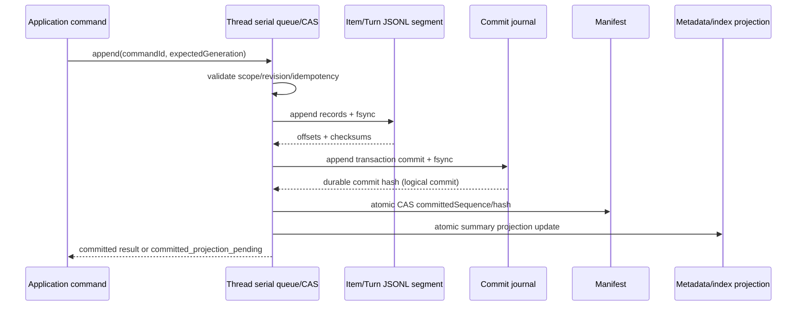

# Office Agent 会话系统架构升级方案

版本：第二轮架构审查稿
日期：2026-10-08
状态：设计审查，未授权进入实施

本文是工程侧目标设计，不修改或替代既有产品决策。项目当前采用单 Agent；本方案保留现有 Agent Runtime、Canonical Tool Contract、Provider Tool Calling、Controlled Provider Tool Bridge 和 Office 工具执行协议。所有“目标”“建议”“待验证”均不是已实施能力或性能结果。

## 1. 目标与非目标

目标是将会话数据逐步整理为 Thread / Turn / Item，降低历史 IPC 和 React 更新范围，并在未来以可恢复的本地文件 Repository 取代大型集合文档的反复全量改写。

非目标：

- 不使用 SQLite 或其他数据库。
- 不引入多 Agent 协同，不增加意图分类 Agent。
- 不重写模型工具调用、Tool Gateway、工具 Schema、权限、预算、取消、幂等和 Observation 协议。
- 不把 Item 变成工具执行控制器。
- 不将 UI 分页边界用作模型上下文边界。
- 本轮不迁移数据、不修改业务代码、不声称性能已改善。

## 2. 真实源码架构与证据

### 2.1 当前会话与执行模型

会话域模型是 `Conversation` 聚合和 `Message[]`，没有 Thread、Turn、Item 域实体。会话状态为 active/archived/deleted；Message 有 user/assistant 角色以及 pending/streaming/completed/failed/cancelled 状态。证据：`src/domain/entities/conversation.ts:28-161`、`:223-234`、`:323-348`。

现有强类型 ID 包括 `ConversationId`、`MessageId`、`ConversationAgentRunId`、`ConversationResponseExecutionId`、`ConversationResponseStreamEventId`、`ProviderInvocationAttemptId` 等，没有 `TurnId`、通用会话 `ItemId` 或 `ToolCallId` 域类型。证据：`src/domain/ids.ts:25-34`、`:83-94`。

执行不是 Conversation 消息实体。当前执行对象包括 `ConversationAgentSessionV1`、`ConversationAgentRunV1`、`ConversationAgentRuntimeV1`、`ConversationResponseExecutionV1` 和持久化流事件。Runtime 服务负责执行准入、账本、Observation、恢复/结算；Provider Adapter 与 Controlled Tool Bridge 实际执行模型和工具。证据：`src/domain/entities/conversation-agent-session.ts:50-70`、`src/domain/entities/conversation-agent-run.ts:40-57`、`src/domain/entities/conversation-agent-runtime.ts:48-111`、`src/application/conversation-agent-runtime-service.ts:44-51`。

### 2.2 当前真实执行主链

```text
ChatPage.startChatResponse
→ preload startAgentResponse
→ ipcMain handler
→ ConversationResponseController.startAgent/startCommand/startValidated
→ ConversationApplicationService + response draft
→ ConversationResponseArtifactFactory
→ ProviderSubmissionOrchestrator
→ DeepSeek/NewAPI Adapter
→ Controlled Provider Tool Loop / Document Tool Bridge
→ Response Lifecycle + Conversation projection
→ response event IPC + ChatPage
```

证据位置：`src/pages/chat/ChatPage.tsx:2475-2539`、`electron/preload.ts:912-913`、`electron/ipc/chat-context-ipc.ts:103-108`、`src/platform/ipc/conversation-response-controller.ts:426-432,599-664,744-765,843-867`、`src/platform/providers/conversation-response-artifact-factory.ts:79-185`、`src/platform/providers/provider-submission-orchestrator.ts:186-218,221-260,296-415`。

保留的工具链事实：Canonical Tool Contract Registry 定义并验证 Provider 工具合同；Provider Tool Calling 解析模型 Tool Call、执行有界循环并在下一轮将 Observation 以 tool 消息返回；Document Tool Bridge 执行主机授权、参数校验、幂等、预算、取消和观察记录。证据：`src/platform/providers/provider-tool-calling.ts:26-90,210-294,331-343`、`src/platform/providers/document-tool-bridge.ts:87-124,134-200,202-310`。

### 2.3 当前持久化和读取边界

项目会话存储在项目 `entities/conversations.json`。Repository 的 `get/list` 读取并解析完整文件；`insert/save` 在完整 conversations 数组上做原子 read-modify-write。证据：`src/platform/repositories/json-project-conversation-repository.ts:28-46,75-136,138-160`。旧全局仓库也读取完整 JSON 并重写完整数组：`src/platform/repositories/json-conversation-repository.ts:73-93,95-161,178-253`。

NodeProjectStorage 使用异步 `fs/promises`，通过 `mutateJsonAtomically()` 执行文件协调，写入 JSON.stringify、sync、rename；`JSON.parse` / `JSON.stringify` 仍在主进程 JavaScript 线程同步执行。证据：`src/platform/storage/node-project-storage.ts:110-123,151-161,170-215`、`src/platform/storage/file-write-coordinator.ts:13-49`。因此“异步文件 API”不等于“大 JSON 不会阻塞主线程”。本轮没有采集 parse/stringify 耗时。

`ConversationController.get/list` 返回完整 Conversation DTO，`toConversationDto()` 将全部 messages 映射到 DTO。证据：`src/platform/ipc/conversation-controller.ts:65-90,267-289`。`chat-context-runtime.list()` 合并项目和 legacy conversation，且为项目条目做 artifact verification。证据：`src/platform/ipc/chat-context-runtime.ts:1174-1208`。打开项目时侧栏摘要 API 已存在，但只供未打开项目的导航摘要，项目打开后的会话载入仍使用全量 `listConversations()`：`src/platform/ipc/project-session-controller.ts:155-184`、`src/pages/chat/ChatPage.tsx:1029-1119,3657-3676`。

### 2.4 当前流式、事件和 UI

Provider Delta 经 120ms/8KB/256KB batcher 后，同时写入 ResponseExecution 事件和 Conversation 投影。投影队列约 120ms 保存 Conversation；完成、取消、失败时 drain 并保存终态。证据：`src/platform/providers/conversation-stream-delta-batcher.ts:17-118`、`src/platform/providers/conversation-text-submission.ts:464-569,580-612,627-721`。

Response Execution repository 的 `appendEvents()` 更新 executions/events 完整 JSON 文档；Lifecycle 每次批量 append 前会读取 execution 与事件列表。证据：`src/platform/providers/conversation-response-streaming.ts:216-247`、`src/platform/repositories/json-conversation-response-execution-repository.ts:138-218`。

Renderer 对 response stream 有 sequence 去重、replay、ACK、最大 in-flight 和 backpressure；ChatPage 使用 requestAnimationFrame 合并事件。证据：`electron/preload.ts:743-802,958-1013`、`electron/ipc/chat-context-ipc.ts:162-201`、`src/platform/providers/conversation-response-streaming.ts:277-352`、`src/pages/chat/ChatPage.tsx:1375-1496`。

生产 Trace 是另一条持久订阅链。ChatPage 订阅时 `afterSequence=0`，Trace Store 会回放持久历史，之后页面又调用 list，UI 端合并去重；Trace 每次事件会触发状态更新。证据：`src/platform/conversation-production-trace.ts:80-143,145-223`、`src/pages/chat/ChatPage.tsx:1221-1242`、`src/pages/chat/productionTimeline.ts:4-58`。

消息 UI 对 `displayMessages` 执行全量 map；当前流式 Assistant 的 Markdown 内容变化会使 ReactMarkdown 重新解析累计全文。历史列表无分页和虚拟列表。证据：`src/pages/chat/ChatPage.tsx:968-981,4069-4076,4186-4190,4605-4623`、`src/pages/chat/StreamingMarkdown.tsx:5-28`、`src/components/MarkdownMessage.tsx:25-38`。父列表重算不等于所有 memo 子树都提交 DOM；已确认 Markdown 全量重解析主要限于当前流式 Item。

## 3. 当前瓶颈、基线状态与优化边界

已从代码确认的风险：

1. 历史 `listConversations()` 对所有会话读取/解析存储并传输完整消息；Renderer 持有全部 Conversation DTO 并完整渲染列表。
2. 长流期间每批 Delta 写 ResponseExecution 全量 JSON，并周期性写 Conversation 全量 JSON。
3. ResponseExecution 事件数增加时，每批 append 的读取、筛选、解析、序列化范围也增加。
4. 文档生成期间 ChatPage 可每 750ms 调用完整 `getConversation()`，最多 600 次；流结束和其他状态路径也会再次刷新全量 DTO。证据：`src/pages/chat/ChatPage.tsx:1167-1182,1445-1458`。
5. Trace subscribe 后又 list，存在已确认的重复历史传输；Renderer 去重不能消除重复 IPC 和解析。

未完成任何性能基线。本方案不记录任何数值为通过结果。

必须分开衡量三个边界：

| 优化边界 | 可减少的成本 | 不自动解决的成本 |
|---|---|---|
| IPC 传输 | Renderer 接收的正文、metadata 和结构化克隆量 | 旧单体 JSON 在主进程的全量 read/parse |
| Renderer 渲染 | React 列表计算、组件提交、Markdown parse、DOM 布局 | Repository 文件 I/O 和 IPC 生产端构建 |
| 物理文件 I/O | 文件读取/写入字节、JSON parse/stringify、fsync 和目录扫描 | React 提交与 Markdown parse |

新增摘要 IPC 如果仍调用旧 Repository 的 `list()`，只能确认 IPC 传输变小；无法声明底层文件读取成本已解决。真实物理 I/O 优化需按 Thread 拆分存储并通过读写计数和字节指标验证。

基线场景为 10/100/1000 个会话、单会话 100/1000 条消息、长 Markdown、连续工具调用、长时间流式输出。指标：summary/open/page p50/p95、IPC bytes、main 同步 parse/stringify 时间、React Commit、Markdown parse、进程内存、文件读写次数/字节、恢复耗时。真实 Provider/Office 运行与合成基准分别记录。

## 4. Thread / Turn / Item 目标数据合同

以下 Schema 是建议合同，正式实施前须进入阶段 0 合同评审。

### 4.1 Thread

```ts
interface ThreadV1 {
  schemaVersion: 1;
  threadId: ThreadId;
  projectId: ProjectId | null;
  title: string;
  status: 'active' | 'archived' | 'deleted';
  createdAt: IsoTimestamp;
  updatedAt: IsoTimestamp;
  lastItemId?: ItemId;
  lastSequence: number;
  itemCount: number;
  turnCount: number;
  generation: number;
}
```

### 4.2 Turn

```ts
interface TurnV1 {
  schemaVersion: 1;
  turnId: TurnId;
  threadId: ThreadId;
  sequence: number;
  status: 'pending' | 'running' | 'waiting_user' | 'waiting_authorization' |
    'needs_reconciliation' | 'completed' | 'failed' | 'cancelled' | 'interrupted';
  createdAt: IsoTimestamp;
  completedAt?: IsoTimestamp;
  userItemId?: ItemId;
  assistantItemIds: readonly ItemId[];
  provenance: 'native' | 'legacy_inferred';
}
```

Turn 不复制 Agent Runtime 的执行状态。`running` 等状态是面向会话的汇总投影，AgentRun/ResponseExecution 仍是执行状态权威来源。

### 4.3 Item

```ts
type ItemType = 'user_message' | 'assistant_message' | 'tool_call_projection' |
  'tool_result_projection' | 'document_artifact_projection';

interface ItemV1 {
  schemaVersion: 1;
  itemId: ItemId;
  threadId: ThreadId;
  turnId?: TurnId;
  sequence: number;
  type: ItemType;
  status: 'pending' | 'streaming' | 'completed' | 'failed' | 'cancelled' |
    'interrupted' | 'unknown';
  createdAt: IsoTimestamp;
  updatedAt: IsoTimestamp;
  content?: string;
  bodyRef?: { segmentId: string; offset: number; length: number; sha256: string };
  projectionSource?: {
    sourceEventId: string;
    agentRunId?: AgentRunId;
    responseExecutionId?: ResponseExecutionId;
    toolCallId?: ToolCallId;
    workId?: WorkId;
  };
}
```

消息 Item 可保留原 Message ID。Tool/Artifact 展示项是从 Runtime 事实投影出的 UI 项，不能声称是执行事实本身。Document Artifact 必须保留真实 `WorkId`，不得复制/合成作品身份。

## 5. ID 语义、唯一性和 Turn/AgentRun 关系

使用带类型前缀的不可变字符串并由主进程 Host 生成；所有 ID 在其项目存储中的唯一性由 Repository 检查。建议新增品牌类型：`ThreadId`、`TurnId`、`ItemId`、`ToolCallId`，并由 `toXId()` 解析验证。除 Thread 映射外，不复用现有品牌类型。

| 身份 | 创建者与生命周期 | 存储位置 | 旧兼容/重放规则 |
|---|---|---|---|
| ThreadId | Host；Thread 全生命周期不变 | Thread metadata/index | 与旧 ConversationId 一对一同值映射，旧 ConversationId 仍有效 |
| TurnId | Host 在接受用户输入时创建；跨恢复不变 | Turn segment + commit record | 旧历史无法证实分界时标 `legacy_inferred`；不重造 AgentRun |
| Message ItemId | Host 沿用既有 MessageId | Item segment/source map | 旧 MessageId 原值保留；业务引用语义不变 |
| 新投影 ItemId | 投影器由稳定 source identity 派生或分配并在首次提交登记 | projection index + Item segment | 唯一键 `(threadId, projectionKind, sourceEventId)`；重放命中原 Item，不新建 |
| AgentRunId | 现有 Agent Runtime 创建者 | 原 Agent Run Repository | 执行生命周期和 ID 保持不变 |
| ResponseExecutionId | 现有 Provider Submission/Artifact Factory 创建 | Response Execution Repository | 原执行可追溯，不以 TurnId 替代 |
| ToolCallId | Provider/Tool Gateway 既有边界产生或接收 | Runtime tool-call journal/checkpoint | 不以 ItemId 替代；projection 唯一键含原 ToolCallId 和 source event |
| WorkId | 现有作品登记/本地校验流程创建 | Work Repository + artifact Item reference | 保持作品身份；Item 只引用 |

旧 MessageId 和新 ItemId 不使用同一未经区分的裸 UUID 命名空间：逻辑上 `ItemId` 是统一身份合同，但旧 message Item 的值保留且带 `kind=message` source mapping；新投影 Item 使用 `item-projection:<opaque-id>` 前缀或独立类型编码。Parser 负责避免将新 ID 误当 MessageId。具体编码应在阶段 0 与平台允许字符规则一同确认。

Turn 可以关联多个 AgentRun：每个 Turn 有 `turnId`，其 `TurnExecutionLinks` 追加多个 AgentRunId 和 ResponseExecutionId。关联是旁路、追加式 metadata，不改变 AgentRun parent/child 关系、lease、budget、resume receipt 或 terminal 状态。

## 6. Agent Runtime 边界和执行不变量

会话层只保存用户/Assistant 消息、显示型工具/产物项目、分页顺序和 Turn 关联。执行权威继续归：

- `ConversationResponseExecutionLifecycle`：响应流序列、终态和事件回放。
- `ConversationAgentRuntimeService`：模型/工具准入、budget、checkpoint、Observation、outbox 和恢复。
- `ConversationAgentSessionService`：等待、resume、lease、cancel/reconciliation。
- `provider-tool-calling.ts`：Tool Call 合同、有限循环、Observation 回传。
- `document-tool-bridge.ts`：受控绑定执行、幂等指纹、权限、preflight、超时/取消和 unknown 语义。

不可变不变量：UI subscription/replay/Item projection 不可调用 Provider 或 Tool Bridge；Runtime recovery 不根据会话 Item 再次执行工具；未知副作用保持冻结；工具调用 ID 和幂等键不变；所有调用仍经原 Canonical Contract、授权和 Observation 路径。

如果要让执行边界获得 TurnId，只在 `startValidated` 确认持久 Turn 后写 `TurnExecutionLink`，不把 TurnId 加进 Provider Tool Schema 或工具参数。

## 7. 新旧 API 兼容矩阵

关键修正：旧 `getConversation()` 保持完整 Conversation DTO 语义，不能偷偷改为 Thread+第一页 Items。旧消费者依赖消息集合索引、revision、状态变更和上下文完整性。

| API/消费者 | 当前语义/依赖 | 目标兼容合同 | 阶段迁移方式 |
|---|---|---|---|
| `ConversationApplicationService.get(id)` | 返回完整 Conversation；域服务和 Controller/Response Controller 使用 | 语义完全不变 | 保持旧 Repository Port；内部可由新存储 adapter 组装完整对象 |
| `ConversationController.get` / IPC `getConversation` | 完整 DTO，含完整 messages | 完整数据仍返回；不设隐式分页 | 新增 `getThread`/`getThreadItemsPage`，旧 IPC 保持 |
| `ConversationController.list` / `listConversations` | 所有会话的完整 DTO | 原合同暂时保持完整且不用于新主 UI | 新增 summary API；逐个调用方迁移后再考虑弃用，不能破坏第三方/测试调用方 |
| `ConversationResponseController.startValidated` | 加载/创建完整 Conversation、校验 revision、追加 user message | 继续通过会话服务写入用户消息；start response DTO 的 legacy conversation 字段保持既有语义 | 执行控制器只通过应用适配层创建/关联 Turn |
| `ConversationResponseArtifactFactory` | 根据 Draft/Conversation revision 解析当前消息并组装模型上下文 | 不从 UI 已加载 Item 中推导上下文 | 注入 `ModelHistoryReader`，适配成现有 Builder 输入 |
| `ConversationContextBuilder` | 过滤已完成历史、最近 40 条、token 裁剪、引用不可信边界 | 限额/语义不变；可从完整历史 Reader 获得必要内容 | 先保留 Builder API，再增加 reader adapter |
| `AgentContextAssembler` | 调用 ConversationContextBuilder，使用 Agent-native 历史 | 不受 UI page size 限制 | 从同一 ModelHistoryReader 获取受预算约束的历史 |
| `ChatPage` 初次加载/历史选择 | 当前 list 全量，再按 ID 选中 | 改用摘要列表，选择时显式请求首屏 Item Page | 新增接口后先双合同测试，再切主 UI |
| ChatPage 终态/轮询/编辑/工作流路径 | 多处 `getConversation()` 读取完整对象并执行域操作 | 在调用方需要完整 Conversation 的地方继续调用旧 API；只读投影改轻量 API | 逐个调用方按目的分类，不做全局语义替换 |
| Agent continuation/workflow/native search 等服务 | 依赖完整 message 搜索、附件、revision、target IDs | 旧应用边界继续获得完整 Conversation，之后可按需改用专用读 port | 不直接把 UI pagination 传入这些模块 |

### 7.1 Repository 与 IPC 目标合同

Repository 分为两种用途：

```ts
interface ConversationRepository { // legacy compatibility contract
  get(id: ConversationId): Promise<Conversation | undefined>; // complete
  list(options?: ConversationListOptions): Promise<readonly Conversation[]>; // complete
  create(value: Conversation): Promise<void>;
  save(value: Conversation, expectedRevision: number): Promise<void>;
}

interface ThreadReadRepository {
  listThreadSummaries(input: SummaryQuery): Promise<SummaryPage>;
  getThread(threadId: ThreadId): Promise<ThreadV1 | undefined>;
  getItemsPage(input: ItemPageQuery): Promise<ItemPage>;
  getTurn(turnId: TurnId): Promise<TurnV1 | undefined>;
  readModelHistory(input: ModelHistoryQuery): Promise<readonly MessageForContext[]>;
}
```

IPC 新增：`listThreadSummaries(query)`、`getThread(threadId)`、`getThreadItemsPage(threadId,cursor,limit,direction,readAtSequence)`、`getTurn(turnId)`。响应正文只在打开 Thread 或续页时传输。所有 request parser 校验 limit、cursor、scope、Thread ID；Renderer 不提供文件路径。

摘要接口若先由旧 `JsonProjectConversationRepository.list()` 适配，文档/指标必须标记为“IPC 传输优化，底层仍全量 read/parse”；不能说已经解决物理存储瓶颈。

### 7.2 完整调用方影响清单

在改 API 前必须逐一分类。当前已确认调用方：

| 模块/文件 | 用途 | 首选阶段行为 |
|---|---|---|
| `src/application/conversation-service.ts` | `get/list/create/save/addUserMessage` 应用服务完整聚合 | 保持旧完整合同；新 Repository adapter 可组装完整 Conversation |
| `src/platform/ipc/conversation-controller.ts` | IPC get/list DTO、revision mutation | 保留 get 语义；新增 summary/page controller 方法 |
| `src/platform/ipc/conversation-response-controller.ts` | startValidated、取消、执行启动、continuation | 保留完整应用对象及 revision gate；新增 Turn link 的窄旁路 |
| `src/application/conversation-context-builder.ts` | 最近完成历史、Token budget 和引用边界 | 使用专用 ModelHistoryReader，不取 UI page |
| `src/application/agent-context-assembler.ts` | Agent-native 上下文装配 | 同上，保持预算和格式合同 |
| `src/platform/providers/conversation-response-artifact-factory.ts` | Draft 校验、文档/附件/Context 解析、模型上下文 | 改为依赖完整应用 Reader，不依赖 Renderer 已加载项 |
| `src/platform/ipc/chat-context-runtime.ts` | project/legacy runtime wiring、list merge、recovery | 新增 repository/provider wiring；明确项目与 legacy summary 来源 |
| `src/platform/ipc/conversation-agent-continuations.ts` | 查找 source message、验证 resume references | 保持按 MessageId 查找完整原文/稳定引用 |
| `src/platform/ipc/conversation-workflow-controller.ts` | workflow 回复、目标解析和执行 | 旧语义保留，后续专用 reader 迁移须单独回归 |
| `src/platform/providers/conversation-native-search.ts` | user message、上下文与本地资料关系 | 不受 UI 分页影响 |
| `src/platform/ipc/chat-context-runtime.ts` helper functions | fail/interrupted projection、artifact verification、legacy copy | 保留完整读改写适配直到各 helper 有专用接口 |
| `src/pages/chat/ChatPage.tsx` | 初始全量 list、选择、refresh、terminal 状态、document polling | 摘要 + 首屏/续页；需保留编辑、重试、reconciliation 和恢复所需字段 |
| `src/shared/chat-context-ipc.ts` | IPC channel、DTO、parser、API interface | 旧字段不删；新增明确版本/合同 |
| `electron/preload.ts` / `electron/ipc/chat-context-ipc.ts` | Renderer API 和主进程 handler | 新增频道，旧 channel 不改语义 |
| tests 下 conversation/controller/artifact/context/IPC contracts | 现有行为保护 | 加旧语义不变、摘要不带正文和分页/context 分离测试 |

完整调用点扫描依据：`rg getConversation` 命中 `ChatPage.tsx` 多处；服务端对 `ConversationApplicationService.get()` 的依赖见 `conversation-response-controller.ts`、`conversation-agent-continuations.ts`、`conversation-workflow-controller.ts`、`conversation-native-search.ts`、`conversation-response-artifact-factory.ts`。实现前需重新扫描并将命中列表纳入阶段 PR 检查，不能仅凭本表假定覆盖新调用点。

## 8. JSONL 持久化与跨文件恢复协议

### 8.1 权威来源

| 数据 | 权威来源 | 派生数据 |
|---|---|---|
| Thread 状态和标题 | `thread.v1.json` 的已提交代际 | `index.v1.json` 摘要索引 |
| Turn/Item 提交顺序和正文 | 已提交 Item/Turn segment + commit records | UI store、快照 |
| AgentRun/ResponseExecution/ToolCall/Observation | 现有各 Runtime/Execution Repository | Tool/Execution 展示 Item |
| Work/文档产物 | 已校验和登记的 Work Repository 与本地文件收据 | Artifact Item 引用 |
| migration mapping | migration ledger/checksum | Thread 与旧 Conversation 解析适配 |

Item projection 不得覆盖 Runtime 权威状态；Thread/Turn 状态是只读汇总投影，不得用于判断是否能重放执行。

### 8.2 Segment 和 Snapshot 合同

建议 Thread 目录：

```text
entities/threads/index.v1.json
entities/threads/<threadId>/thread.v1.json
entities/threads/<threadId>/manifest.v1.json
entities/threads/<threadId>/turns/turns-<generation>-<n>.jsonl
entities/threads/<threadId>/items/items-<generation>-<n>.jsonl
entities/threads/<threadId>/commits/commits-<generation>.jsonl
entities/threads/<threadId>/snapshots/snapshot-<generation>-<sequence>.json
entities/threads/<threadId>/migration/progress.v1.json
```

每条 JSONL 记录必须含 `schemaVersion`、`generation`、`sequence`、稳定 `recordId`、类型、payload/checksum。文件不是只写 JSON line 后就当作提交；commit record 是可见性边界。

Manifest 至少保存：generation、committedSequence、segment 列表与 byte offset、snapshot sequence/checksum、最后 commit hash、最近验证结果。Reader 只读取 manifest 已提交 offset 以内且被 commit 记录覆盖的部分。

Snapshot 必须记录：Thread ID、generation、包含到的已提交 sequence、Item/Turn 索引状态、源 commit hash、snapshot checksum。Snapshot 本身不覆盖 segment 权威历史；它是加速恢复/分页的可丢弃派生物。生成快照后先原子写快照，再 CAS 更新 Manifest 指向它。

### 8.3 跨文件提交边界

为避免 thread metadata、Item、Turn、关联记录跨文件产生半提交状态，建议先实现单 Thread 提交日志，再让其他文件作为可重建投影：

1. 在 Thread 串行队列/CAS 中检查当前 generation、next sequence 和业务幂等键。
2. 将 Item/Turn 记录写入 segment，flush/fsync，记录其 segment offset、length 和 checksum；此时未提交，不可见。
3. 写入一个 commit record，含 transactionId、previousCommitHash、new sequence range、各记录 ID 与 hash、可恢复的 Thread metadata delta、可选 Runtime link delta；flush/fsync。该记录是事务逻辑提交点。
4. 原子更新 Manifest 的 committedSequence、segment offsets、commit hash 和 metadata projection revision。若进程在 commit record 已 durable、manifest 未更新时退出，recovery 验证该记录后向前推进 manifest；不得丢弃已提交事实。
5. 更新 `thread.v1.json` 和全局 summary index 为可重建投影；任何一个投影失败，记录 projection debt，Reader 仍按 commit log 恢复权威值；后台有界重试重建投影。
6. 成功响应只有在 commit record durable 后返回。manifest 投影未完成可以返回 `committed_projection_pending`，但不能重复 append 原操作。

跨文件锁仅保护并发互斥，不构成事务。若阶段实测后 commit protocol 复杂度过高，可以把单 Thread 的 authoritative metadata 和 commit records 合并到同一个 manifest journal 文件；必须保持单一 durable commit boundary，而不是退回多文件无协调写入。

### 8.4 指定崩溃窗口处理

| 崩溃窗口 | 恢复行为 |
|---|---|
| Thread metadata 草稿更新，Item 尚未写 | metadata 仍未 commit，不可见；丢弃未提交临时数据或保持 source command pending 后安全重试 |
| Item 已 append，Manifest 未更新 | 检查 committed offset/hash；若对应 commit record durable，则推进 Manifest；否则尾部标记为 uncommitted，保留原 bytes 到 quarantine 文件后截断到上一已提交 offset |
| Turn 已写、AgentRun link 失败 | Turn link 是 commit transaction 一部分则整体不可见/恢复；若 link 是 Runtime 之后的独立事务，记录 `link_pending` outbox，由 Runtime ID 扫描 reconciliation 补关联，不改/重跑 AgentRun |
| JSONL 写入中途异常退出 | 通过 byte offset/checksum 找到最后完整已提交记录；仅允许自动处理尾部 torn write |
| Segment 尾部半条 JSON | 保留损坏尾部字节到独立 recovery artifact，记录 file/hash/offset，截断到最后 commit offset 后继续；不得静默删除或吞掉已提交记录 |
| 非尾部损坏/sequence gap/hash mismatch | 标记 Thread degraded/read-only，定位之后的有效 segments，生成隔离清单和备份；不能自动跳过中间损坏并假装连续；用户可显式恢复备份或导出诊断 |
| 两个异步操作同时更新同 Thread | 单 Thread Promise queue + FileWriteCoordinator + generation/sequence CAS；不同 Thread 可并行 |
| Snapshot 与增量事件 | Snapshot 记录 commit sequence/hash；恢复先验证它对应的 commit，再应用 sequence 更大的已提交 records；sequence/hash 不一致时回退更早 snapshot 或从 segment 重建 |
| 重放重复事件 | 在 commit transaction 对 `(sourceStore, sourceEventId, projectionKind)` 建唯一索引；重复命中同记录视为成功 no-op，不新建 Item |

### 8.5 文件写入时序



### 8.6 恢复状态机

```text
START
→ verify thread identity, manifest schema, generation and manifest checksum
→ verify manifest's last commit hash and referenced segment existence
→ scan only committed offsets; validate JSON, sequence, record IDs, checksums
→ inspect bytes after committed offsets
   ├─ valid durable commit exists: roll forward manifest/projections
   ├─ incomplete tail only: preserve tail to quarantine, truncate to committed offset
   └─ corruption before committed offset: DEGRADED_READ_ONLY + recovery report
→ load latest snapshot whose generation/sequence/hash validates
→ replay committed records after snapshot sequence (projection only)
→ reconcile Runtime links against existing AgentRun/Execution repositories
→ READY or DEGRADED_READ_ONLY
```

Recovery never calls Provider Tool Calling or Office tool bindings. Unknown Runtime outcomes remain frozen according to existing Runtime semantics.

### 8.7 日志增长、归档和压缩

Segments rotate by configured byte/record thresholds, not per Item. Compaction only runs when a verified snapshot covers a closed segment and every authoritative event/reference needed for audit is either retained or archived with checksum. Archived files remain addressable and recoverable; no retention deletion is implied. ResponseExecution events require separate design because they are authoritative replay/audit events: compaction may replace only events safely represented by a durable execution snapshot and must preserve sequence range/hash chain and Runtime receipts. Limits, archive policy and disk-space behavior remain a phase 0/4 decision; no arbitrary truncation is permitted.

## 9. React 增量渲染方案

Thread summary store 与当前 Thread Item store 分开；Item 以 `itemId → Item` 映射存储，顺序数组仅在追加/分页时改变。流式事件只更新目标 Item 的 content revision，不构造新的全量 item list。历史 Item 组件 memo 化；流式 Item 独立 state/subscription。工具/文档投影 Item 用 source event 唯一键稳定复用。

虚拟列表不是预设优化。先在性能基线下测会话 100/1000 messages 和不同高度 Item；若 Commit/Layout 时间超门槛再选择虚拟列表。需验证锚定 Item + offset、向上阅读期间禁用自动跟随、顶部分页 prepend 补偿、ResizeObserver 高度变化和终态滚动。

Markdown：历史消息的解析结果可按 item revision/hash 缓存；流式内容受控刷新频率或在完整段落边界解析，最终态完整解析。不得把局部 React state 优化误报为 Markdown 增量 AST。

## 10. 模型上下文兼容

`ConversationContextBuilder` 的 system/reference 语义、完成消息过滤、最近 40 条、最大 64k 输入预算、引用上限及老历史裁剪必须保留。证据：`src/application/conversation-context-builder.ts:44-160`。

`AgentContextAssembler` 继续使用同样的历史来源/预算合同。Artifact Factory 不从 Renderer Item store 取上下文；改为经 `ModelHistoryReader` 按 current MessageId/ItemId 读取必要的完整历史，后投影成现有 Builder/Assembler 输入。Reader 可从尚未在 UI 加载的早期页取上下文，也需保留 workflowReply 排除、附件与引用 hash 验证。

首阶段以 adapter 保持 `ConversationContextBuilder.build({conversation,...})` 和 `AgentContextAssembler.assemble(...)` API；后续如需流式/分页 reader 版本，必须逐项比较输出 messages、tokens、truncated 和 reference snapshots。

## 11. 迁移、Shadow Read、Cutover 与回滚

### 11.1 状态机

```text
LEGACY_AUTHORITATIVE
→ MIGRATION_SCAN (旧文件 checksum/count/schema 固定)
→ MIGRATING (按 Conversation，幂等导入 Thread/Turn/Item)
→ MIGRATION_VERIFIED (ID/count/content/hash 校验；Runtime links 仅导入可证明关系)
→ SHADOW_READ (legacy 仍为读写权威；新存储仅由旧写入提交后的 outbox/change record 追平)
→ CUTOVER_PREPARED (新存储追平到指定 legacy sequence；无未决 outbox；无运行中 execution，或显式冻结并等待它们 terminal)
→ NEW_AUTHORITATIVE
→ ROLLBACK_WINDOW
→ NEW_ONLY_AFTER_COMPATIBILITY_WINDOW
```

### 11.2 写策略与安全切换

Migration scan 阶段旧 Repository 是唯一权威，新 Repository 只接收历史导入记录。导入以 `(legacyConversationId, legacyMessageId, sourceChecksum)` 唯一键幂等。

Shadow Read 期间不能无协调地双写两边，也不能只复制一次然后忽略后续新增消息。推荐 transitional write path：旧 Repository 仍为权威，单个 application command 在同一 project/thread serialization boundary 中先写 legacy，再写一条 durable outbox change record（与 legacy 写入的原子性当前不具备，需要在实施前落实）。更安全的最小迁移方案是先给 legacy writer 增加 write-ahead change journal：先 journal command intent，执行旧 CAS，再记录 legacy revision/Message IDs，然后 importer 消费 journal 并幂等更新新仓。任一投影失败时 legacy commit 保留，outbox 不确认，重启后追平。该 transitional journal 是迁移机制，不是 Provider/Tool execution journal。

若暂时无法让 legacy write 与迁移 journal 具有可恢复的提交协议，则 Shadow Read 只能做静态/只读历史校验，必须冻结会话写入后追平并 cutover；不得称其可在线追平。

新增消息写入期间，AgentRun 和 ResponseExecution 仍由现有 Runtime repositories 保存。先以其原生 MessageId/RunId/ExecutionId 完成旧写，之后由稳定 association projector 追加 Turn links。link 写失败是可重建 projection debt；不得回放 AgentRun 或工具。

Shadow Read 比较摘要、Thread 元数据、Item 序列、Message ID/content hash、执行/作品引用；差异写报告，不能自动覆盖权威侧。新旧同时可见时 UI 必须按稳定 `(projectId, legacyConversationId)` 合并，禁止把同一 Thread 显示两次。

Cutover 条件：migration 计数/hash 全匹配；outbox lag 为零；summary/index 可重建且验证；分页高水位正确；上下文合同比较通过；无写入未决；AgentRun/ResponseExecution 在运行期间仍通过原仓库解析。切换瞬间使用 project-level generation/fence 阻止旧 writer 接受新请求。

### 11.3 正在运行的 Agent 与回滚

Cutover 不迁移或重建执行中 AgentRun。可以先等待 active executions 全部进入可证明终态；若业务必须不停机，则会话新仓只能作为它们的消息存储投影，Runtime execution/event repositories 保持原权威，并保留同一个 Thread writer fence。未完成这个关联验证之前，默认 cutover gate 是 active execution count = 0。

回滚窗口中，若新仓是唯一写权威，直接切回旧仓会丢失新写入，因此不允许声称完整回滚。允许两种明确方案：

1. Cutover 前保留旧仓并采用经过验证的同步 dual projection/outbox，回滚前确认旧仓追平新仓 commit sequence，再翻回 authority fence。
2. 旧仓只读归档；回滚是应用回到新仓的旧版本/适配器，不回退数据格式。若新格式不能被旧二进制读取，就只能恢复经过验证的备份并承认切换后新增会话需从新仓导出/重放，不能称零丢失回滚。

原始 `conversations.json` 永不在迁移时删除或覆盖。Turn 推断无可靠证据则写 `legacy_inferred`。工具调用、Observation 和响应事件只按现有 Runtime/Execution 数据建立 link；没有事实记录的历史执行不伪造。

## 12. 分阶段实施计划

阶段估算以小 PR 数量描述，不作为工期承诺。每阶段退出条件都须通过相应门禁；项目当前 `AGENTS.md` 要求功能分支从 develop 分支建立并保留，阶段实际范围以 PLANS 顶部维护记录登记。

### 阶段 0：设计合同与基线

- 前置：负责人批准仅进入合同/基线工作；本阶段不需要数据迁移。
- 修改模块：仅本架构 Markdown、性能 harness/诊断方案（后续如授权）、测试覆盖清单；当前轮已完成文档设计，尚未采集基线。
- 禁止：业务源码、Runtime、Gateway、数据文件、依赖。
- 合同：旧 API 兼容矩阵、ID 合同、commit/recovery protocol、指标定义。
- 验收：可复现 benchmark fixture；全部指标声明测量点/数据规模；旧 get/list 语义及执行链不变量审阅通过。
- 回滚：仅文档/benchmark 分支可逆删除，不触碰用户数据。
- 规模/风险：1–2 个文档/验证 PR；主要风险是基线 harness 引入观测扰动。
- 依赖：后续所有阶段。

### 阶段 1：摘要和按需加载 API

- 前置：阶段 0 DTO 和 cursor 稳定；旧 Conversation API 合同测试存在。
- 修改：shared IPC contracts、主进程 Controller、Preload、ChatPage history loading；先可由旧 Repository adapter 供摘要，明确仍全量读 JSON。
- 禁止：Agent Runtime、Provider、Tool Gateway、Conversation 领域状态迁移。
- 验收：list summary 无 message body；getConversation 完整返回；首屏/游标稳定；新增消息不改变已固定高水位页；项目和 legacy summary 不重复。
- 回滚：Renderer feature flag 回旧 list API；旧 IPC/Repository 保留。
- 规模/风险：2–4 个小 PR；范围中等；主要风险是当前 ChatPage 多处假设全量 Message 和 document recovery/编辑状态。
- 依赖：阶段 0。

### 阶段 2：React normalized state 与局部更新

- 前置：阶段 1分页合同；阶段 0 有 React commit 基线。
- 修改：ChatPage conversation store、Item row/stream component、Markdown update policy、滚动锚定；虚拟列表由基线决定。
- 禁止：Provider SSE、工具循环、Runtime 状态模型、存储 schema。
- 验收：delta 只改变目标 Item；历史组件 props 稳定；向上阅读/分页 prepend/自动跟随/可变高度通过测试；commit 与 Markdown 时间记录对比。
- 回滚：保留旧列表组件作为 feature flag fallback；store 可从完整/分页 DTO 重建。
- 规模/风险：3–5 个小 PR；中高；滚动位置和长代码块高度最主要。
- 依赖：阶段 1；若分页 UI 尚不稳定不开展虚拟化。

### 阶段 3：Thread/Turn/Item 合同及适配

- 前置：阶段 0 ID/迁移规则批准；旧读 API 回归通过。
- 修改：domain IDs/entities、Repository Ports、Conversation↔Thread/Message↔Item adapter、ModelHistoryReader、Turn execution links；新类型先用于 shadow projection。
- 禁止：改变 Provider/Tool schema、现有 AgentRun ID/lifecycle、ToolCall 幂等键。
- 验收：旧 Message IDs 原样；新投影 ID replay 稳定；上下文输出与旧 Builder 对比一致；每个 ToolCall 展示项可追溯原权威记录。
- 回滚：关闭新 adapter feature flag，旧域对象仍可读写；不改 legacy 文件。
- 规模/风险：2–4 PR；中高；当前 workflow/continuation 大量按 MessageId 搜索。
- 依赖：阶段 0；可以与 UI 阶段先后分开，但不得让 UI 依赖未稳定的 Item schema。

### 阶段 4：文件 Repository 与一致性协议

- 前置：阶段 0 commit protocol 通过故障注入审查；阶段 3 Repository contract 固定；阶段 0 有物理 I/O 基线。
- 修改：Thread index/segments/manifest/commit journal/snapshot/recovery、per-thread queue/CAS、ResponseExecution event storage adapter（独立保持 Runtime Repository contract）。
- 禁止：工具执行流程、用户历史迁移、默认切换存储权威。
- 验收：每个崩溃窗口测试；非尾损坏只读告警；同 Thread 并发 CAS；Snapshot + segment 可重建；物理 I/O 确有 benchmark 记录。
- 回滚：新 Repository 尚处 shadow 时关闭读；保留其文件以供诊断，旧仓仍为权威。
- 规模/风险：4–7 PR；高；文件一致性、索引修复和日志归档风险最高。
- 依赖：阶段 3，基线阶段 0。

### 阶段 5：迁移、Shadow Read、Cutover 与完整回归

- 前置：阶段 4 故障恢复全通过；迁移 journal/outbox 事务策略已可证明；备份与用户数据空间检查完成。
- 修改：migration scanner/importer/progress ledger、shadow comparator、authority fence、rollback tooling、真实 Electron 验证脚本。
- 禁止：改造 Runtime/Tool Gateway、无记录的数据修复或清理。
- 验收：幂等重跑/中断续跑；ID/count/content hash 对账；outbox 追平；运行中 Agent gate；断电/强杀重启恢复；完整回归和真实端到端证据分开报告。
- 回滚：仅在旧权威仍追平时自动切回；否则停写并使用新格式兼容版本或经核验的备份，禁止虚称旧版本零丢失回滚。
- 规模/风险：3–6 PR；最高；迁移丢失、双显示、活跃执行关联和回滚数据分叉。
- 依赖：阶段 4，且阶段 1-3 兼容读链稳定。

每阶段继续验证 Canonical Tool Contract、Provider Tool Calling、Controlled Provider Tool Bridge、取消、超时、重复请求和 Unknown freeze。阶段 1–4 的合成测试通过不能代替阶段 5 的真实 Electron/Office/Provider 验收。

## 13. 测试与验收矩阵

| 类别 | 用例 | 性质/结果要求 |
|---|---|---|
| 兼容合同 | 旧 getConversation 返回所有 Message，旧 list DTO 保持完整 | 单元 + IPC 集成 |
| 新读合同 | summary 不含正文；Thread page 不读其他 Thread body | Repository + IPC 集成；计数 read bytes |
| 分页 | 固定 readAtSequence 时 append 并翻页无重复/漏项 | Repository 属性测试 |
| Model context | 未加载 UI 页的旧消息仍按 40 条/64k budget 组装；与 Builder 输出比较 | 单元 + artifact factory 集成 |
| ID | legacy Message ID 保留；投影重复 replay 返回原 Item；不同 Thread namespace 无碰撞 | Domain/Repository 集成 |
| Agent/Tool | 参数 Schema、拒绝、连续工具、Observation、幂等、timeout、cancel、resume、unknown freeze | 现有单元/集成测试；不改真实协议 |
| 事件 | 重复 event、乱序、重连 replay、ACK、backpressure、终态确认 | Stream/IPC 集成 |
| 崩溃 | 每个 file protocol 写入点注入退出，重启后 roll forward/recovery report | Repository 故障注入集成 |
| 损坏 | 尾半行、丢失 segment、非尾改字节、checksum mismatch、index 丢失 | Repository 集成；数据不可静默丢失 |
| 迁移 | 多次运行、每阶段中断、旧新重复映射、active execution、回滚追平 | 离线 integration + 临时复制数据 |
| 文档工作流 | 生成、修改、产物引用、WorkId 追溯、异常退出 | 单元/集成 + 单独真实 Office 验证 |
| 性能 | 10/100/1000 threads，100/1000 messages，长 Markdown/工具/流 | 基准测试，优化前后同硬件同 fixture |

真实 Provider 消耗、真实 Office 文件、工具外部副作用必须另行标注；测试通过不等于外部 E2E 完成。

## 14. 风险、回滚策略与待确认事项

### 已确认风险

- 摘要 API 建在单体 conversations.json 上时仍全量读取/解析；只减少 IPC bytes。
- 新 Thread/Turn/Item 与大量服务仍使用完整 Conversation 聚合，需要明确完整对象适配和 ModelHistoryReader 边界。
- 多文件 JSONL 无事务；FileWriteCoordinator 只串行，不提供跨文件原子 commit。
- Tool/Artifact Item 是可重建投影，必须有 source identity 去重，不是 Runtime 权威状态。
- migration shadow read 若没有 legacy durable change journal，不能追平并发新增写入。
- Cutover 后只读保留的旧文件不足以保证回滚；必须同步追平或承认兼容应用回滚而非旧 schema 回滚。
- response event archive/compaction 可能涉及审计与未知结果语义，必须单独定 retention 和 hash/sequence 保全规则。

### 尚未验证

- 1000 个会话/1000 条消息下 JSON.parse、React Commit、IPC bytes、内存和 fsync 的真实成本。
- project summary path 对 retained document verification 的额外文件读取量。
- 事件恢复、Snapshot、segment 压缩目标阈值和磁盘空间行为。
- 所有 Conversation API 外部消费者是否均已被当前静态检索覆盖；实现阶段需再扫描并以 TS 引用/测试核验。
- `clientCommandId` 的跨重启新建会话幂等闭环需重新独立审计；本方案不改变现有执行协议。

### 待确认事项

1. 新 Item 投影 ID 的具体编码格式及其与现有 DTO ID parser 允许字符的兼容性。
2. JSONL record/segment 的 rotation 阈值、归档位置、磁盘不足时行为和保留周期。
3. 是否接受迁移期间短暂冻结写入作为无安全 outbox 前的首个 cutover 方案。
4. 回滚窗口长度，以及旧格式同步投影是否值得承担额外双写复杂度。
5. 阶段 0 性能 harness 是否允许新增独立测试/benchmark 文件；本轮未新增这些文件。

## 15. 本轮设计修正摘要与建议批准阶段

相对第一轮方案，修正如下：

- 删除“旧 `getConversation()` 适配为 Thread + 第一页 Items”的建议；旧 API 保持完整返回，新增独立 Summary/Page API。
- 不再将所有 ItemId 都直接别名为 MessageId；仅 Message Item 沿用 MessageId，新投影 Item 有独立稳定 identity 和 source dedup key。
- 明确 IPC summary 优化不等于旧 JSON 文件 I/O 优化。
- 增加 authoritative commit journal/committed offsets/manifest CAS，细化 crash recovery、tail quarantine、非尾损坏和 projection debt。
- Shadow Read 期间指定旧仓 authority、持久变更追平要求和双写失败策略；没有 outbox 时只能静态 shadow 或冻结写入，不能假称在线追平。
- 明确 Cutover 的 active Agent gate、authority fence 和有条件回滚，不承诺旧程序可无损读取新格式。
- 阶段顺序调整为基线/API/UI/模型合同/存储/迁移，虚拟列表依据数据决定。

推荐首先批准阶段 0：设计合同和性能基线。该阶段不触碰用户数据、不切换 Repository、不改 Agent 执行链。阶段 0 的明确退出条件是旧 API 兼容合同、ID/parser 合同、文件 commit/recovery protocol review 和同条件性能基线报告齐备；之后再单独批准阶段 1。
