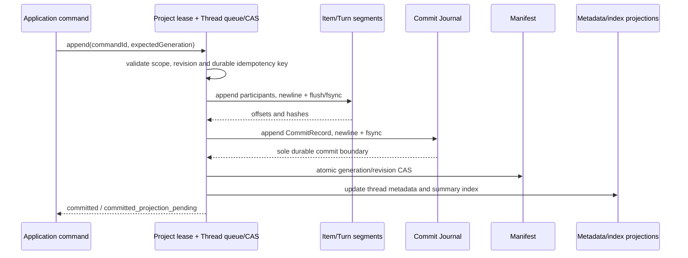

# Office Agent 会话系统重构：阶段 0 合同与基线

日期：2026-10-08
状态：阶段 0 合同与软件合成基线已交付；不含生产代码迁移或存储切换
分支：`feature/conversation-phase0`

本报告是第二轮方案的阶段 0 补充记录，方案正文见 [`conversation-system-refactor.md`](../architecture/conversation-system-refactor.md)。正文保持原样。本报告冻结可进入后续实现的候选合同、源码消费者关系、当前合成基线和阶段门禁。Thread/Turn/Item 尚未加入生产源码；报告不声称任何优化已经实施。

## 1. 执行边界与工作区

阶段 0 只新增合同/基准/审计材料和兼容性测试。未修改 TypeScript/TSX 业务逻辑、Runtime、Canonical Tool Contract、Provider Tool Calling、Controlled Provider Tool Bridge、运行配置、依赖或用户项目数据。基准 JSON 使用项目忽略的 `outputs/conversation-phase0/`；Fixture JSON 在测试结束后从系统临时目录清除。

当前源码执行权威仍为 Agent Runtime、Response Execution、既有 Agent Run/Session 和 Tool Gateway。新 Item 中的 Tool Call、Tool Result、Artifact 只是可重建的 UI 投影。

## 2. 阶段 0 冻结合同

### 2.1 IDs

| 身份 | 创建者/生命周期 | 存储和兼容规则 |
|---|---|---|
| ThreadId | Host 会话服务创建，Thread 生命周期不变 | 与旧 ConversationId 的值一对一相同；旧 ConversationId 类型与接口继续有效 |
| TurnId | Host 在用户命令已接收、幂等键已认领后创建 | 新增带类型前缀 `turn-<uuid>`；同一已接受 command 的恢复/重放解析回同一 TurnId |
| Message ItemId | 既有 Message ID Factory 创建 | `value` 与旧 MessageId 完全相同；Item 身份带 `namespace: "message"`，不改变旧 MessageId 业务语义 |
| Projection ItemId | Host projection writer 创建 | 结构身份为 `{ namespace: "projection", value: "item-projection-v1:<sha256>" }`；hash 输入是 canonical tuple `(threadId, projectionKind, sourceSystem, sourceIdentity)` |
| AgentRunId | 既有 ConversationResponseController/Continuation Runtime | 使用现有 ID、Repository、parent/child、lease 和终态合同 |
| ResponseExecutionId | 既有 Artifact Factory/Provider Submission | 使用现有 ID、retryOf、Execution Repository 和事件序列 |
| ToolCallId | Provider 返回，Tool Gateway 原样校验和传递 | 不由会话层生成；投影内作为关联字段保留原值，不作 ItemId 或 TurnId 使用 |
| WorkId | 既有作品登记和本地验证过程 | Item 只引用原 WorkId；不复制、不合成作品身份 |

Item 的唯一键是 tagged identity 的规范序列化，不是裸字符串，因此旧 MessageId 即使碰巧以 `item-projection-v1:` 开头，也不会和 Projection Item 冲突。Repository 另对 `(threadId, namespace, value)` 建唯一约束。Projection identity 保持 source identity 稳定；对 SHA-256 冲突采用 source tuple 二次核验并报 corruption/conflict，不静默覆写。

工具展示项身份：Tool Call 和 Tool Result 分别使用不同 `projectionKind`，source tuple 含 `threadId + responseExecutionId + ToolCallId`。同一 ToolCall 的后续 Runtime/Production event 更新现有投影或其状态，不重复新建同 kind Item。若不存在可靠 ToolCallId，则只可按已持久 Runtime event identity 投影；不可按到达次数分配新身份。

### 2.2 Thread / Turn / Item V1

以下为逻辑字段合同。磁盘 wire schema 必须再定义 closed parser、版本迁移和 checksum；禁止无校验 `as` 断言作为持久数据验证。

```ts
type ThreadId = ConversationId; // wire value 兼容；brand 转换由 adapter 完成
type TurnId = string & { readonly __turnId: unique symbol };
type ProjectionItemId = string & { readonly __projectionItemId: unique symbol };
type ItemId =
  | { readonly namespace: 'message'; readonly value: MessageId }
  | { readonly namespace: 'projection'; readonly value: ProjectionItemId };

interface ThreadV1 {
  schemaVersion: 1;
  threadId: ThreadId;
  projectId: ProjectId | null;
  title: string;
  status: 'active' | 'archived' | 'deleted';
  createdAt: IsoTimestamp;
  updatedAt: IsoTimestamp;
  lastItemId?: ItemId;
  lastItemSequence: number;
  itemCount: number;
  turnCount: number;
  generation: number;
}

interface TurnV1 {
  schemaVersion: 1;
  turnId: TurnId;
  threadId: ThreadId;
  turnSequence: number;
  status: 'open' | 'completed' | 'failed' | 'cancelled' | 'interrupted' | 'unknown';
  createdAt: IsoTimestamp;
  completedAt?: IsoTimestamp;
  userItemId: ItemId;
  assistantItemIds: readonly ItemId[];
  provenance: 'native' | 'legacy_inferred';
  executionLinkRevision: number;
}

type ItemType = 'user_message' | 'assistant_message' | 'tool_call_projection' |
  'tool_result_projection' | 'document_artifact_projection';

interface ItemV1 {
  schemaVersion: 1;
  itemId: ItemId;
  threadId: ThreadId;
  turnId?: TurnId;
  sequence: number; // monotonically assigned among committed Thread Item records
  type: ItemType;
  status: 'pending' | 'streaming' | 'completed' | 'failed' | 'cancelled' | 'interrupted' | 'unknown';
  createdAt: IsoTimestamp;
  updatedAt: IsoTimestamp;
  messageSource?: { readonly messageId: MessageId; readonly messageRevision: number };
  content?: string;
  bodyRef?: { readonly segmentId: string; readonly offset: number; readonly length: number; readonly sha256: string };
  projectionSource?: {
    readonly eventSystem: 'response_execution' | 'agent_runtime' | 'production_trace' | 'work_repository';
    readonly sourceIdentity: string;
    readonly responseExecutionId?: ConversationResponseExecutionId;
    readonly agentRunId?: ConversationAgentRunId;
    readonly toolCallId?: string;
    readonly workId?: WorkId;
  };
}
```

Turn 表示一条被 Host 接收的用户输入及其会话级输出。继续/恢复若新增一条用户输入就是新 Turn；Agent session 可跨多个 Turn。一个 Turn 关联关系由只追加的 `TurnExecutionLinkV1` 管理，可挂多个 AgentRunId 和 ResponseExecutionId；这不改写任何 AgentRun 生命周期。Turn `status` 是 transcript 汇总状态，不用于工具调度、重复执行判定或恢复授权。无法证明的旧轮次边界必须标 `legacy_inferred`。

### 2.3 ID 关联和投影边界

```text
ConversationId ──同值映射── ThreadId
MessageId ──同值 + namespace=message── Message ItemId
TurnId ──user/assistant message items── ItemId
TurnId ──append-only links── AgentRunId[] / ResponseExecutionId[]
ResponseExecutionId + ToolCallId ──projection key── Tool ItemId
WorkId ──reference only── Document Artifact ItemId
```

ToolCallId 永远不是 ItemId；Tool result UI 内容来自经脱敏的 Runtime Observation/生产事件 projection，不将 tool args、凭证、绝对路径或原始完整结果复制进会话存储。Work artifact Item 必须指向现有验证后的 WorkId。重放只 reconcile projection key 和状态，不调用任何 Provider/Tool API。

## 3. Repository 和 IPC 合同

```ts
interface SummaryQuery {
  projectId: ProjectId; // IPC 主进程再与 active project scope 比对
  cursor?: string;
  limit: number; // 1..200，超界返回 limit_out_of_range，不静默夹取
  includeArchived?: boolean;
  includeDeleted?: boolean;
}
interface SummaryPage {
  items: readonly ThreadSummaryV1[];
  nextCursor?: string;
  readAtSequence: number;
  hasMore: boolean;
}
interface ItemPageQuery {
  threadId: ThreadId;
  cursor?: string;
  limit: number; // 1..200
  direction: 'older' | 'newer';
  readAtSequence?: number;
}
interface ItemPage {
  threadId: ThreadId;
  items: readonly ItemV1[];
  nextCursor?: string;
  readAtSequence: number;
  hasMore: boolean;
}
interface ThreadReadRepository {
  listThreadSummaries(query: SummaryQuery): Promise<SummaryPage>;
  getThread(threadId: ThreadId): Promise<ThreadV1 | undefined>;
  getThreadItemsPage(query: ItemPageQuery): Promise<ItemPage>;
  getTurn(turnId: TurnId): Promise<TurnV1 | undefined>;
  readModelHistory(query: ModelHistoryQuery): Promise<readonly MessageForContext[]>;
}
```

Cursor 是版本化 base64url opaque DTO，解码后验证 `threadId/projectId/direction/readAtSequence/last(sequence, tagged itemId)`；它不是授权凭证。排序唯一规定为 `(sequence ASC, namespace ASC, itemId.value ASC)`，next/older page 使用 exclusive tuple 比较。首屏捕获 Thread 已提交 `lastItemSequence` 为 readAtSequence；后续页沿用该高水位，新写入不影响这一浏览快照。cursor 错误返回 `cursor_invalid`，Thread/项目不匹配返回 `cursor_scope_mismatch`，跨项目/未打开项目分别返回 `project_scope_mismatch`/`project_not_open`。

新增 IPC 仅为 `listThreadSummaries`、`getThread`、`getThreadItemsPage`、`getTurn`；`readModelHistory` 是主进程 Application/Repository 内部接口，不开放 Renderer。分页错误合同还包括 `thread_not_found`、`repository_corrupt`、`repository_degraded_read_only`、`storage_error`。旧 `getConversation`、`listConversations` 继续返回完整 DTO；旧 `ConversationApplicationService.get/list` 继续返回完整 Domain Conversation。适配必须显式命名为 `toLegacyConversation`/`toThreadPage` 等，不能改变旧函数返回语义。

模型历史独立读取：Adapter 通过当前 MessageId 定位 user input，从 Repository 读完整历史候选，再调用现有 `ConversationContextBuilder`/`AgentContextAssembler`；保持最近 40 条、64k input、16k references、workflow reply 排除、token 裁剪和 Tool Message 格式。UI 未加载早期 Item 不得改变 ModelHistoryReader 的读取结果。

## 4. 文件 segment 与恢复合同

本阶段冻结逻辑写协议；阶段 4 必须按目标 Windows 文件系统故障注入验证耐久语义，不能直接把“write + fsync”当成跨文件事务。

```ts
interface SegmentRecordV1<T> {
  schemaVersion: 1;
  generation: number;
  sequence: number;
  transactionId: string;
  recordId: string;
  recordKind: 'turn' | 'item' | 'turn_execution_link';
  idempotencyKey: string;
  occurredAt: IsoTimestamp;
  previousRecordHash: string;
  payload: T;
  payloadHash: string;
  recordHash: string;
}
interface CommitRecordV1 {
  schemaVersion: 1;
  generation: number;
  transactionId: string;
  commitSequence: number;
  previousCommitHash: string;
  participants: readonly { segmentId: string; startOffset: number; endOffset: number; recordIds: readonly string[]; checksum: string }[];
  metadataDeltaHash: string;
  commitHash: string;
}
interface ThreadManifestV1 {
  schemaVersion: 1;
  threadId: ThreadId;
  generation: number;
  committedSequence: number;
  committedItemSequence: number;
  committedTurnSequence: number;
  lastCommitHash: string;
  segments: readonly { segmentId: string; recordKind: string; committedBytes: number; lastSequence: number; checksum: string }[];
  snapshot?: { snapshotId: string; sequence: number; checksum: string; sourceCommitHash: string };
  revision: number;
}
```

Record/hash bytes使用确定性 canonical JSON UTF-8；JSONL 行必须以换行结尾，`recordHash/commitHash` 按合同规定排除自身 hash 字段计算。每 Thread 由 host 项目 writer lease 限定一个进程写入，进程内使用 Thread queue 和 `sharedFileWriteCoordinator`，Manifest 使用 generation/revision CAS。现有 `sharedFileWriteCoordinator` 是进程内协调器；不得据此声称已有跨进程 Thread 锁。阶段 4 必须实现/复用 OS 文件租约或明确 Electron project single-writer invariant，检测 stale owner 时用进程启动身份/nonce 而非裸 PID。

唯一 durable commit boundary 是 Commit Journal 中完整换行结束、checksum/previousHash 链验证通过且 fsync 成功的 `CommitRecordV1`。Segment append、Thread metadata、summary index、turn link 与 Manifest 更新都不是各自的 commit boundary。提交前各参与 segment flush/fsync；Commit Record 汇总所有已追加 offsets/record IDs 和 metadata delta hash，落盘后逻辑提交；随后 CAS 前推 Manifest，最后更新 Thread metadata/summary 索引 projection。跨文件 commit record 的实现需确保所有 Participant segment 和 journal 文件目录项均存在并已经满足目标 OS durability 条件；失败不得返回成功。

崩溃恢复顺序：验证 Thread identity 和 Manifest checksum/schema/generation → 验证 Commit Journal 完整行、sequence/hash chain → 从 Manifest 高水位验证 segment committed offsets 与 checksums → 扫描 Manifest 之后 journal 中完整 Commit Record 并向前核验 Participant offsets → roll-forward durable commits 和 Manifest → 检查未提交尾部 → 将尾部原始 bytes 复制到带 hash 的 quarantine，再只截断未提交部分 → 校验并选择 snapshot → replay snapshot 之后的 committed records 更新会话 projection → rebuild `thread.v1/index` Projection Debt → reconcile AgentRun/Execution links → READY。

非尾部 corruption、hash 链断裂、committed offset 内半行、sequence gap、丢失的已提交 Participant 一律 `DEGRADED_READ_ONLY` 并生成 recovery report；不自动跳过、覆盖旧备份或丢弃有效历史。Snapshot 仅为 projection checkpoint；检查 `(threadId,generation,sequence,sourceCommitHash,snapshotChecksum)` 后才能使用，不覆盖 Segment/Commit Authority。Projection Debt 可由 Commit Journal/segment 重建；重建幂等且永不触发执行。

### 写入时序



Idempotency key须在 Commit Journal 的 committed set / snapshot compaction checkpoint 中持久查询。相同 key+payload hash 重放返回原 commit；同 key 不同 hash 为 `idempotency_conflict`。Compaction 不得遗忘仍可能重放的 key；可安全收缩范围必须由 committed high-water fence 证明。

## 5. 真实源码差异和 ID 限制

审查稿中的高层源码事实仍匹配当前树；补充事实：`ConversationId` 和 `MessageId` 是 nominal brands，但 parser 只 trim/拒空值，没有前缀/字符集 namespace 约束，见 `src/domain/ids.ts:1-12,83-86`。生成方目前分别使用 `conversation-${randomUUID()}`、`message-${randomUUID()}`，见 `src/platform/ipc/chat-context-runtime.ts:1547-1551`；有些文档 generation IPC 也直接创建 MessageId，见 `electron/ipc/document-generation-ipc.ts:75`。因此只凭字符串前缀不能确保旧 ID 不碰撞；冻结的 tagged `ItemId` 及 Repository tuple 唯一键是必要兼容合同。`

审查稿描述的 “一个已接收 user input 创建一个 Turn” 是目标合同，不是当前实现事实。当前 AgentSession 可能跨 response/child runs，Artifact Factory 先写 assistant pending Message 再建 ResponseExecution；Turn linking 必须置于现有 durable admission/execution 创建后旁路关联，不能替代任何已有 ID 或改写恢复顺序。`ConversationResponseExecutionSnapshotV1` 继续保存旧 conversation/user/assistant IDs，见 `src/domain/entities/conversation-response-execution.ts:88-126`。

原审查稿主 API 消费者列表补充 TypeScript Compiler API 解析到的生产调用文件：

- `src/pages/chat/ChatPage.tsx`
- `src/application/agent-context-assembler.ts`
- `src/platform/providers/conversation-native-search.ts`
- `src/platform/documents/conversation-attachment-context.ts`
- `src/platform/documents/conversation-document-page-context.ts`
- `src/platform/providers/conversation-response-artifact-factory.ts`
- `src/platform/ipc/conversation-controller.ts`
- `src/platform/ipc/conversation-workflow-controller.ts`
- `src/platform/ipc/conversation-web-research-controller.ts`
- `src/platform/ipc/conversation-response-controller.ts`
- `src/platform/ipc/conversation-agent-continuations.ts`
- `src/platform/ipc/chat-context-runtime.ts`
- `electron/ipc/document-generation-ipc.ts`

`tests/performance/conversation-phase0-reference-audit.mjs` 使用 TS API 解析 `tsconfig.test.json`、`electron/tsconfig.json`。最终审计 36 个架构稿证据路径存在，解析到 84 个所选合同方法的 production call sites、247 个方法调用/类型符号引用。原先初版审计泛计整个 watched file 的 157 个 calls 已修正，不再作为调用方数量。明细见 `outputs/conversation-phase0/reference-audit.json`。

## 6. 性能基线

复现命令：

```powershell
pnpm exec vitest run tests/performance/conversation-phase0-baseline.test.ts --reporter=verbose
node tests/performance/conversation-phase0-reference-audit.mjs --out outputs/conversation-phase0/reference-audit.json
```

基准 JSON 自动写到 `outputs/conversation-phase0/baseline.json`，fixture 存储目录在测试结束时删除。基准环境：Node v24.20.0、Windows x64、AMD Ryzen 7 9700X、16 logical CPUs、约 16.28 GB RAM。Node/Vitest 合成进程，不是 Electron main/真实 Renderer；一次串行 suite 的时钟数据，不作为硬性能门禁。

| 会话 × 每会话消息 | JSON 大小 | Repository list / 单 Thread get | DTO 映射 + JSON 序列化 | 全量 JSON payload | 摘要 payload | Repository 推导读放大 |
|---|---:|---:|---:|---:|---:|---:|
| 10 × 100 | 0.56 MB | 8.57 / 6.44 ms | 1.07 + 0.60 ms | 383,151 B | 1,871 B | list + get，约 1.11 MB |
| 100 × 100 | 5.59 MB | 50.39 / 44.92 ms | 13.41 + 6.55 ms | 3,858,681 B | 18,881 B | list + get，约 11.19 MB |
| 1000 × 100 | 56.23 MB | 454.91 / 433.29 ms | 27.74 + 92.56 ms | 38,885,781 B | 190,781 B | list + get，约 112.46 MB |
| 10 × 1000 | 5.56 MB | 43.50 / 46.52 ms | 1.18 + 9.33 ms | 3,825,661 B | 1,881 B | list + get，约 11.11 MB |

补充测量：10×100 与 10×1000 JSON parse-only probe 分别 0.76 ms/0.56 MB、6.00 ms/5.56 MB；10×100 Save 36.52 ms，legacy Repository 写 backup + primary，观察到两份合计 1,113,430 B；benchmark RSS/heap 在 1000×100 场景读后分别约 689 MB/528 MB（当前同一进程此前已跑其他场景，不能当独立场景增量）。Node event-loop-delay probe 1000×100 max 9.9 ms，10ms resolution 下只有一个短 Repository list window，其他 scenario 为 0；这不是 Electron 主进程 long-task 测量。

长 Markdown：168,198 chars，ReactMarkdown server render 771.38 ms，输出 309,038 B。此为 SSR parser/renderer 时间，不是浏览器 React Commit。Tool 展示投影：100 messages + 2,000 synthetic ProductionTrace events，0.98 ms，只量 `projectProductionMessages()`。流 batcher：1 MiB burst→128 persisted batches、4.08 ms；15.74 秒持续小 Delta、1 MiB→129 batches。persist 是内存计数器，不写磁盘，不运行 Provider。

场景覆盖：实跑 10×100、100×100、1000×100、10×1000，覆盖会话数量与单会话消息数量两个维度的低/高值。未跑 100×1000 和 1000×1000 的笛卡尔积；单体格式外推约 0.56 GB/5.6 GB，当前 free memory 约 1.7 GB 且 Repository 会解析全部对象，OOM/换页风险不适合作为本次在线运行 fixture。以后需用受控逐级生成/独立进程运行，不从此次结果推断这两种规模。

未测量：真实 Electron main long task、IPC `structuredClone` 实际传输、Chromium React Commit、可视滚动/可变高度、真实进程增量内存、OS 实际读写 syscall/fync bytes、连续真实工具调用、Provider 长时间输出。IPC JSON bytes 是 DTO JSON 理论体积；Repository read count/bytes 根据已确认 `get/list` 各调一次 `readFile` 和 fixture 文件大小推导，未用 OS syscall tracer。摘要 mapping 在已全量加载 Conversation 后计算，所以它只证明传输候选体积差，不证明摘要 API 底层 I/O 变小。

这组数据明确展示当前全量模型成本增长；没有优化后同条件结果，不能声称任何性能提升。

## 7. 兼容性测试基线

新增的完整旧 API 合同测试在 `tests/platform/conversation-controller.test.ts`，验证 list/get 返回完整正文、原 MessageId、message revision 和 Conversation revision。它在已有 Controller 套件中运行。

现有直接覆盖及文件：

| 合同 | 当前覆盖 |
|---|---|
| 完整 Conversation Repository、revision CAS、备份和显式旧 schema migration | `tests/platform/conversation-repository.test.ts` |
| 完整 Controller get/list、Message ID/revision、legacy copy | `tests/platform/conversation-controller.test.ts` |
| Context Builder 与 AgentContextAssembler 组装、历史裁剪、reference 和 token budget | `tests/application/conversation-context-builder.test.ts` |
| Artifact Factory 与 Provider context creation | `tests/platform/conversation-response-artifact-factory.test.ts`、`tests/platform/conversation-document-page-integration.test.ts` |
| ResponseExecution 状态、连续 stream event、重复/gap 拒绝、恢复/replay | `tests/platform/conversation-response-streaming-contracts.test.ts`、`tests/platform/conversation-response-controller.test.ts` |
| Canonical Tool Contract/Schema/Bridge/Observation/production trace | `tests/platform/provider-tool-calling.test.ts`、`tests/platform/canonical-tool-chain.test.ts` |
| Agent Runtime model/tool admission、重复调用、checkpoint、未知冻结、outbox | `tests/application/conversation-agent-runtime-service.test.ts`、`tests/platform/conversation-agent-runtime-repository.test.ts` |
| Agent Session resume nonce、cancel、deadline、lease | `tests/application/conversation-agent-session-service.test.ts`、`tests/platform/conversation-agent-session-repository.test.ts` |
| Recovery 不重放未知副作用 | `tests/platform/conversation-agent-recovery-runtime.test.ts` |
| Response startup cancel 和执行协调 | `tests/platform/r07-response-start-cancellation.test.ts`、`tests/platform/conversation-execution-coordinator.test.ts` |
| Stream timeout 与 Delta backpressure | `tests/platform/provider-stream-timeout.test.ts`、`tests/platform/conversation-stream-delta-batcher.test.ts` |

最终阶段 0 定向兼容门禁通过：21 files / 313 tests。命令：

```powershell
pnpm exec vitest run tests/platform/conversation-controller.test.ts tests/platform/conversation-repository.test.ts tests/application/conversation-context-builder.test.ts tests/platform/conversation-response-controller.test.ts tests/platform/conversation-response-artifact-factory.test.ts tests/platform/conversation-response-streaming-contracts.test.ts tests/platform/provider-tool-calling.test.ts tests/platform/canonical-tool-chain.test.ts tests/application/conversation-agent-runtime-service.test.ts tests/platform/conversation-agent-runtime-repository.test.ts tests/application/conversation-agent-session-service.test.ts tests/platform/conversation-agent-session-repository.test.ts tests/platform/conversation-agent-recovery-runtime.test.ts tests/platform/r07-response-start-cancellation.test.ts tests/platform/conversation-execution-coordinator.test.ts tests/platform/provider-stream-timeout.test.ts tests/platform/conversation-stream-delta-batcher.test.ts --maxWorkers=1 --minWorkers=1
```

回归门禁覆盖旧 API/Message revisions、Repository CAS/backup、Context Builder、Artifact Factory、Response Controller/stream replay、Canonical Tool Chain/Observation、Agent Runtime/Session/Recovery、cancel/resume/timeout/idempotency 和 conversation workflow/continuation。另运行 `pnpm typecheck` 与本轮新增/修改文件 ESLint，均通过。未运行完整 `pnpm test`、生产 build、完整真实 Electron 或真实 Provider/Office E2E。

用户点名的 `tests/platform/conversation-phase0-contract.test.ts` 在本轮开始和最终检查时均不存在，因此没有删除任何测试文件；兼容性合同加在既有 `tests/platform/conversation-controller.test.ts`。本轮未新增独立 Controller contract test 文件。

Stage 0 run 内有两次 benchmark harness 初始失败：一次模板字符串包含未转义 Markdown fence，一次 import 未从模块直出 barrel 导出。两处均在 benchmark-only 文件修正；最后一次 benchmark 通过并写入 `outputs/conversation-phase0/baseline.json`。生产源码未因这些失败被修改。

## 8. 阶段 1–5 工程检查清单

### 阶段 1：Summary 与按需加载 IPC

- 允许：`src/shared/chat-context-ipc.ts` 新 DTO/parser；Conversation Controller/IPC handlers/preload；ChatPage 初始摘要和打开后首屏/续页；legacy adapter read-only tests。
- 禁止：改旧 `getConversation/listConversations` 返回语义；切换存储权威；改 Model Context、Agent Runtime、Provider/Tool Gateway 或 legacy JSON writer。
- 新合同：Summary DTO 无正文；cursor 包含 scope/direction/readAtSequence/tuple；limit 1..200；稳定 tie-break；完整旧 DTO 兼容；明确错误码。
- 验收：旧 API contract tests；摘要 IPC bytes；翻页增量/去重、高水位；项目/legacy 无重复；选择 Thread 不读取其他 Thread message body。若底层旧 repository 全量 read，测量并如实标示。
- 回滚：Renderer flag 切回完整旧 list/get；移除新 IPC consumer，不删 repository 文件。
- 依赖：阶段 0；阶段 2 的 UI store 依赖此合同。

### 阶段 2：React Normalized Item Store

- 允许：ChatPage data store、item components、流式 Item 局部订阅、Markdown parse scheduling、scroll anchor；按基线决定是否虚拟列表。
- 禁止：IPC/Repository durable schema、Provider SSE、Tool Loop、Runtime status lifecycle。
- 新合同：Item ID tagged union；同 ID props/update；分页 prepend anchor；用户向上读时禁止自动滚到底；tool/artifact 可变高度稳定 key。
- 验收：真实 Chromium/Electron React Profiler Commit、Markdown parse 与 100/1000 条对比；滚动位置/ResizeObserver 测试；流更新只提交目标 Item；交互与无虚拟列表回退一致。
- 回滚：保留旧 renderer fallback，规范化 store 可由旧 DTO 重建。
- 依赖：阶段 1；本轮 React Commit 未测，必须先补 instrumentation。

### 阶段 3：Thread/Turn/Item Adapter 与 ModelHistoryReader

- 允许：domain contracts/IDs、完整旧聚合到新实体 adapter、Turn link read/write port、ModelHistoryReader adapter、parse/contract tests。
- 禁止：迁移/删除 conversations.json、切新 repository authority；改 AgentRun 生命周期/ID；改 ToolCall ID/Schema。
- 新合同：ThreadId 同值 ConversationId；Message Item 同值 MessageId 并带 namespace；projection identity 稳定；Turn provenance；多 AgentRun/Execution append-only links；Model context 独立读完整必要历史。
- 验收：全历史 context 与原 Builder 输出一致；legacy IDs 不变；replay 不增 projection 项；Turn link write failure 不触发执行重放；strict parser/future schema refusal。
- 回滚：关闭 adapter feature switch，旧 Conversation 仍为唯一 authority。
- 依赖：阶段 0 IDs/API合同；阶段 1 旧接口兼容稳定。

### 阶段 4：Segment、Commit Journal、Manifest、Snapshot、Recovery

- 允许：新 Thread Repository/存储路径、project writer lease、fault injection/storage tests、snapshot rebuild 与 bounded archive metadata。
- 禁止：迁移用户数据、默认读新仓、删除/修改现存 conversations.json、修改 Runtime/Tool execution journal。
- 新合同：Segment/Commit/Manifest checksum；一个 durable commit boundary；generation+sequence CAS；项目单 writer；Projection Debt；degraded read-only 和 quarantine。
- 验收：每个写入点 crash injection；尾半行/非尾损坏；跨进程竞争；manifest 前后崩溃；snapshot 重放；idempotency 重放；NTFS durability 实测。恢复过程绝不调用 Provider/Tool。
- 回滚：仍处 shadow，关 reader switch；保留所有新文件和报告供诊断，旧仓继续权威。
- 依赖：阶段 3 合同冻结；阶段 0 物理 I/O 基线。JSONL 不等于事务，FileWriteCoordinator 只是现有进程内锁。

### 阶段 5：迁移、Shadow Compare、Cutover、完整回归

- 允许：迁移/import ledger、legacy change journal/outbox、shadow comparator、authority fence、operator recovery/rollback tooling、Electron 验证。
- 禁止：无报表修复/删除源记录；有未完成 Agent execution 时重绑其执行 ID；无法追平时宣称旧格式无损回滚。
- 新合同：source checksum + migration idempotency；mapping/count/hash report；legacy 期间写入追平；authority epoch/fence； active execution gate；rollback compatibility window。
- 验收：中断迁移恢复、重复迁移无重复、shadow lag=0、完整身份/正文 hash 对账、活跃执行 gate、强杀进程恢复、Tool Gateway 回归、真实 Electron 文件 reopen。真实 Provider 测试另行授权并区分。
- 回滚：仅旧库确实追平且旧 writer fence 可安全恢复才回旧权威；否则停写并运行兼容新格式的应用版本，绝不谎称旧二进制无损回滚。
- 依赖：阶段 4 恢复/损坏门禁全部通过；阶段 1–3 consumers 已适配。

## 9. 阶段 0 退出评估

已完成：源码/类型依赖核对；合同与恢复协议在本报告中冻结；旧 API 完整语义有新增回归合同；性能合成基线和复现文件已生成；Runtime/Tool 关键现有测试覆盖盘点完成。

未完成或未达到真实运行验证：完整 6 种会话×消息笛卡尔规模中的两种大场景；React Commit/实际 Chromium Markdown；Electron main long task；真实 IPC structured clone；OS syscall/fsync 计数；非尾损坏/崩溃恢复故障注入；NTFS 多进程 writer lease 真实性能和 durability。没有 JSONL 生产实现可执行这些故障注入。

结论：阶段 0 的合同、类型引用审计、旧 API 兼容测试和 Node 合成 baseline 交付已完成，达到“阶段 0 文档/软件合同退出条件”。Electron/Renderer、实际 IPC clone、OS I/O 和大型笛卡尔场景 gap 已具体记录；这些数据不能由本基线替代，且须在阶段 2 的性能结论及阶段 4/5 的真实性验收前补测。阶段 1 技术上可在其独立门禁下开始，但当前指令只授权阶段 0，因此本轮未进入阶段 1；实施仍需明确授权。
