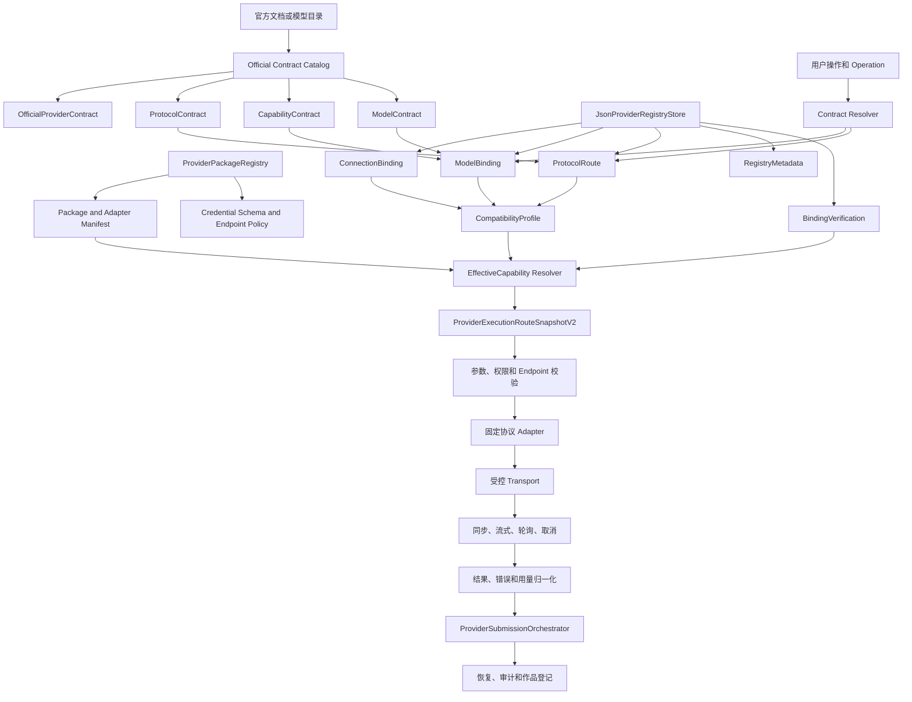

# 官方合同统一适配框架——工程落地实施总计划

> 状态：计划阶段，未实施（2026-10-09）
>
> 本文基于当前工作区源码和测试引用制定，只规划后续工程工作，不代表任何能力已经实现，也不授权真实模型调用、联网检索、凭证读取或注册数据迁移。

## 1. 目标和边界

当前体系包含供应商分支、模型分支、连接模板、能力 Profile 和特殊 Adapter 逻辑。本计划将其逐步演进为：

```text
官方合同 -> 连接绑定 -> 操作级协议路由 -> 合同解析
-> 不可变执行快照 -> 固定协议适配器 -> 统一执行
```

最终目标：

- 新增已有协议的官方模型，主要通过官方合同、能力合同和绑定数据完成。
- 新增透明兼容中转站，只增加连接、兼容性描述、验证证据和模型绑定，不增加业务路由代码。
- 只有出现新的协议执行语义时，才新增或扩展协议 Adapter。
- 官方模型语义不再由 `packageId`、`providerName` 或 `providerModelKey` 特判决定。
- 保留文本、图像、视频、流式、异步轮询、取消、恢复、结果接收、错误、用量和审计能力。

强制边界：

- 原地演进现有 `ProviderPackageRegistry`、`JsonProviderRegistryStore`、Provider 实体、路由快照和执行 Runtime。
- 不建立第二套 Provider Registry 或第二套 Execution Runtime。
- 不引入新的 Agent 意图分类器，不重写 Agent Runtime、Tool Bridge 或 Document Runtime。
- 不一次性删除旧字段、旧 `ProviderProtocolBinding` 或兼容读取逻辑。
- 合同定义语义，CompatibilityProfile 描述兼容范围，Adapter 实现协议行为，Platform 控制凭证、Endpoint、权限、费用、状态和执行。

## 2. 当前源码基线

### 2.1 现有结构和目标定位

| 当前结构 | 当前职责 | 目标定位 |
| --- | --- | --- |
| `src/domain/entities/provider-package.ts` | Credential、Endpoint、Template、Adapter 描述 | Package 安装清单和连接实现清单 |
| `src/platform/providers/provider-package-registry.ts` | Package、Template、Adapter、Endpoint 引用解析和校验 | Package 与官方合同引用校验入口 |
| `src/domain/entities/provider-catalog.ts` | `ProviderModelDefinition`、Profile Template、Model Profile | 官方模型合同引用和运行时 Profile 投影 |
| `src/domain/entities/provider.ts` | Provider、Connection、Model、ProtocolBinding、Capability Evidence | V1 数据载体，逐步扩展 Binding、Route、Verification |
| `src/platform/providers/provider-registry.ts` | JSON Registry 持久化、版本冲突和引用校验 | 唯一 Provider Registry |
| `src/domain/entities/provider-execution-route.ts` | `ProviderExecutionRouteSnapshotV1` | 原地升级为 V2 执行计划快照 |
| `src/platform/providers/provider-submission-orchestrator.ts` | 提交确认、授权、快照、幂等和执行编排 | 消费解析后的 V2 计划 |
| `src/platform/providers/provider-operation-router.ts` | Model -> ProtocolBinding -> Evidence -> Adapter | Operation -> ProtocolRoute 解析器 |
| `src/platform/providers/provider-execution-route-dispatcher.ts` | 按 Adapter Key/Version 调用 submit/query/cancel/receive | 保留，Adapter 继续负责协议状态机 |
| `src/platform/providers/provider-registry-feature-candidates.ts` | 候选、参数和路由模板组装 | 只读 EffectiveCapability 投影 |
| `src/platform/providers/newapi/newapi-contracts.ts` | 协议、Schema、Package 和模型工厂混合定义 | 拆分官方协议、能力和连接语义 |
| `src/platform/providers/newapi/unicompapi-model-capabilities.ts` | 网关模型能力表和模型特判 | 网关声明/兼容投影，不直接作为官方合同 |

### 2.2 当前调用关系

```text
ProviderPackageRegistry
  -> ProviderConnectionContractService
  -> ProviderManagementFramework
  -> JsonProviderRegistryStore

JsonProviderRegistryStore
  -> RegistryFeatureCandidateSource
  -> ProviderFeatureCandidateService
  -> ProviderSubmissionOrchestrator

ProviderSubmissionOrchestrator
  -> ProviderExecutionRouteSnapshotV1
  -> ProviderSubmissionDispatchBridge
  -> ProviderExecutionRouteDispatcher
  -> protocol Adapter
```

`ProviderExecutionRouteSnapshotV1` 已经冻结 Package、Adapter、Connection、Credential version、Model、Profile、ProtocolBinding、Schema、Runtime Policy 和 Authorization Claim。它应演进为计划快照，而不是另建持久化的 `ResolvedExecutionPlan`。

### 2.3 主要缺口

1. `ProviderModel` 只有一个 `protocolBindingId`，无法表达同一模型按操作选择多条协议路由。
2. `ProviderModelDefinition`、`ModelFeatureProfile` 和 `ModelCapabilityEvidence` 混合了官方语义、连接声明、验证事实和启用状态。
3. `newapi-contracts.ts` 同时放置通用协议、NewAPI Package、UniCompAPI 参数和按 Package ID 限制的模型工厂。
4. `unicompapi-model-capabilities.ts` 是网关目录和本地能力声明的混合物，不足以证明原始官方模型身份。
5. `provider-registry-feature-candidates.ts` 在部分候选读取流程中调用 `registry.mutate()`，存在隐式写入。
6. NewAPI、UniCompAPI、Kimi、Vidu、MiniMax、Kling、Volcengine Adapter 或 Runtime 中仍有 Package、Template 或 Model Key 特判。

## 3. 目标架构

### 3.1 数据分层

**OfficialContract**：不可变、版本化、可校验的官方语义定义。

- `OfficialProviderContract`：官方厂商/API 身份、文档来源、修订和内容 Hash。
- `ProtocolContract`：官方协议版本、操作、请求/响应、流式事件、同步/异步生命周期、查询、取消、错误和结果映射。
- `CapabilityContract`：产品能力、参数 Schema、输入限制、结果 Schema、用量 Schema 和约束。
- `ModelContract`：官方模型 ID、所属官方供应商、能力合同引用、弃用信息和来源。

合同不能保存 API Key、用户 Endpoint、运行状态、权限、绝对路径或可执行代码。

**CompatibilityProfile**：描述某个连接或网关对官方协议/能力的兼容范围，包括支持/拒绝字段、映射、流式事件、异步状态、查询、取消、结果接收、兼容扩展和已知限制。它不能伪装成官方协议版本。

**运行时绑定**：

- `ConnectionBinding`：Endpoint、CredentialRef、Endpoint Policy、Connection revision 和连接状态。
- `ModelBinding`：`modelContractId`、`connectionId`、远端模型名、展示覆盖、绑定状态和路由优先级。
- `ProtocolRoute`：`modelBinding + operation -> protocolContract + adapter + compatibilityProfile`。
- `BindingVerification`：实际探测的能力、样例摘要、验证时间、有效期、结果和失败原因。
- `RegistryMetadata`：候选、发布、启用、禁用、废弃等可变状态。

**EffectiveCapability**：

```text
官方能力
∩ 连接声明能力
∩ CompatibilityProfile
∩ BindingVerification
∩ Adapter 实际支持范围
∩ Runtime Authorization 和安全策略
```

未验证、验证失败、验证过期、Adapter 不支持或授权拒绝的能力不得进入可执行集合。

### 3.2 目标架构图



### 3.3 执行链路

```text
用户请求
-> ModelBinding
-> Operation 对应 ProtocolRoute
-> ModelContract、CapabilityContract、ProtocolContract
-> CompatibilityProfile 和 BindingVerification
-> EffectiveCapability
-> ProviderExecutionRouteSnapshotV2
-> 参数、权限、Endpoint、费用和取消预算校验
-> 固定 Adapter
-> submit/query/cancel/receive_result
-> 结果、错误、用量归一化
-> 执行、恢复和审计事实
```

## 4. 类型设计顺序

1. 版本和来源基础类型：合同 Schema 版本、官方协议版本、Adapter 实现版本、Binding/Verification revision、Hash、Source Evidence。
2. 不可变官方合同：`OfficialProviderContract`、`ProtocolContract`、`CapabilityContract`、`ModelContract`。
3. 兼容性描述：`CompatibilityProfile`。
4. 运行时绑定：`ConnectionBinding`、`ModelBinding`、`ProtocolRoute`、`BindingVerification`、`RegistryMetadata`。
5. `EffectiveCapabilityResolver`：计算最终可执行能力和失败原因。
6. `ProviderExecutionRouteSnapshotV2`：冻结解析结果。
7. 运行时切换：最后修改 Router、候选服务和提交编排。

官方协议版本、内部合同 Schema 版本、Adapter 实现版本必须独立建模。

## 5. 分阶段实施计划

### 阶段一：架构冻结与基线

**目标**：冻结当前数据结构、任务链路、持久化格式、测试覆盖和特判清单。

**真实源码范围**：Provider Package、Catalog、Provider、Route Snapshot、Package Registry、Provider Registry、Management Framework、Feature Candidates、Operation Router、Submission Orchestrator、Route Dispatcher、Migration，以及所有现有协议 Adapter 和测试。

**工作**：建立字段矩阵、调用关系图、Registry/V1 快照 fixture、错误码清单和 `packageId/providerModelKey` 特判清单。只读审计，不改行为。

**依赖/迁移**：无前置依赖，无数据迁移。

**测试/验收**：模型、图片、视频、异步、取消、恢复和审计入口均有调用链；基线测试、typecheck、lint、build、diff check 通过。

**回退**：只产生审计资料，删除新增资料即可回退。

### 阶段二：官方合同体系

**目标**：增加不可变官方合同和来源校验，不改变运行时。

**文件**：新增 `src/domain/entities/provider-official-contract.ts`；扩展 `provider-catalog.ts`、`provider-package.ts`、`src/domain/index.ts`、`provider-package-registry.ts`；增加领域和 Package Registry 测试。

**类型**：`ContractArtifactEnvelope`、`OfficialProviderContract`、`ProtocolContract`、`CapabilityContract`、`ModelContract`。

**规则**：合同内容不可变；新内容生成新版本；不保存 Secret、Endpoint、运行状态或任意代码；来源不明只能是候选声明，不能 published/enabled。

**依赖/迁移**：依赖阶段一；不改现有 Registry 数据，旧 `ProviderModelDefinition` 继续兼容解析。

**测试/验收**：来源缺失、Hash 错误、版本冲突、重复 ID、未知引用和网关伪装官方合同均失败；旧 Package 仍可解析；不接入运行时。

**回退**：只保留领域类型和纯校验。

### 阶段三：兼容性与运行时绑定

**目标**：引入 CompatibilityProfile、ConnectionBinding、ModelBinding、ProtocolRoute、BindingVerification。

**文件**：新增 `src/domain/entities/provider-compatibility.ts`；扩展 `provider.ts`、`provider-catalog.ts`、`provider-registry.ts`、`provider-package-registry.ts`、`provider-connection-contract-service.ts`、`provider-management-framework.ts`。

**规则**：保留 ProviderConnection/ProviderModel 为兼容载体；新增按 `modelBinding + operation` 唯一定位的 ProtocolRoute；保留 ProviderProtocolBinding 为 V1 投影；Adapter bindings 只表示已安装 Adapter；验证证据保存实际探测结果、时间、有效期和失败原因。

**迁移/兼容**：惰性生成旧模型和旧 ProtocolBinding 的只读投影，不删除旧数组和 ID。

**测试/验收**：一个模型多个操作/协议、一个模型多个连接、Route 唯一性、Verification 过期、连接删除后的历史保留、V1 投影通过；新 Binding 不要求修改 Adapter。

**回退**：新 Route 只读，不参与执行。

### 阶段四：Effective Capability Resolver

**目标**：以纯读取方式计算有效能力，移除候选读取隐式写入。

**文件**：`provider-registry-feature-candidates.ts`、`provider-feature-candidates.ts`、NewAPI image/video routing、`unicompapi-model-capabilities.ts`、`provider-registry.ts`。

**规则**：能力取官方、声明、兼容、验证、Adapter 和授权的交集；候选列表不得调用 `registry.mutate()` 创建 Profile、Evidence 或 Route；绑定、验证和启用必须显式管理。

**测试/验收**：未验证、过期、Adapter 不支持、授权拒绝均不可执行；候选列表纯读；同一模型不同操作得到不同能力；不再由 Package/Model Key 单独决定能力。

**回退**：旧路由函数保留为只读兼容层。

### 阶段五：执行快照 V2

**目标**：用现有 Route Snapshot 原地冻结完整解析计划。

**文件**：`provider-execution-route.ts`、Submission Orchestrator、Route Dispatcher、Route Snapshot Repository、Project Submission Acceptance、Provider Contracts Migration，以及 invocation/submission/recovery 测试。

**V2 字段**：`operation`、官方 Provider/Model Contract ID/version/hash、ProtocolRoute/ProtocolContract ID/version、CompatibilityProfile ID/version/hash、EffectiveCapability ID/hash、remoteModelKey、BindingVerification IDs/revisions。

**规则**：新任务创建 V2；V1 历史任务只按原快照解释；V1/V2 并存；只保存 Credential Version/Reference，不保存 Secret。

**测试/验收**：V1 读取、异步查询、取消、恢复、迟到回调；V2 Hash 和引用校验；合同或 Binding 后续变更不影响已保存快照；历史任务不被重新解释。

**回退**：保留 V1 创建路径；V2 失败不得静默生成不完整计划。

### 阶段六：运行时按 Operation 路由

**目标**：将 Router 从单一 ProtocolBinding 演进为 Operation 级 ProtocolRoute，保留现有 Adapter 状态机。

**文件**：Operation Router、Route Dispatcher、Submission Dispatch Bridge、Submission Orchestrator、Feature Candidates、文本/图片/视频提交模块、NewAPI Runtime。

**规则**：新增 `resolveExecutionPlan`；新旧提交路径双路径共存；Adapter 继续实现 submit/query/cancel/receive_result、流式事件和状态机；不引入 Agent 意图分类器，不重写 Tool Bridge 或 Document Runtime。

**测试/验收**：同一模型不同操作选择不同 Route；官方和中转连接隔离；Adapter 版本不匹配失败；文本、图片、视频、异步、轮询、取消、恢复和幂等回归；同协议新增模型不需要业务 Adapter。

**回退**：按 Provider、Connection、Operation 灰度，保留 `legacy_route` 和 `resolved_route_v2`。

### 阶段七：模型目录治理

**目标**：拆分 UniCompAPI/NewAPI 的官方来源、网关声明和实际验证。

**目录字段**：`upstreamProvider`、`officialModelKey`、`gatewayModelKey`、`officialProtocol`、`gatewayProtocol`、`officialSourceEvidence`、`declaredCapabilities`、`verifiedCapabilities`、Schema refs、`compatibilityProfileRef`。

**文件**：NewAPI contracts、UniCompAPI contracts/capabilities、OpenAI-compatible identity、NewAPI routing、Management Framework、Feature Candidates，以及 Vidu/MiniMax/Kling/Volcengine packaged catalogs。

**规则**：来源不明条目只能是网关候选声明；同名不同官方供应商不合并；合同 Hash 变化生成新版本；新同协议模型只增加合同和绑定数据。

### 阶段八：特判迁移

**目标**：把可声明的模型差异迁移到合同，保留真正协议执行差异。

**可迁移**：参数范围、能力、结果/用量 Schema、远端模型名、操作路由和兼容扩展。

**必须保留在 Adapter**：流式事件解析、异步状态机、查询/取消、签名算法、厂商认证、非声明式响应解析、网络错误语义。

**重点**：NewAPI identity/runtime/Chat/Image/Video Adapter、Management Framework、Feature Candidates、Prompt Once、文本/图片/视频提交模块及 DeepSeek/Vidu/MiniMax/Kling/Volcengine Runtime/Adapter。

**验收**：删除可数据化特判后，既有模型请求和结果不变；真正协议差异仍明确落在 Adapter。

### 阶段九：灰度、双路径和旧结构退役

**目标**：完成对照、灰度、回退和旧字段写入停止策略。

**验证**：模型调用、图片、视频、流式、轮询、取消、恢复、错误、用量、凭证轮换、连接禁用/删除、重复提交、迟到回调和旧任务兼容。

**退役**：旧结构至少保留一个完整历史任务兼容窗口；旧字段先停止新增写入，再经过恢复和审计验证后才考虑删除。

## 6. 迁移矩阵

| 旧结构/字段 | 新结构/语义 | 处理 |
| --- | --- | --- |
| `Provider.packageId/packageVersion` | Package manifest reference | 保留 |
| `ProviderConnection.endpoint` | `ConnectionBinding.endpoint` | 转换并兼容读取 |
| `credentialReference/credentialVersionId` | `CredentialRef`/credential revision | 转换，禁止复制密钥 |
| `templateId/templateKind` | Connection template metadata | 保留，不代表官方能力 |
| `adapterBindings` | Installed Adapter bindings | 保留，不作为模型能力真相 |
| `ProviderModel.providerModelKey` | `ModelBinding.remoteModelKey` | 转换 |
| `ProviderModel.providerModelKey` | `ModelContract.officialModelKey` | 来源确认后映射 |
| `ProviderModel.protocolBindingId` | `ProtocolRoute[]` | 兼容投影，停止新增写入 |
| `activeProfileId` | Effective Capability reference | 拆分转换 |
| `capabilityEvidenceId` | Binding Verification reference | 转换并保留历史 |
| `enabled/catalogState/revision` | Registry Metadata | 拆分转换 |
| `ProviderModelDefinition` | ModelContract compatibility source | 先兼容读取，后收敛 |
| `profileTemplates` | ProtocolRoute candidates + Capability refs | 转换 |
| `ModelFeatureProfile` | Capability/Route/Verification projection | 拆分 |
| `ModelCapabilityEvidence` | BindingVerification | 转换，保留历史引用 |
| `ProviderProtocolBinding` | Materialized ProtocolRoute V1 projection | 兼容投影 |
| `ProviderExecutionRouteSnapshotV1` | `ProviderExecutionRouteSnapshotV2` | 版本化共存 |
| Adapter 内 `providerModelKey` 分支 | Plan 中的 `remoteModelKey` 和合同声明 | 逐步迁移 |

## 7. 风险控制

| 风险 | 控制措施 |
| --- | --- |
| Registry schema 不兼容 | 兼容读取、原子写入、旧字段保留、冲突重试 |
| 历史任务被重新解释 | 快照保存合同/Binding/Verification/Adapter 版本 |
| Operation 路由歧义 | `ModelBinding + Operation` 唯一路由约束 |
| 网关能力虚报 | Official、Declared、Verified 三层分离，能力取交集 |
| Schema 与 Adapter 不一致 | Resolver 同时校验 Schema 引用和 Adapter Descriptor |
| 凭证泄露 | 合同和快照只保存 CredentialRef/Version |
| 重复注册/执行 | 合同/Binding 唯一约束，保留幂等键和快照 |
| 隐式读写 | 候选列表纯读，绑定/验证/启用显式写入 |
| 中转站部分兼容 | CompatibilityProfile、探测样例、操作级 Verification 和有效期 |
| 协议版本混淆 | 官方协议、内部 Schema、Adapter 实现版本独立建模 |
| 双写不一致 | 明确 canonical owner，旧结构只做投影 |
| 回退失败 | V1/V2 共存、旧 Adapter identity 保留、灰度开关可回退 |

## 8. 任务依赖和提交顺序


每批次必须有独立源码范围、领域/平台测试、离线验证、typecheck、相关 lint、相关测试和 `git diff --check`；未满足本批次验收不得进入下一批次。

## 9. 推荐第一实施批次

### 名称

官方合同边界与来源基线批次。

### 允许修改

- `src/domain/entities/provider-catalog.ts`
- `src/domain/entities/provider-package.ts`
- `src/domain/index.ts`
- 新增 `src/domain/entities/provider-official-contract.ts`
- 新增 `tests/domain/provider-official-contract.test.ts`
- 扩展 `tests/domain/provider-contracts.test.ts`
- 扩展 `tests/platform/provider-package-contracts.test.ts`

### 明确不允许修改

- `src/platform/providers/provider-operation-router.ts`
- `src/platform/providers/provider-submission-orchestrator.ts`
- `src/platform/providers/provider-execution-route-dispatcher.ts`
- `src/platform/providers/provider-submission-dispatch-bridge.ts`
- `src/domain/entities/provider-execution-route.ts`
- `src/platform/providers/provider-registry.ts`
- `src/platform/providers/provider-registry-feature-candidates.ts`
- 所有 NewAPI、DeepSeek、Vidu、MiniMax、Kling、Volcengine Adapter
- Electron IPC、Preload、UI、Agent Runtime、Tool Bridge、Document Runtime
- 现有注册数据、凭证和数据库

### 第一批验收

- 来源缺失、Hash 错误、版本冲突、重复 ID、未知引用失败关闭。
- 官方合同和网关声明不能互相伪装。
- 旧 Package、旧 ModelDefinition、旧 Registry 行为不变。
- 不产生新的 Provider Registry 或 Execution Runtime。
- 不改变模型列表、提交、轮询、取消、恢复或审计行为。
- 定向测试、typecheck、lint、build、diff check 通过。
- 无真实模型请求、联网、凭证读取或注册数据变更。

## 10. 进入编码前需要负责人确认

1. 只有官方文档、官方目录和官方 API 响应样例才能生成 `published ModelContract`。建议：是。
2. 网关模型只能是声明候选，不能直接成为官方合同。建议：是。
3. `CompatibilityProfile` 采用封闭世界，未声明/未验证能力默认不支持。建议：是。
4. 连接验证和能力验证是否按 Operation 分开设置有效期。
5. 同一模型多协议时，优先级由用户选择、项目配置还是系统策略决定；执行时必须得到唯一 Route。
6. 第一阶段继续使用 Package-owned TypeScript Descriptor，不引入远程合同下载。建议：是。
7. `ProviderExecutionRouteSnapshotV2` 继续沿用现有实体和 Repository 名称。建议：是。
8. 旧 `ProviderProtocolBinding` 至少保留一个完整历史任务兼容窗口。建议：是。
9. 无法核实官方来源的 UniCompAPI 模型保留候选但不可启用，还是直接隐藏。

## 11. 当前状态

本次只完成源码审计和计划文档，没有修改源码、配置、数据库、注册数据或迁移脚本；没有调用真实模型、读取凭证、联网或产生收费请求。下一步应先确认第 10 节问题，再执行阶段一基线冻结。
