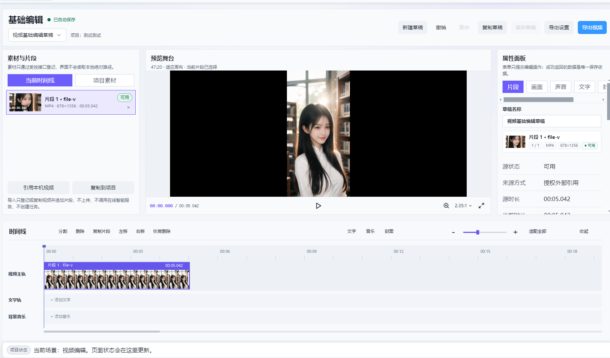

# 视频时间线布局审核

状态：v001 布局已确认，并按本轮补充要求实施。当前分支 `fix/video-thumbnail-preview`。真实 Electron 原视频验收待完成。

## 请求与范围

2026-09-08：用户要求参考剪映截图的主轨抽帧布局，先给方案与界面效果审核，确认后在当前分支修改。截图 1 是结构参考，截图 2 是当前显示问题的证据。沿用现有浅色页面，只调整时间线区域。

现有依据：`src/pages/creation/video/VideoEditingPage.tsx` 的时间比例、标尺、片段、播放头和抽帧槽位；`src/styles/pages.css` 的轨道和胶片样式；`src/shared/video-editor-thumbnail-spec.ts` 的拼图尺寸。遵循 AGENTS.md 阶段 9 范围与现有页面边界。工作树已有相关未提交修改，实施时必须在它们之上最小调整。

## 推荐方案

- 默认采用 80 px/s 的时间显示比例；5.042 秒约 403 px，短片右侧留空。此值是待审核的界面比例，不是视频时长或业务参数限制。
- 提供减小、滑杆、增大、适配全部；长视频默认横向滚动，用户主动适配时留约 10% 尾部空间。缩放不改视频真实时长。
- 主轨片段约 76 px 高：20 px 名称与时长标题带，约 54 px 胶片区。竖屏素材以小幅竖图显示，按高度保持比例，横屏采用较宽单格；不得把整张拼图拉成单张封面。
- 胶片从左到右按对应源时间采样，复用现有拼图/帧缓存；裁剪与变速继续映射到真实源时间。加载、缺失和失败状态不伪装成真实抽帧。
- 左侧轨道名固定，右侧标尺、所有轨道、播放头使用同一比例。空白时间仅用于视图，播放与导出仍止于真实总时长；空白点击定位钳制到片尾。
- 文字和音乐轨保持紧凑，保留现有添加操作。没有核验源音频波形能力，本方案不绘制或承诺波形。
- 窄窗口保留固定轨道名和片段比例，工具栏按现有断点换行，时间轴自身横向滚动；不得通过拉伸片段填满或压扁图片来适配。

## 已核实与待核实

当前 `timelineFitPixelsPerSecond = viewportWidth / duration` 且 effective 比例不能低于 fit，直接解释短视频铺满。当前源代码已有 40 帧拼图和 56 px 抽帧槽位，因此不能仅凭旧截图认定当前运行版本没有抽帧；拼图固有尺寸、CSS 高度/宽度、缓存与运行构建是否一致仍需真实运行核验。

## 效果图及限制

效果图是对用户截图 2 的局部设计合成，上半区沿用截图。未取得原视频，胶片格重复使用截图中的同一画面，只表达尺寸和排列，不证明真实时间采样。它不是实际应用运行截图，也不是可操作页面。

## 实施与验收边界

审核通过后仅修改时间线视图计算、抽帧显示样式及对应回归；只有真实证据确认拼图生产有错时才扩展到媒体生产端。不得覆盖当前其他改动。

验收：同一 5.042 秒素材默认约 403 px 宽且右侧留空；名称、时长和图片不重叠；真实抽帧按时间变化；缩放、标尺点击、播放头、裁剪与变速映射一致；长视频可滚动；适配全部可见完整片段；空白不计入播放和导出。执行对应领域/UI 测试、构建和 Electron 同路径人工验证。本轮只核对源码与静态效果图，不声明上述运行验收通过。

active_version: v001
prototype_status: approved
approved_version: v001
approval_mode: explicit: 2026-09-08 本任务负责人确认效果图并补充抽帧密度
approval_evidence: 用户回复“效果图不错”，补充“5秒视频大概抽帧8张图片”，后续通过 Ctrl 加滚轮增加图片；保持 v001 布局，示意图原文件不覆盖
implementation_version: v001
implementation_status: partial

资产清单：v001/timeline-layout-review.png，1686×990，浅色、单片段选中、桌面静态示意。原始截图来自用户本轮附件，未外发。

SHA-256：`02A37D2BF9C2B15C9C30D699A40731B30158C109781E8A5251C8991B37B1EB16`。

静态约束复核：与用户截图的浅色布局兼容；时间比例、标题带、胶片格和右侧留白已检查，未发现新增区域文字重叠。上半区保留原截图，因此其中已有的属性栏滚动和预览黑边不作为本方案修复项。真实交互、主题切换和窄窗口运行仍未验证。图中工具文字仅示意位置，实施复用项目现有按钮与图标。

## 2026-09-08 实施与验证更新

最新负责人决策：移除“适配全部”按钮以减少工具栏占位，保留缩放图标、滑杆与 Ctrl 滚轮。本条覆盖此前方案和历史验证中的适配全部入口，审核原图保留历史记录。

后续验收纠正：用户原片截图暴露格内规律白条，确认是固定竖向图片宽度小于槽宽；此前静态约束检查不完整，不能据其声称与效果图一致。当前改为每格等比例填充、居中裁去超出高度；独立帧采用 cover。`check-render.cjs` 新增槽宽、裁片宽、真实单帧宽、高度覆盖检查，旧版明确失败，修正后通过；默认 8 张与放大后 15 张保持，截图已更新。真实原片仍需在 Electron 复验。

负责人补充覆盖示意图密度：默认 80 px/s、单格目标 56 px，5.042 秒为 8 格；Ctrl 向上滚轮放大后增加抽帧，向下减少。40 帧缓存不足时复用已有 Canvas 按时间提帧、取消和并发控制，不以重复封面充当额外抽帧。Canvas 保留原画面比例。

已实施默认比例、显式缩放和适配按钮、76 px 主轨、顶部标题带、小幅拼图裁片。同步调整标尺、主轨点击、播放头、文字和音乐轨的坐标，让右侧空白只属于视图。现有片段业务字段与导出链未改动。

回归验证：领域测试 17/17，相关 UI 合同 29/29，构建、定向 ESLint、diff 检查通过。浏览器测试使用实际 VideoEditingPage 和受控 IPC 测试数据：1686×990 下初始宽 403.359375 px、8 帧，Ctrl 滚轮 -360 后 15 帧，适配比例约 0.9；1024×768 无页面横向溢出。拼图为带编号的测试图片，确认 CSS 分格和源帧选择，不宣称用户原视频实际抽帧完成验收。

浏览器验证文件：`check-render.cjs`、`render-desktop.png`、`render-compact.png`，属于实施验证证据，不覆盖 v001 审核图。测试媒体刻意无可播放内容，所以预览区域为空、显示准备失败；不用于证明预览或播放成功。测试浏览器热更新 WebSocket 被本机网络检查阻止，首次模块加载和实际组件交互正常。真实 Electron、用户原片、长片连续滚动和导出仍需人工验收，未提交、未推送。
